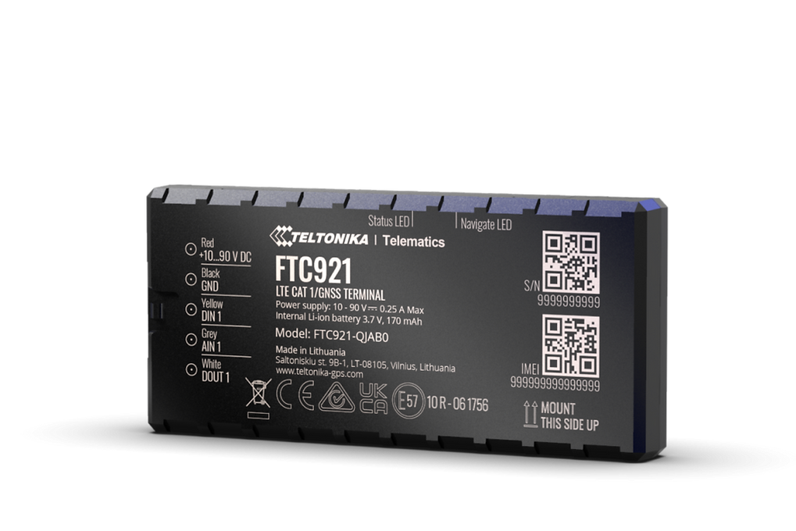

# Teltonika - FTC921

El Teltonika FTC921 es un rastreador GPS de nueva generación pensado para aplicaciones de e-movilidad y protección antirrobo. Basado en la plataforma Fleet Telematics, el FTC921 ofrece posicionamiento GNSS preciso y conectividad celular confiable con LTE Cat 1 y retroceso a 2G. Su diseño soporta entradas de alta tensión y gestión de energía optimizada, lo que lo hace ideal para motocicletas eléctricas, motonetas y rickshaws que operan en entornos urbanos y a baja velocidad.

Como dispositivo compatible con Plaspy, el FTC921 se integra para entregar ubicación en casi tiempo real, telemetría básica e información de estado del equipo a equipos de flota y seguridad. El soporte para gestión remota mediante las herramientas estándar de Fleet Telematics facilita el mantenimiento masivo de dispositivos, mientras que sus capacidades de manejo de energía y modos de sueño permiten flujos de trabajo de monitoreo continuo y antirrobo con mínima intervención.

## Características destacadas

- Rastreador compatible con Plaspy para integración fluida en los procesos de monitoreo de flotas.
- Conectividad LTE Cat 1 con retroceso a 2G para cobertura celular amplia y telemetría estable.
- Entrada de alimentación de alta tensión adecuada para vehículos de e-movilidad como motocicletas y motonetas eléctricas.
- Recepción GNSS mejorada con soporte para hasta 41 satélites visibles, optimizando el posicionamiento a baja velocidad.
- Modos de sueño optimizados para reducir el impacto en la batería del vehículo y prolongar la autonomía del dispositivo.
- Construido sobre la plataforma Fleet Telematics con gestión remota vía FOTA WEB y TCT.
- Disponible en opciones estándar y en kit de unidad única para adaptarse a despliegues de flota y pruebas piloto.

## Cómo funciona con Plaspy

Al integrarse con Plaspy, el FTC921 transmite coordenadas GNSS y el estado del dispositivo para que los operadores puedan monitorear ubicación de vehículos, estado de energía y telemetría básica casi en tiempo real. Plaspy ingiere esos datos para ofrecer mapeo, alertas e informes históricos, mientras que las herramientas de gestión remota simplifican la configuración y el mantenimiento de firmware en toda la flota.

- Actualizaciones de ubicación en tiempo casi real y telemetría básica entregadas a Plaspy para seguimiento en vivo.
- Reportes de estado de energía y alimentación del vehículo para soportar alertas antirrobo y notificaciones por pérdida de energía.
- Datos GNSS de alta precisión que mejoran el posicionamiento en entornos urbanos y escenarios de baja velocidad.
- Soporte de gestión remota mediante FOTA WEB y TCT que complementa los flujos de trabajo de dispositivos en Plaspy.
- Integración con el sistema de alertas e informes de Plaspy para habilitar notificaciones por geocercas y supervisión operativa.

## Casos de uso típicos

- Gestión de flotas urbanas y logística ligera donde el posicionamiento a baja velocidad es relevante.
- Supervisión de flotas de e-movilidad para vehículos como motocicletas eléctricas, motonetas y rickshaws.
- Protección antirrobo con monitoreo continuo y alertas por pérdida de alimentación.
- Despliegues básicos de track and trace para recuperación de activos y análisis de rutas.
- Programas piloto y rollouts a pequeña escala usando kits de unidad única antes de un despliegue mayor.

## Por qué elegir este rastreador con Plaspy

El FTC921 ofrece un equilibrio entre conectividad, manejo de alimentación y rendimiento GNSS, pensado para escenarios de e-movilidad y antirrobo. Su compatibilidad con Plaspy facilita incorporar seguimiento en tiempo real y telemetría básica dentro de una vista centralizada de gestión de flotas, mientras que las herramientas de gestión remota ayudan a mantener los dispositivos con menos intervención manual.

Si sus necesidades operativas incluyen flotas de vehículos eléctricos o rastreo urbano a baja velocidad, combinar el FTC921 con Plaspy ofrece una vía práctica hacia monitoreo continuo, alertas e informes históricos. Para obtener más información sobre Plaspy visite https://www.plaspy.com. Las especificaciones del producto, disponibilidad y detalles del fabricante pueden cambiar con el tiempo, por lo que le recomendamos verificar las especificaciones actuales en la documentación oficial del fabricante en https://www.teltonika-gps.com/.
