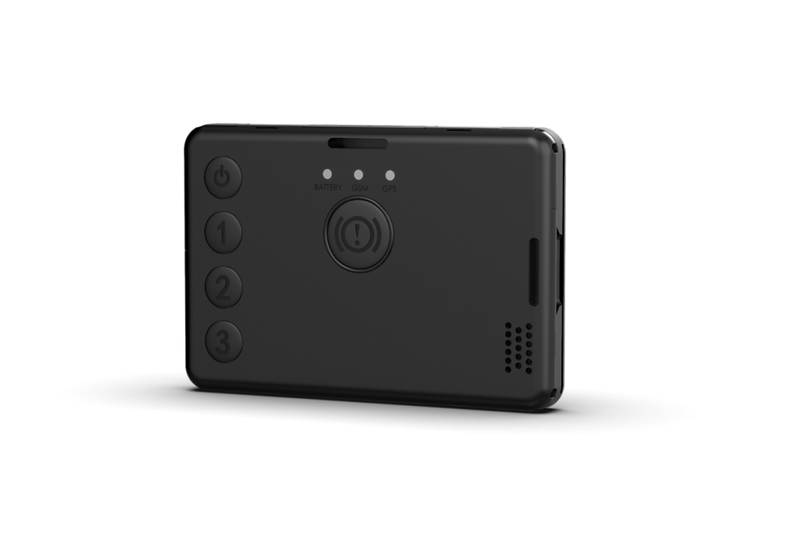

# Teltonika - GH5200

El GH5200 es un rastreador GPS personal compacto y autónomo 2G, diseñado para la gestión de personal y la seguridad individual. Pensado para uso continuo sobre la persona, el dispositivo se puede llevar en un cordón, cinturón o portacredencial y ofrece funciones clave de seguridad como voz bidireccional, controles programables, detección automática de incidentes y soporte para sensores y balizas Bluetooth. Su formato y conjunto de características lo hacen idóneo para trabajadores en solitario, técnicos de campo y personas vulnerables en entornos industriales, agrícolas y de servicios.

Como dispositivo compatible con Plaspy desde el primer uso, el GH5200 puede enviar datos de ubicación, eventos y estado directamente a su entorno de monitoreo Plaspy. Esta integración permite seguimiento en tiempo real, marcas de tiempo en incidentes y enrutamiento de alertas para que los equipos de operaciones y los respondedores tengan una visión completa sin configuraciones complejas. Plaspy recibe eventos de botones, alertas de hombre caído y de no movimiento, además de telemetría de sensores Bluetooth para facilitar una respuesta rápida y una supervisión operativa continua.

## Aspectos destacados

- Rastreador GPS 2G portátil diseñado para la seguridad del personal y la protección personal.
- Voz bidireccional, llamada de emergencia y alertas por SMS a destinatarios configurados para contacto inmediato.
- Cinco botones configurables para seguimiento bajo demanda, alertas ámbar y escenarios personalizados.
- Detección automática de incidentes, incluyendo avisos de hombre caído y ausencia de movimiento en incidentes sin supervisión.
- Soporte para múltiples sensores y balizas Bluetooth para ampliar la telemetría de proximidad y condiciones ambientales.
- Batería interna recargable para operación autónoma prolongada, con cable de carga incluido.
- Documentación y base de conocimientos para simplificar la integración con Plaspy y el soporte continuo.

## Cómo funciona con Plaspy

Al integrarse con Plaspy, el GH5200 envía continuamente posiciones y eventos a una plataforma centralizada para monitoreo en vivo, alertas e informes históricos. Plaspy procesa los mensajes del dispositivo, muestra la ubicación en mapas en tiempo real, registra eventos de seguridad con marcas de tiempo y enruta notificaciones a despachadores o contactos de emergencia para que los equipos puedan actuar con rapidez.

- Las actualizaciones de ubicación y telemetría en tiempo real aparecen en los mapas y vistas de seguimiento en vivo de Plaspy.
- Las llamadas de emergencia y los eventos por SMS se registran y se muestran en los registros de incidentes de Plaspy para coordinar la respuesta.
- Las detecciones de hombre caído y de falta de movimiento generan automáticamente eventos de incidente y alertas dentro de los paneles de Plaspy.
- Las pulsaciones de botones programables se capturan como alertas personalizadas o desencadenantes para flujos de trabajo y acciones del operador.
- Los datos de sensores y balizas Bluetooth se presentan como campos de telemetría adicionales para enriquecer el contexto situacional.

## Casos de uso típicos

- Monitoreo de trabajadores en solitario y respuesta rápida a incidentes en servicios públicos, mantenimiento y servicios de campo.
- Seguridad para técnicos de campo donde la voz bidireccional y las alertas inmediatas reducen el tiempo de respuesta.
- Supervisión de personal agrícola distribuidos en distintas ubicaciones para garantizar seguridad y responsabilidad.
- Operaciones de servicio y remotas donde se requiere protección personal vestible y registros de incidentes.
- Seguimiento y asistencia a personas vulnerables dentro de programas de cuidado gestionado o responsabilidades de atención.

## Por qué elegir este rastreador con Plaspy

El GH5200 es un dispositivo enfocado en la seguridad personal que encaja de forma natural en despliegues de Plaspy orientados a la protección de personas en lugar de telemática vehicular. Su diseño para llevar encima, los botones programables y la detección automática de incidentes convierten eventos personales en alertas accionables y registros dentro de Plaspy, ayudando a las organizaciones a mantener conciencia situacional y ofrecer asistencia más rápida.

Para equipos que necesitan una capa de seguridad para el personal sencilla y eficaz, el GH5200 aporta telemetría relevante y capacidad de voz que Plaspy traduce en monitoreo, informes y flujos de notificación. Si también requiere telemática de vehículos, el GH5200 complementa estrategias de seguimiento más amplias al cubrir la dimensión de seguridad humana junto a otros tipos de dispositivos.

To learn more about Plaspy and how compatible devices like the GH5200 integrate with our platform visit https://www.plaspy.com. Product specifications, availability and manufacturer details can change over time, so please verify current technical information and official documentation with the manufacturer at https://www.teltonika-gps.com/ before purchase.
