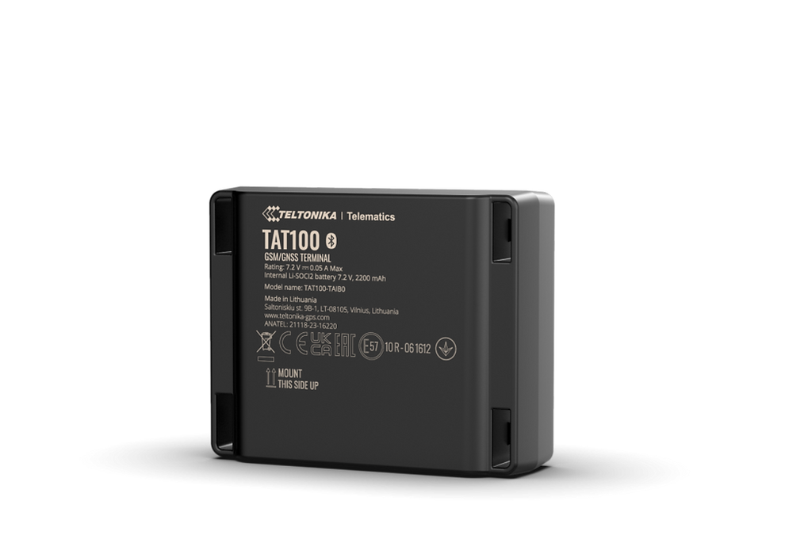

# Teltonika - TAT100

El TAT100 es un rastreador GPS compacto a batería diseñado para la supervisión prolongada de activos. Su resistente carcasa con clasificación IP68 y la conectividad quad-band 2G GSM ofrecen informes de ubicación confiables para activos sin alimentación. Con varias configuraciones de batería y soporte micro USB opcional en determinados SKUs, el TAT100 resulta idóneo para despliegues donde la instalación sin cableado y el bajo mantenimiento son prioritarios.

Como dispositivo compatible con Plaspy, el TAT100 se integra en flujos de trabajo de seguimiento existentes para ofrecer mapas, alertas e informes históricos sin configuraciones complejas. Sus escenarios de reporte configurables permiten a los operadores equilibrar la frecuencia de actualizaciones y la vida útil de la batería, por lo que el TAT100 puede funcionar como rastreador principal o de respaldo para la gestión de flotas, logística, alquiler de equipos y otras necesidades de monitoreo cuando se usa con Plaspy.

## Aspectos destacados

- Totalmente compatible con Plaspy para una integración directa en paneles y procesos de informes
- Carcasa resistente IP68 adecuada para activos exteriores y entornos adversos
- Conectividad quad-band 2G GSM para cobertura amplia en redes celulares heredadas
- Varias opciones de batería y reportes configurables para prolongar la vida de despliegue
- Instalación sin cables con opciones de montaje sencillas y micro USB opcional en algunos SKUs
- SKUs estándar disponibles para facilitar la adquisición y opciones de compra al por mayor para grandes despliegues
- Útil como rastreador de respaldo junto a rastreadores vehiculares para aumentar la redundancia y la visibilidad

## Cómo funciona con Plaspy

El TAT100 envía informes periódicos de ubicación y estado del dispositivo a través de redes celulares, que Plaspy procesa para mapas en vivo, geovallas, alertas y reproducción histórica de rutas. Usted puede configurar intervalos de reporte y umbrales de eventos para que los activos transmitan únicamente la información necesaria para cada caso de uso, lo que ayuda a preservar la batería sin sacrificar la visibilidad operativa.

- Rastreo en tiempo real mediante informes periódicos de ubicación configurables según sus necesidades
- Telemetría y estado del dispositivo visibles en Plaspy para monitorear la salud y presencia del activo
- Geovallas y alertas para notificar al equipo cuando los activos salen de áreas predefinidas
- Reproducción de rutas históricas e informes para auditorías y análisis operativos
- Configuración consciente del nivel de batería para equilibrar la frecuencia de actualización con la autonomía

## Casos de uso típicos

- Rastreo de respaldo para remolques o vehículos arrendados para garantizar redundancia y continuidad
- Monitoreo de contenedores y carga en patios y durante el tránsito gracias a la carcasa resistente a la intemperie
- Seguimiento de equipos de construcción y alquiler para reducir pérdidas y mejorar la utilización
- Logística y seguimiento de mercancías donde la telemetría periódica minimiza las necesidades de mantenimiento
- Seguridad discreta de activos y prevención de robo para equipos de alto valor o en alquiler

## Por qué elegir este rastreador con Plaspy

El TAT100 es una opción práctica para organizaciones que requieren un rastreador de activos duradero y de bajo mantenimiento que funcione de forma integrada con Plaspy. Su protección IP68 y las opciones de batería permiten despliegues prolongados en activos remotos o expuestos, mientras que los reportes configurables permiten a los equipos operativos seleccionar el equilibrio adecuado entre frecuencia de actualizaciones y vida útil de la batería.

En combinación con Plaspy, el TAT100 transforma los informes periódicos de ubicación en información accionable mediante mapas, alertas e informes históricos. La adquisición se simplifica gracias a SKUs estándar y opciones de compra al por mayor, y el dispositivo puede actuar tanto como rastreador principal de activos como complementario a rastreadores vehiculares para mejorar la seguridad y supervisión del transporte.

Learn more about Plaspy and how compatible devices like the TAT100 can fit your fleet and asset monitoring needs at https://www.plaspy.com. Product specifications, availability and manufacturer details can change over time, so verify current technical information and configuration options on the manufacturer site https://www.teltonika-gps.com/.
