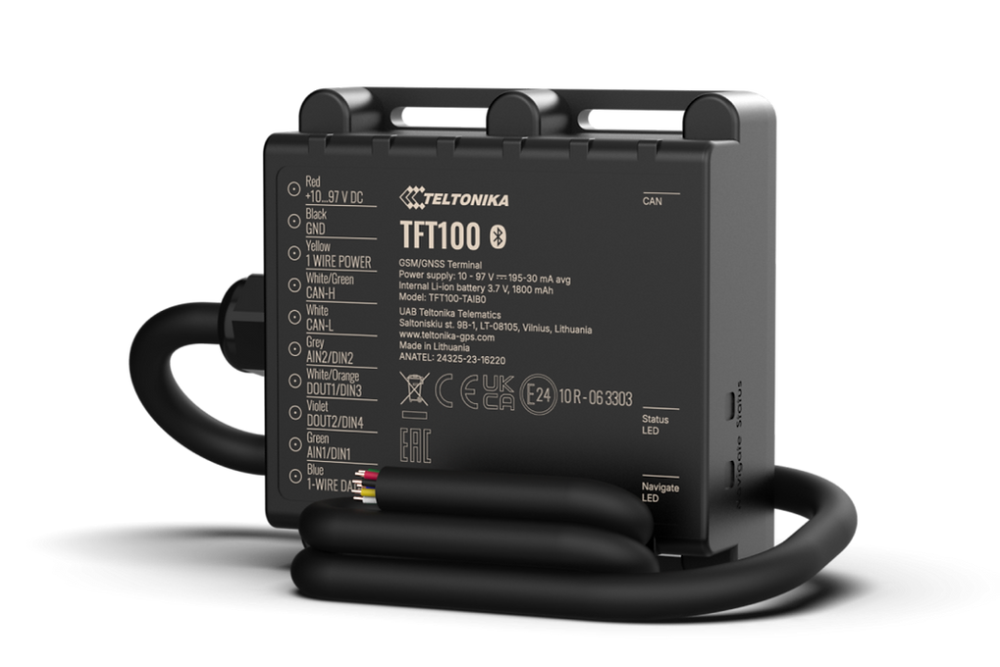

# Teltonika - TFT100

El Teltonika TFT100 es un rastreador GPS 2G robusto diseñado para e movilidad y vehículos industriales de alta tensión como montacargas, manipuladores telescópicos, cargadores y otra maquinaria pesada. Con una carcasa certificada IP67 y un amplio rango de entrada de 10–97 V, este equipo está pensado para funcionar de manera fiable en entornos industriales y exteriores hostiles donde la resistencia al clima y la gestión de altas tensiones son fundamentales.

Como dispositivo compatible con Plaspy desde el primer momento, el TFT100 puede enviar ubicación y telemetría del vehículo a Plaspy para monitoreo en tiempo real y supervisión operativa. Su conectividad con el bus del vehículo y la posibilidad de emparejar sensores por Bluetooth Low Energy lo convierten en una opción práctica para gestores de flota que requieren trazabilidad consolidada, visualización de telemetría y generación de alertas en flotas de e movilidad e industriales.

## Aspectos destacados

- Carcasa resistente IP67 diseñada para uso en exteriores y en vehículos industriales de alta tensión.
- Amplio rango de alimentación de 10–97 V para adaptarse a distintas arquitecturas de vehículos eléctricos e industriales.
- Conectividad celular 2G para reportes de posición y envíos de telemetría en regiones con cobertura compatible.
- Interfaces directas al bus del vehículo y puertos serie, además de BLE para ampliar entradas de sensores y telemetría.
- Ideal para escenarios de flota y activos como montacargas, manipuladores telescópicos y cargadores.
- Configurable con las herramientas de gestión de Teltonika para preparar los flujos de datos hacia plataformas backend como Plaspy.

## Cómo funciona con Plaspy

Al integrarse con Plaspy, el TFT100 proporciona fijaciones de posición y telemetría del vehículo que Plaspy transforma en mapas, alertas e informes operativos. Configure el rastreador con las herramientas del proveedor para definir qué señales del vehículo y qué datos de sensores se reportan, y luego dirija la telemetría del dispositivo a su instancia de Plaspy para que la plataforma pueda mostrar y actuar sobre la información entrante.

- La ubicación en tiempo real y la reproducción de rutas históricas aparecen en Plaspy para monitoreo y revisión.
- Los datos del bus y las interfaces serie pueden analizarse y mostrarse en los paneles de Plaspy para visualizar estado de baterías y sistemas.
- Los sensores conectados por BLE aportan eventos ambientales y de movimiento que Plaspy puede indexar y graficar.
- Use eventos parseados del vehículo para activar alertas en Plaspy y flujos de trabajo rutinarios de mantenimiento y seguridad.
- Plaspy convierte la alimentación del rastreador en informes y métricas operativas útiles para optimizar flotas y programación.

## Casos de uso típicos

- Supervisión de parámetros del sistema de gestión de baterías en montacargas eléctricos y vehículos industriales eléctricos.
- Seguimiento de flotas de e movilidad para optimizar rutas, ciclos de carga y utilización de unidades.
- Control de posición y operación de maquinaria pesada que trabaja en exteriores y en condiciones exigentes.
- Monitoreo ambiental y de activos mediante sensores BLE para temperatura, humedad y detección de manipulación.
- Flujos de trabajo antivandalismo y seguridad que combinan eventos del bus y alertas de sensores en reglas de respuesta.

## Por qué elegir este rastreador con Plaspy

El TFT100 es adecuado para organizaciones que operan flotas de e movilidad y equipos industriales de alta tensión y necesitan un rastreador duradero que entregue telemetría esencial a una plataforma de gestión de flotas. Su construcción robusta y la amplia compatibilidad con sistemas de alimentación vehicular reducen las complicaciones de instalación en entornos adversos, mientras que las interfaces a bordo y el soporte BLE permiten una recolección de datos más rica que Plaspy puede transformar en información accionable.

Si está evaluando dispositivos para flotas de e movilidad o equipos pesados, el conjunto de funciones del TFT100 lo hace una opción práctica cuando se integra con Plaspy para centralizar seguimiento, alertas e informes. Learn more about Plaspy on our main website https://www.plaspy.com and verify current product availability and specification details with the manufacturer documentation at https://www.teltonika-gps.com/ since specifications and product status can change over time.
