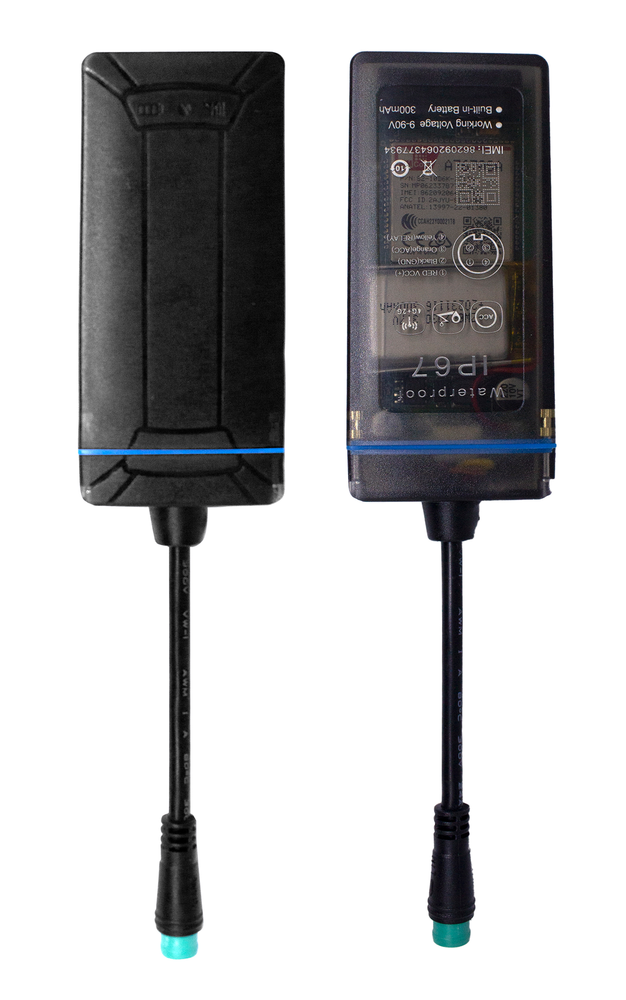

# ThingSys - J16W

El J16W es un rastreador robusto con certificación IP67 diseñado específicamente para instalaciones en vehículos. Compacto y liviano, combina un módem 4G LTE CAT1 con retroceso a 2G y un receptor GNSS de alta sensibilidad para proporcionar posicionamiento y telemetría fiables aun en entornos exigentes. La familia J16W incluye una unidad base con entrada ACC y control de relé, y la variante J16Wm que añade micrófono y funcionalidad SOS para flujos de trabajo de emergencia.

Como dispositivo compatible con Plaspy, el J16W integra la ubicación del vehículo, el estado de ignición y eventos de control en los paneles y alertas de Plaspy. Su almacenamiento en búfer offline y su resiliencia ante cortes de energía ayudan a mantener la transmisión continua hacia Plaspy, por lo que el J16W es apto para monitoreo de flotas, visibilidad de rutas, operaciones anti robo y gestión de incidentes cuando se utiliza junto con los flujos de trabajo de Plaspy.

## Puntos destacados

- Diseñado para vehículos con carcasa IP67 que ofrece protección en condiciones adversas.
- Conectividad celular 4G LTE con retroceso a 2G para amplia cobertura y reportes confiables.
- Receptor GNSS de alta sensibilidad compatible con GPS y BeiDou para ubicación precisa del vehículo.
- Tamaño compacto y peso reducido para instalaciones discretas en activos de flota.
- Amplio rango de voltaje de operación y batería de respaldo integrada para preservar reportes durante interrupciones de energía.
- Entradas dedicadas para vehículo y salida de relé para detección de ignición y acciones controladas de corte o restauración.
- Almacenamiento de datos offline y retransmisión para preservar la telemetría cuando la conectividad es intermitente.

## Cómo funciona con Plaspy

Cuando se conecta a Plaspy, el J16W envía posición GNSS y telemetría del vehículo para que Plaspy muestre seguimiento en vivo, alertas y reproducción histórica. Plaspy procesa banderas de estado y eventos I/O del dispositivo para respaldar supervisión operativa, alertas automatizadas e informes sobre los activos de la flota.

- Actualizaciones de ubicación en tiempo real y reproducción de rutas para visibilidad operativa y monitoreo.
- Detección de ignición y ACC que puede disparar alertas, informes o resúmenes de uso en Plaspy.
- Control por relé para corte y restauración utilizable en rutinas de inmovilizador y anti robo gestionadas desde Plaspy.
- Almacenamiento de puntos offline con retransmisión para que Plaspy mantenga un registro continuo de telemetría tras la restauración de red.
- Soporte de la variante J16Wm para eventos SOS y micrófono, de modo que los flujos de trabajo de incidentes en Plaspy puedan incluir señalización de emergencia y contexto de voz.

## Casos de uso típicos

- Gestión de flotas para autobuses, camiones y vehículos de servicio que requieren visibilidad continua de ubicación y estado.
- Seguridad vehicular y operaciones anti robo mediante monitoreo de ignición y control de inmovilizador por relé.
- Respuesta remota a incidentes donde la señal SOS y el contexto de audio se integran en los flujos de trabajo de operadores.
- Seguimiento de vehículos pequeños y motocicletas donde el tamaño compacto y el amplio soporte de voltaje son ventajosos.
- Flujos operativos que dependen del almacenamiento offline y la reconciliación posterior de telemetría para informes.

## ¿Por qué elegir este rastreador con Plaspy?

El J16W es una opción práctica para organizaciones que necesitan un rastreador vehicular resistente que entregue datos de posición y estado confiables a Plaspy. Su carcasa duradera, amplia cobertura celular y almacenamiento integrado reducen las brechas de datos y facilitan la monitorización continua en distintos tipos de vehículos. Las variantes con soporte SOS y micrófono aportan capacidades útiles para el manejo de incidentes cuando se combinan con las funciones de alertas y gestión de Plaspy.

Para saber más sobre cómo Plaspy puede usar rastreadores compatibles como el ThingSys J16W visite https://www.plaspy.com. Las especificaciones del producto y la disponibilidad pueden cambiar con el tiempo, por favor verifique los detalles técnicos y las características de las variantes en el sitio del fabricante https://www.thingsys.com/.
