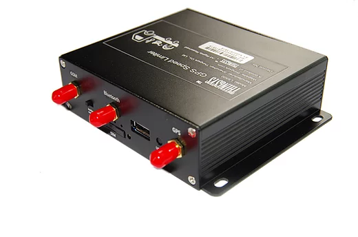

# ThingSys - LS500

El ThingSys LS500 es un limitador de velocidad GPS y terminal de rastreo vehicular multifunción diseñado para controlar la velocidad con precisión y monitorear la ubicación de forma continua. Basado en un chip inteligente ARM y equipado con receptor GPS U-blox, comunicación GSM GPRS y módulo Bluetooth, el LS500 integra funcionalidades de limitación de velocidad y rastreo en un equipo compacto. Su diseño prioriza la precisión del control y la fiabilidad operativa, permitiendo que el acelerador del vehículo opere dentro del rango de velocidad permitido sin sacrificar el torque de potencia.

Como dispositivo compatible con Plaspy, el LS500 puede enviar información de ubicación y velocidad a Plaspy para la supervisión centralizada de flotas. Las organizaciones que requieren límites de velocidad aplicados y visibilidad de posición pueden usar el LS500 junto con Plaspy para consolidar rastreo, monitoreo, alertas e informes en una sola plataforma. La compatibilidad del equipo y sus especificaciones robustas lo convierten en una opción adecuada para operadores de flotas que buscan soluciones integradas de control de velocidad y seguimiento.

## Características principales

- Dispositivo de doble función que combina limitador de velocidad y rastreo GPS en un solo terminal
- Alta precisión en el control de velocidad gracias a un chip de control basado en ARM
- Receptor U-blox para posicionamiento preciso y datos de ubicación confiables
- Módulo de comunicación GSM GPRS para transmisión continua de datos
- Bluetooth integrado para opciones adicionales de conectividad
- Diseño compacto y resistente con amplios rangos de tensión de operación y temperatura
- Mayor capacidad antiinterferencias para un desempeño confiable en entornos exigentes

## Cómo funciona con Plaspy

Al integrarse con Plaspy, el LS500 suministra datos de ubicación y velocidad que Plaspy utiliza para mostrar mapas, alertas e informes operativos. Plaspy procesa la información del dispositivo para ofrecer a los administradores de flota visibilidad en tiempo real e información histórica sin necesidad de modificar el comportamiento del vehículo más allá de la función nativa de limitación de velocidad del LS500.

- Rastreo de ubicación en tiempo real en los mapas de Plaspy para vehículos individuales y flotas
- Visibilidad de velocidad y movimiento para apoyar el cumplimiento y generar alertas
- Informes de eventos y reproducción histórica para análisis de rutas y revisión de incidentes
- Paneles centralizados que combinan datos del LS500 con otros activos gestionados en Plaspy
- Notificaciones configurables para resaltar eventos de exceso de velocidad o desviaciones

## Casos de uso típicos

- Aplicación y control de políticas de velocidad en flotas de vehículos comerciales
- Monitoreo de vehículos de reparto y logística para cumplimiento de rutas y límites de velocidad
- Gestión de transporte municipal o regional donde se requiere control de velocidades
- Supervisión de flotas de alquiler donde el rastreo y la limitación de velocidad aportan valor operativo
- Operaciones en regiones con entornos difíciles que demandan un rastreo robusto

## Por qué elegir este rastreador con Plaspy

El LS500 es una opción práctica para organizaciones que necesitan tanto control preciso de velocidad como rastreo vehicular confiable. La combinación de funciones específicas de limitación y comunicaciones GPS integradas lo hace adecuado para flotas que requieren aplicación de límites sin perder visibilidad. Al emparejar el LS500 con Plaspy, usted podrá centralizar el monitoreo, simplificar los informes y mantener una supervisión operativa efectiva en flotas mixtas.

Para más información sobre cómo el ThingSys LS500 puede integrarse con Plaspy y para revisar consideraciones de despliegue, conozca más sobre Plaspy en el sitio principal https://www.plaspy.com. Las especificaciones del producto y la disponibilidad pueden variar con el tiempo, así que verifique los detalles actuales del dispositivo y la documentación técnica en el sitio oficial del fabricante https://www.thingsys.com/ antes de tomar decisiones de compra.
