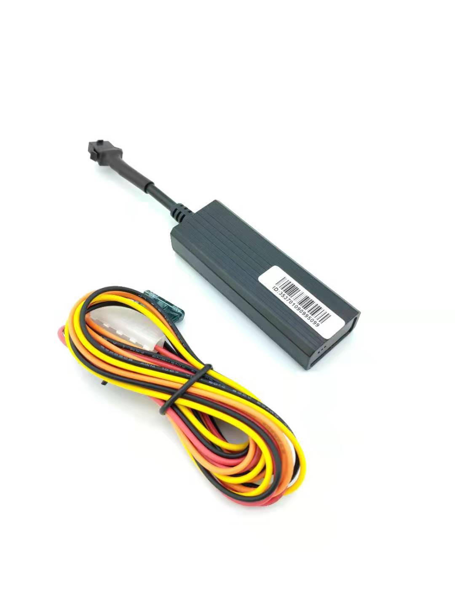

# ThingSys - TS-G17H

El TS-G17H es un rastreador GPS compacto para vehículos, diseñado para ofrecer seguimiento en tiempo real de forma confiable y discreta. Preparado para despliegues globales, combina conectividad GSM cuatribanda con reportes GPRS TCP/IP e implementa el formato de mensajes GT06 para proporcionar ubicación, telemetría básica y funciones antirrobo. Su tamaño reducido, antena GPS integrada y batería de respaldo lo hacen adecuado como rastreador oculto para autos y localizador de motocicletas cuando el espacio y la continuidad en los reportes son importantes.

Como dispositivo compatible con Plaspy, el TS-G17H puede integrarse en los flujos de trabajo de Plaspy para ofrecer visibilidad continua y controles remotos prácticos. Al apuntar sus reportes hacia Plaspy, el equipo envía actualizaciones de posición, estado de encendido y eventos de alarma que Plaspy procesa para mapeo en vivo, alertas y reproducciones históricas. Esto convierte al TS-G17H en una opción directa para operadores que necesitan rastreo fiable y controles de inmovilización remotos sencillos dentro de la plataforma Plaspy.

## Características principales

- Compatibilidad con Plaspy mediante el protocolo GT06 y reportes GPRS TCP/IP para actualizaciones en tiempo real al servidor.
- Soporte GSM cuatribanda para una amplia cobertura celular en múltiples regiones.
- Control por relé para acciones de inmovilización remota y flujos de trabajo de antirrobo y recuperación.
- Amplio rango de tensión de entrada y tamaño compacto, apto para autos, camiones y motocicletas.
- Antena GPS integrada y batería de respaldo que mantienen los reportes de posición durante interrupciones de alimentación.
- Soporte para geocercas y alarmas por exceso de velocidad para notificaciones automáticas de incidentes.

## Cómo funciona con Plaspy

La integración se basa en que el dispositivo reporte mensajes de posición y eventos a un servidor Plaspy usando GPRS TCP/IP y el formato GT06. Una vez configurado para enviar mensajes a Plaspy, el TS-G17H aporta a la plataforma información de ubicación y estado que Plaspy utiliza para visualización, alertas e informes.

- Actualizaciones de ubicación y telemetría en tiempo real para mapeo en vivo en los paneles de Plaspy.
- Reportes de estado de ignición y ACC para reflejar si el vehículo está encendido o apagado, útil en auditorías y control de uso de flotas.
- Alarmas de geocerca y exceso de velocidad que se transmiten a Plaspy para activar notificaciones y flujos de respuesta.
- Comandos remotos de inmovilizador vía relé que pueden iniciarse desde Plaspy o mediante métodos de comando configurados.
- Opciones estándar de configuración y diagnóstico vía SMS y comandos soportadas para aprovisionamiento y resolución de problemas remotos cuando se requiera.

## Casos de uso típicos

- Gestión de flotas para monitoreo de ubicación, seguimiento de encendido y detección de exceso de velocidad.
- Flujos de recuperación y antirrobo mediante instalación oculta e inmovilización por relé.
- Seguimiento de motocicletas donde el tamaño compacto y la flexibilidad de voltaje son críticos.
- Control de alquileres y activos usando geocercas y funciones de inmovilizador remoto.
- Reporte de telemetría básica combinado con los paneles de Plaspy para visibilidad operativa.

## Por qué elegir este rastreador con Plaspy

El TS-G17H ofrece un equilibrio práctico entre funciones esenciales de rastreo e integración sencilla para organizaciones que usan Plaspy. Su implementación del protocolo GT06 y los reportes GPRS hacen que la incorporación a Plaspy sea predecible, y el enfoque del hardware en detección de ignición, control por relé y alimentación de respaldo satisface requisitos comunes de flotas y seguridad sin complejidad innecesaria.

Para equipos que requieren seguimiento en tiempo real fiable, alertas por eventos y controles remotos simples, el TS-G17H es una elección pragmática para combinar con los mapas, informes y herramientas de alerta de Plaspy. Su tamaño compacto y flexibilidad de voltaje también lo convierten en una opción versátil para distintos tipos de vehículos y despliegues.

Obtenga más información sobre cómo Plaspy soporta dispositivos como el TS-G17H en el sitio principal de Plaspy https://www.plaspy.com. Las especificaciones del producto, disponibilidad y detalles del fabricante pueden cambiar con el tiempo, por lo que le recomendamos verificar los datos técnicos y las listas de funciones actuales con el fabricante en https://www.thingsys.com/.
