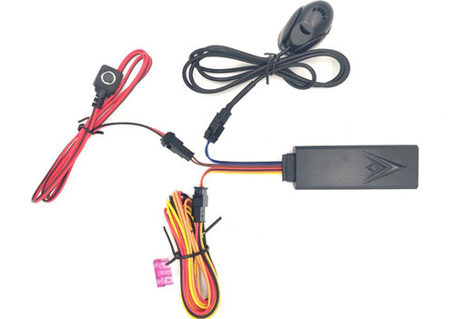

# ThingSys - TS-G17M

El TS-G17M, procedente de una familia de dispositivos ya establecida, es un rastreador GPS compacto y multifuncional diseñado para la seguridad de motocicletas y vehículos ligeros donde la compatibilidad con Plaspy y la telemetría fiable son importantes. Diseñado para seguimiento en tiempo real sobre GSM/GPRS con posicionamiento híbrido GPS/GPRS/LBS/AGPS, el TS-G17M combina alarmas enfocadas al vehículo y control de relé con un factor de forma reducido \(76 × 26 × 15 mm\), facilitando su instalación en motocicletas y activos similares. La integración compatible con Plaspy aporta esas actualizaciones de ubicación en tiempo real, alarmas y controles remotos a una única vista de gestión de flota o activos.

Construido para respaldar medidas antirobos y monitoreo operativo, el TS-G17M incluye control remoto de relé para corte de motor/combustible \(capacidad de inmovilización\), detección ACC \(estado de ignición\), un botón SOS de pánico y un micrófono integrado para supervisión de voz remota. Con características como alertas de geocerca, alarmas de vibración/inclinación, alertas de apagado de energía y hasta 365 días de reproducción histórica de rutas, este rastreador GPS está optimizado para seguimiento en tiempo real, telemetría y gestión segura de flotas a través de la plataforma Plaspy.

## Casos de uso

- Gestión de flotas para mensajeros motorizados y flotas de vehículos ligeros — ubicación en vivo, auditoría de trayectos y control de combustible/motor mediante comandos de relé.
- Protección antirobos — alarmas por vibración e inclinación, además de inmovilización remota mediante relé para recuperar vehículos robados o manipulados.
- Seguridad del conductor y respuesta ante incidentes — botón de pánico SOS y monitoreo de voz para evaluar rápidamente situaciones de emergencia a través de Plaspy.
- Telemetría operativa y mantenimiento — alertas de batería baja y de apagado para prevenir fallos imprevistos y monitorizar la carga.
- Cumplimiento normativo o registro de evidencias — hasta 365 días de reproducción histórica de rutas para cumplimiento, resolución de disputas o investigación de incidentes.

## Cómo funciona con Plaspy

Cuando se empareja con Plaspy, el TS-G17M ofrece datos de ubicación y estado a través de GPRS o SMS para que los gestores de flota y los propietarios de vehículos accedan a seguimiento en tiempo real, alertas e informes históricos desde una única interfaz. Plaspy ingiere el posicionamiento y telemetría híbridos del dispositivo, convirtiendo los datos brutos de GPS/GPRS/LBS/AGPS en mapas utilizables, alertas de geocerca y reproducción de la cronología de rutas. Los comandos remotos iniciados en Plaspy —como la activación del relé para el corte del motor— se transmiten de vuelta al TS-G17M a través del enlace celular.

- Actualizaciones de ubicación y telemetría en tiempo real vía GPRS \(TCP/IP\) y SMS.
- Estado de ignición/ACC reportado para eventos de inicio/parada y análisis de trayectos.
- Alertas de geocerca y apagado enviadas a Plaspy como notificaciones push o alertas.
- Control remoto del inmovilizador/relé para corte de motor o combustible a través de la interfaz de comandos de Plaspy.
- Monitoreo de voz y eventos SOS accesibles en los registros de incidentes de Plaspy para una respuesta rápida.

## Resumen técnico

| Conectividad | GSM / GPRS / GPS con GPRS Clase 12 \(TCP/IP\); Seguimiento por SMS/GPRS; posicionamiento híbrido \(GPS/GPRS/LBS/AGPS\) |
| --- | --- |
| Bandas | GSM cuádruple banda: 850 / 900 / 1800 / 1900 MHz |
| Alimentación y batería | Voltaje de funcionamiento DC 9–100V; batería interna recargable 180 mAh; corriente típica ≈22 mA @12V DC, ≈12 mA @24V DC |
| Interfaces | Control de relé para corte de motor/combustible, detección ACC \(ignición\), botón SOS de pánico, micrófono incorporado, sensor G para vibración/inclinación, alarmas de batería baja y de apagado |
| GNSS | GPS \(MTK6261\), MCU MTK; tiempos de posicionamiento Cold ≈38s, Warm ≈32s, Hot ≈2s \(cielo despejado\); precisión reportada ≈5–10 m \(RM 2D de 10 m\) |
| Bluetooth | No especificado / no indicado |
| Gestión remota | Configuración y comandos vía SMS/GPRS; modos de seguimiento incluyen tiempo real, programado/intervalo y rastreo a demanda \(FOTA no especificado\) |
| Factor de forma y entorno | Dimensiones 76 × 26 × 15 mm; uso en motocicletas/vehículos ligeros; colores negro o OEM; rango de temperatura de operación -20°C a +70°C; humedad 20%–80% RH; 1 año de garantía |

## Casos de uso

- Gestión de flotas para mensajeros motorizados y flotas de vehículos ligeros — ubicación en vivo, auditoría de trayectos y control de combustible/motor mediante comandos de relé.
- Protección antirobos — alarmas de vibración e inclinación, además de inmovilización remota mediante relé para recuperar vehículos robados o manipulados.
- Seguridad del conductor y respuesta ante incidentes — botón de pánico SOS y monitoreo de voz para evaluar rápidamente situaciones de emergencia a través de Plaspy.
- Telemetría operativa y mantenimiento — alertas de batería baja y de apagado para prevenir fallos imprevistos y monitorizar la carga.
- Cumplimiento normativo o registro de evidencias — hasta 365 días de reproducción histórica de rutas para cumplimiento, resolución de disputas o investigación de incidentes.

## Por qué elegir este rastreador con Plaspy

El TS-G17M es una opción pragmática cuando necesitas un rastreador GPS compacto, apto para motocicletas, que se integre de forma fluida con Plaspy para una gestión centralizada de la flota. Su conectividad GSM cuádruple banda y posicionamiento híbrido proporcionan un seguimiento en tiempo real consistente, mientras que la detección ACC, el inmovilizador controlado por relé y múltiples tipos de alarmas ofrecen los controles antirobo que esperan los operadores. Para las organizaciones que dependen de la telemetría—eventos de ignición, notificaciones de batería baja y alertas de vibración—el TS-G17M alimenta esos datos directamente a Plaspy para que los equipos actúen con rapidez. Su factor de forma compacto, la reproducción histórica prolongada y la garantía de 1 año lo convierten en un componente fiable y rentable en cualquier despliegue de rastreo compatible con Plaspy.

