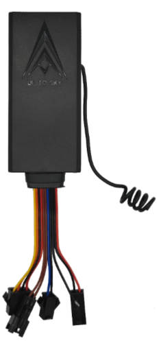

# ThingSys - TS-G17Ms

El TS-G17Ms de ThingSys es un rastreador GPS compacto y compatible con Plaspy, diseñado para ofrecer seguimiento en tiempo real confiable y gestión práctica de vehículos. Pensado para motocicletas, automóviles y vehículos comerciales ligeros, combina un chipset GPS de alta sensibilidad con modos de reporte flexibles para que administradores de flota y propietarios puedan monitorear ubicaciones, alarmas y telemetría básica desde la plataforma Plaspy.

Como dispositivo que soporta alertas SOS, alarmas por vibración y exceso de velocidad, detección de encendido ACC y corte remoto de combustible o energía mediante el relé incluido, el TS-G17Ms se integra de forma natural en los flujos de trabajo de Plaspy para la supervisión de seguridad y operaciones. Su factor de forma discreto, amplio rango de voltaje para vehículos y modos de bajo consumo lo convierten en una opción práctica cuando la protección antirrobo, el monitoreo de rutas y la recuperación rápida son prioridades al integrarlo con Plaspy.

## Aspectos clave

- Compatibilidad confirmada con Plaspy para seguimiento centralizado en tiempo real y supervisión de flotas.
- Chipset GPS de alta sensibilidad que favorece adquisición rápida de satélites y fijaciones de posición fiables en entornos exigentes.
- Soporta tanto tracking continuo por GPRS como sondeos por SMS para mayor flexibilidad en reportes.
- Funcionalidades de seguridad integradas, incluyendo alerta SOS, alarmas por vibración y exceso de velocidad, y detección de encendido ACC.
- Función de inmovilizador remoto mediante el relé incluido para permitir corte de combustible o energía como respuesta antirrobo.
- Amplio rango de voltaje de funcionamiento y modos de sueño de bajo consumo adecuados para distintas instalaciones en vehículos.
- Factor de forma compacto y discreto, ideal para motocicletas, automóviles y vehículos comerciales.

## Cómo funciona con Plaspy

Una vez conectado a Plaspy, el TS-G17Ms envía datos de ubicación y eventos a la plataforma para que los operadores puedan ver posiciones de los vehículos, alarmas y actualizaciones de estado en casi tiempo real. Plaspy muestra las trazas y eventos de alarma en paneles y puede enrutar notificaciones e informes a los equipos operativos según reglas configuradas.

- Actualizaciones de ubicación en tiempo real mediante tracking GPRS y consultas puntuales por sondeo SMS.
- Visibilidad de alarmas para eventos SOS, exceso de velocidad y vibración en los paneles de Plaspy, con opciones de notificación.
- Estado de encendido ACC enviado a Plaspy para análisis de arranques y detenciones e información sobre comportamiento del conductor.
- Acciones de inmovilizador remoto usando el relé del dispositivo que pueden coordinarse mediante los flujos de trabajo de incidentes en Plaspy.
- Los eventos del equipo pueden activar alertas de geocerca, informes programados y notificaciones accionables para equipos de flota.

## Casos de uso típicos

- Protección antirrobo con inmovilización remota y flujos de recuperación rápida gestionados desde Plaspy.
- Gestión de flotas en tiempo real para monitoreo de rutas, visibilidad de ETA y supervisión operativa.
- Monitoreo del comportamiento del conductor mediante eventos de exceso de velocidad y detección de encendido para apoyar programas de seguridad.
- Respuesta de seguridad y emergencia con alertas SOS y, donde esté soportado, monitoreo de voz bidireccional opcional.
- Despliegues mixtos de vehículos como motocicletas, autos y vehículos comerciales ligeros que requieren rastreo discreto.

## Por qué elegir este rastreador con Plaspy

El TS-G17Ms ofrece un conjunto equilibrado de funciones de rastreo y seguridad, adecuado para organizaciones que buscan monitoreo y control vehicular sencillos pero fiables. Su compatibilidad con reportes continuos en línea y sondeos por SMS da a las flotas mixtas la flexibilidad para gestionar conectividad y costos sin sacrificar informes de posición y manejo de alarmas a través de Plaspy.

Plaspy integra los datos del rastreador en una vista operativa única, permitiendo alertas automáticas, reportes consolidados y respuestas coordinadas ante incidentes de robo o desviaciones operativas. Para empresas y propietarios enfocados en la seguridad vehicular y una supervisión práctica de flotas, el TS-G17Ms integrado con Plaspy es una opción pragmática que prioriza seguimiento confiable y funciones esenciales de control remoto.

Para más información sobre Plaspy visite https://www.plaspy.com. Las especificaciones del producto, disponibilidad y datos del fabricante pueden cambiar con el tiempo, por lo que le recomendamos verificar la información técnica actual en el sitio oficial de ThingSys https://www.thingsys.com/.
