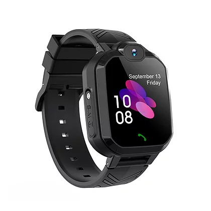

# ThingSys - TS-H1

El ThingSys TS-H1 es un rastreador GPS compacto diseñado para escenarios de uso como dispositivos vestibles y monitoreo por guardianes. Ofrece comunicación bidireccional mediante funciones de llamada y respuesta, y envía mensajes de localización que incluyen enlaces a Google Maps para compartir ubicaciones de forma rápida. El equipo soporta conectividad GSM, GPRS y GPS, con soporte opcional para BDS y AGPS, incorpora batería interna, una ranura para una sola SIM, una pantalla táctil precisa, un puerto USB, autodiagnósticos del sistema operativo y protección de la SIM, además de una clasificación de resistencia al agua IP67.

Como dispositivo compatible con Plaspy, el TS-H1 puede enviar actualizaciones de ubicación y mensajes de alerta a la plataforma Plaspy para una gestión y visibilidad centralizadas. Sus alertas por manipulación, alarmas recordatorias, respaldo LBS para zonas con mala cobertura y la capacidad de actualizar el software de forma remota lo convierten en una opción práctica para organizaciones que desean monitorear personas o activos mientras centralizan el mantenimiento del dispositivo y las notificaciones de eventos en una sola plataforma.

## Puntos clave

- Comunicación bidireccional por llamada para facilitar la comunicación con el guardián y comprobaciones rápidas
- Posicionamiento GPS que envía mensajes con enlaces a Google Maps para ver ubicaciones fácilmente
- Alerta por manipulación y resistencia IP67 para mayor durabilidad en el uso diario y en condiciones exigentes
- Soporta GSM, GPRS y GPS con BDS y AGPS opcionales para más opciones de posicionamiento
- Actualización remota de software y autodiagnóstico integrado para simplificar el mantenimiento
- Respaldo por LBS para mantener la funcionalidad básica de ubicación en zonas con cobertura GPS limitada

## Cómo funciona con Plaspy

El TS-H1 se puede integrar en Plaspy para ofrecer visibilidad continua de la ubicación, notificaciones y reportes del estado del dispositivo. Cuando el rastreador envía actualizaciones de posición o mensajes de eventos, Plaspy procesa esos mensajes y los presenta en mapas, líneas de tiempo de actividad y flujos de notificaciones para apoyar la supervisión operativa y el monitoreo por guardianes.

- Visualización en tiempo real e histórica de posiciones en los mapas de Plaspy usando los mensajes de ubicación del dispositivo
- Notificaciones en Plaspy por eventos de manipulación, alarmas recordatorias y actividad de llamadas entrantes
- Uso de reportes de ubicación por LBS en áreas con GPS limitado para mantener la continuidad de los datos de rastreo
- Información de estado del dispositivo y autodiagnósticos visibles para el seguimiento de mantenimiento y salud del equipo
- Coordinación del estado de actualizaciones remotas dentro de los flujos de gestión de dispositivos en Plaspy

## Casos de uso típicos

- Monitoreo por guardianes de niños o adultos vulnerables con comunicación bidireccional y compartición de ubicación
- Dispositivos de seguridad personales para trabajadores solitarios y personal de campo que requieren visibilidad de ubicación y alertas
- Seguimiento de activos o equipos portátiles donde la impermeabilidad y la detección de manipulación son importantes
- Monitoreo rutinario donde las alarmas recordatorias y el mantenimiento remoto sencillo reducen las visitas de campo
- Situaciones que requieren reporte de ubicación alternativo en zonas con visibilidad satelital intermitente

## Por qué elegir este rastreador con Plaspy

El TS-H1 combina funciones de comunicación prácticas, reportes de ubicación y resistencia del dispositivo, lo que lo hace adecuado para organizaciones que necesitan un rastreo vestible e integrado en una plataforma de gestión. Su alerta por manipulación, funciones de recordatorio y respaldo por LBS mejoran la fiabilidad de los flujos de monitoreo, mientras que los autodiagnósticos y la opción de actualización remota ayudan a reducir la carga operativa.

Emparejado con Plaspy, el TS-H1 le permite centralizar datos de ubicación, alertas e información de salud del dispositivo para que los equipos mantengan visibilidad y respondan a eventos de manera eficiente. Si usted necesita un rastreador estilo vestible con protecciones integradas y compatibilidad con plataforma, el TS-H1 es una opción sensata para evaluar junto con Plaspy.

To learn more about how Plaspy can work with compatible devices visit https://www.plaspy.com. Product specifications, availability, and manufacturer details can change over time, so please verify current specifications with the official manufacturer documentation at https://www.thingsys.com/.
