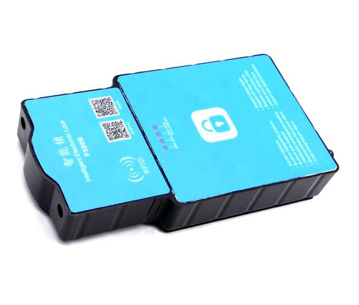

# ThingSys - TS-P4X

El TS-P4X es un rastreador GPS magnético y de uso rudo diseñado para despliegues prolongados en contenedores de carga, remolques y otros activos de transporte de larga distancia. Diseñado para condiciones exteriores exigentes, el equipo combina una batería de respaldo recargable de alta capacidad de 15,000 mAh con potentes imanes integrados y opciones celulares multiplataforma para ofrecer seguimiento de ubicación confiable y operación extendida en campo.

Como dispositivo compatible con Plaspy, el TS-P4X puede reportar posiciones, eventos de alarma y registros almacenados en la plataforma Plaspy para obtener visibilidad centralizada y supervisión de flotas. Su buffering para áreas sin cobertura, geocercas configurables y gestión remota de firmware lo convierten en una opción práctica cuando usted necesita monitoreo remoto y continuidad de datos de seguimiento dentro de Plaspy.

## Aspectos clave

- Compatible con Plaspy para una ingestión sencilla en paneles de flota y flujos de reporte
- Funcionamiento prolongado gracias a una batería de respaldo recargable de 15,000 mAh, adecuada para activos sin alimentación
- Montaje magnético resistente y factor de forma compacto para fijación segura en exteriores de contenedores o chasis
- Soporte celular para múltiples generaciones con transmisión de datos GPRS para telemetría de bajo ancho de banda consistente
- Gran buffer para áreas sin cobertura que retiene hasta 20,000 registros para preservar continuidad durante cortes de conectividad
- Configuración remota y capacidad de actualización OTA de firmware para reducir la necesidad de mantenimiento en sitio

## Cómo funciona con Plaspy

El TS-P4X transmite actualizaciones de ubicación y telemetría del dispositivo a los endpoints en la nube aceptados por Plaspy, donde esos flujos se ingieren y se muestran para monitoreo en tiempo real, alertas y reproducción histórica. Plaspy utiliza los eventos del dispositivo y los registros en buffer para preservar la continuidad y activar respuestas operativas cuando las condiciones lo requieran.

- Actualizaciones en tiempo real de ubicación y telemetría entregadas a Plaspy para seguimiento en vivo y reproducción histórica
- Eventos de alarma y estado, como cambios en el estado de cerradura y alertas de manipulación, transmitidos como eventos discretos para flujos de trabajo anti robo
- Soporte de geocercas con perímetros configurables que generan alertas de entrada y salida dentro de Plaspy
- Reenvío de datos almacenados por áreas sin cobertura para que los registros se suban cuando se restablece la conectividad y así mantener el historial
- Configuración remota y actualizaciones OTA de firmware para mantener los dispositivos actualizados sin intervención física
- Integración con pipelines de telemetría más amplios para que Plaspy pueda correlacionar los flujos de ubicación del TS-P4X con otras señales operativas cuando estén disponibles

## Casos de uso típicos

- Monitoreo prolongado de contenedores durante movimientos intermodales donde no hay alimentación externa disponible
- Protección antirrobo de remolques y cargamentos usando reportes de manipulación y estado de cerradura junto con control de accesos
- Gestión de flota para activos no alimentados donde el buffering por áreas sin cobertura preserva el historial de ubicación
- Visibilidad logística para despliegues de larga distancia que requieren montaje robusto y larga autonomía de batería
- Agregación de telemetría operativa para soportar reportes centralizados e investigación de incidentes

## Por qué elegir este rastreador con Plaspy

El TS-P4X está diseñado específicamente para seguimiento de larga duración y uso rudo, donde la durabilidad, la capacidad de batería y el montaje seguro son prioridades. Su combinación de amplio almacenamiento para áreas sin cobertura, geocercas configurables y gestión remota facilita el despliegue y mantenimiento de grandes flotas de activos no tripulados cuando se integra con una plataforma como Plaspy.

Elegir el TS-P4X para su uso con Plaspy ofrece a los equipos una solución práctica para rastreo de contenedores, remolques y otros activos que equilibra la resistencia en campo con la visibilidad a nivel de plataforma. Para obtener más información sobre Plaspy y cómo se gestionan los dispositivos compatibles en la plataforma visite https://www.plaspy.com. Las especificaciones del producto, su disponibilidad y los datos del fabricante pueden cambiar con el tiempo, por lo que le recomendamos verificar las especificaciones vigentes y la información de soporte en el sitio oficial de ThingSys en https://www.thingsys.com/.
