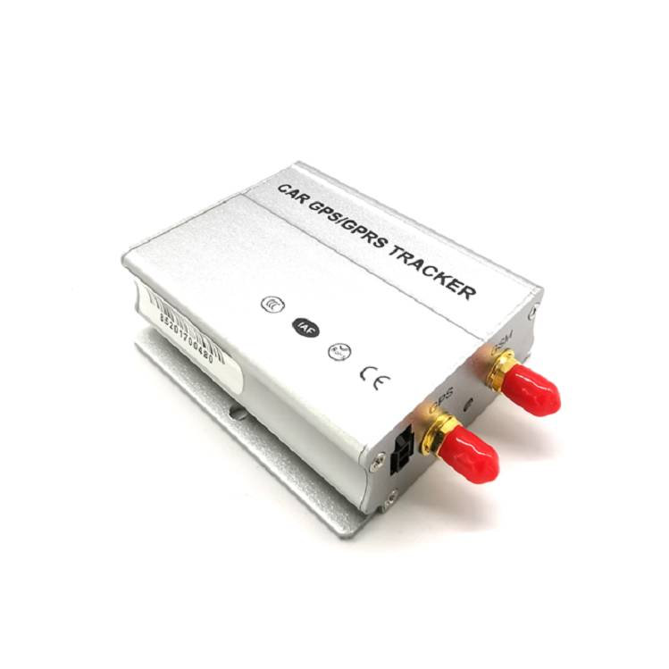

# ThingSys - TS-V1

# TS-V1 Professional Vehicle GPS Tracker

El TS-V1 es un rastreador GPS compacto cableado diseñado para la gestión profesional de flotas, la prevención de robos y la telemetría de vehículos. Diseñado para instalación en vehículos comerciales, maquinaria de construcción, coches de alquiler y vehículos privados, el TS-V1 ofrece un seguimiento en tiempo real fiable, geocercas, estadísticas de kilometraje y funciones de control remoto como el corte de combustible y de energía y alarmas SOS. Su diseño robusto, su amplio rango de voltaje de operación y su batería de respaldo extraíble lo hacen apto para la operación continua de la flota.

Listo para Plaspy fuera de la caja, el TS-V1 se integra con plataformas de posicionamiento en línea de terceros mediante ajustes configurables de IP/puerto y soporta tanto SMS como control/comando basado en plataformas. Esto facilita añadir este rastreador GPS a su configuración de Plaspy para un seguimiento centralizado en tiempo real, gestión de flotas, respuesta ante robos e informes de telemetría.

## Aspectos destacados

- Compatible con Plaspy: IP/puerto configurables y protocolos compatibles con la plataforma para una integración fluida con los paneles y alertas de Plaspy.
- Seguimiento en tiempo real: chip GNSS SiRF III o U‑blox de alta sensibilidad que ofrece aproximadamente 5 m de precisión de ubicación para actualizaciones fiables.
- Amplio soporte celular: 2G/3G/4G \(bandas dependen del país de destino\) para opciones de conectividad global.
- Listo para gestión de flotas: estadísticas de kilometraje, monitoreo de ACC/encendido y alertas de exceso de velocidad para apoyar la visibilidad operativa y la generación de informes.
- Antirrobo y control remoto: alarma SOS, compatibilidad con los sistemas antirrobo originales del vehículo y salidas de corte remoto de combustible y energía.
- Diseño de energía robusto: entrada de DC 9–36 V; batería de respaldo interna recargable de 3.7 V / 600 mAh Li‑ion \(utilizada como respaldo\).
- I/O flexible y sensores: múltiples entradas digitales, una entrada analógica de combustible y sensores de temperatura de opción para telemetría ampliada.

## Cómo funciona con Plaspy

La integración del TS-V1 con Plaspy permite una visión unificada de la ubicación y el estado del vehículo. Instale la unidad cableada en el vehículo, conecte las antenas GPS y GSM suministradas, configure el dispositivo para apuntar a su servidor Plaspy \(modifique IP y puerto si es necesario\) y la unidad cargará datos de posición y eventos en tiempo real. Plaspy se encargará de la visualización, la gestión de geocercas, las alertas y los informes históricos.

- Actualizaciones de ubicación y telemetría en tiempo real enviadas a Plaspy para seguimiento en mapa en vivo y reproducción histórica.
- Monitoreo del estado ACC/encendido para eventos de motor encendido/apagado y cálculo preciso del kilometraje.
- Monitoreo de combustible a través de la entrada analógica para sensores de combustible \(p. ej., TS-C11\) para telemetría de combustible y informes de consumo.
- Salidas de corte remoto para circuitos de combustible o energía—use comandos de Plaspy o SMS para inmovilizar un vehículo cuando sea necesario.
- Notificaciones de SOS, movimiento, exceso de velocidad y violaciones de geocerca reenviadas a Plaspy para alertas inmediatas al operador.
- Monitoreo remoto de voz y compatibilidad con alarmas de antirrobo del vehículo para mejorar los flujos de recuperación y verificación de incidentes.

## Resumen técnico

| Conectividad | 2G / 3G / 4G \(el modelo/las bandas dependen del país de destino\) |
| --- | --- |
| Bandas | Bandas celulares dependientes del país \(configurables por modelo\) |
| Potencia y Batería | Voltaje de funcionamiento DC 9V–36V; batería interna recargable de respaldo extraíble de 3.7V / 600 mAh Li‑ion \(utilizada como respaldo\) |
| Interfaces | 3 entradas digitales \(incluyendo ACC\), 1 entrada de sensor de temperatura \(TS-C5\), 1 entrada SOS/puerta abierta; 2 salidas digitales \(corte remoto de combustible/energía\); 1 entrada analógica para sensores de combustible \(p. ej., TS-C11\) |
| GNSS | Chip GNSS SiRF III o U‑blox; sensibilidad -159 dBm; precisión aprox. 5 m; TTFF: Hot 1 s, Warm 35 s, Cold 45 s, Reacquisition 0.1 s |
| Bluetooth | No listado en las especificaciones del dispositivo |
| Gestión Remota | IP y puerto configurables; admite comandos SMS y de plataforma en línea para configuración remota y acciones |
| Forma y Medio Ambiente | Dimensiones 95 × 75 × 25 mm; Peso 0.459 kg; Temperatura de funcionamiento -20°C a +70°C; Almacenamiento -40°C a +85°C; Humedad 5%–95% sin condensación |

## Casos de uso

- Gestión de flotas: seguimiento en tiempo real, informes de kilometraje y alertas de exceso de velocidad para optimizar rutas y comportamiento del conductor.
- Antirrobo y recuperación: alarma SOS, compatibilidad con sistemas antirrobo del vehículo y corte remoto de combustible/energía para una respuesta rápida.
- Diagnóstico remoto y telemetría: estado ACC, entrada analógica de combustible y sensores de temperatura opcionales para telemetría continua del estado del vehículo y consumo de combustible.
- Maquinaria de construcción y vehículos especializados: rango operativo robusto y amplio rango de voltaje hacen que el TS-V1 sea adecuado para equipos pesados y flotas de uso especial.
- Vehículos de alquiler y compartidos: geocerca, alertas de movimiento y inmovilización remota ayudan a hacer cumplir las políticas de uso y a reducir el uso indebido.

## Por qué elegir este rastreador con Plaspy

Emparejar el TS-V1 con Plaspy ofrece a los operadores de flotas una solución confiable y fácil de integrar para el seguimiento en tiempo real, telemetría y control antirrobo. El conjunto profesional de E/S \(ACC, entrada analógica de combustible, SOS, salidas digitales\) y las configuraciones de conectividad configurables permiten una rápida incorporación en flotas gestionadas por Plaspy sin cambios complejos de firmware. Obtiene posicionamiento GNSS preciso, alertas basadas en eventos y actuación remota \(corte de combustible/energía\) que Plaspy puede convertir en flujos de trabajo automatizados, informes y alertas para el operador. Esta combinación facilita la gestión escalable de flotas, refuerza las defensas anti-robo y centraliza la telemetría del vehículo para decisiones operativas más informadas.

