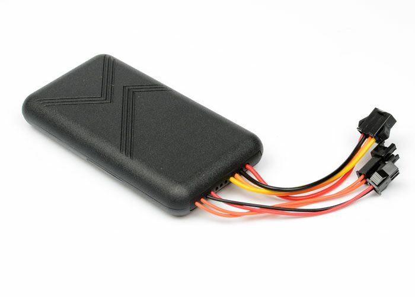

# ThingSys - TS-V6H

El TS-V6H es un rastreador GPS robusto, compatible con Plaspy, diseñado para un posicionamiento de vehículos fiable, seguimiento en tiempo real y gestión de flotas. Construido alrededor de un receptor UBLOX GNSS, con soporte para rangos de voltaje de vehículo amplios y conectividad GPRS/SMS, el TS-V6H proporciona actualizaciones de ubicación continuas, detección de manipulación y funciones de control remoto que se integran directamente con Plaspy para telemática de flotas y flujos de trabajo de anti-robo.

Ideal para flotas mixtas, vehículos de alquiler y operadores preocupados por la seguridad, el TS-V6H ofrece telemetría práctica: detección de ignición, alertas de manipulación basadas en vibración, seguimiento de la batería de respaldo y corte remoto de potencia/circuito mediante relé, lo que facilita añadir monitoreo, alertas y operaciones basados en Plaspy sin necesidad de cambios de hardware.

## Aspectos clave

- Rastreador GPS compatible con Plaspy que ofrece un seguimiento fiable en tiempo real mediante GPRS y consultas de ubicación por SMS.
- Chip UBLOX GNSS de alta sensibilidad \(−159 dBm\) con precisión típica de posicionamiento alrededor de 5 metros.
- Entrada de 9–75 VDC para conexión directa a coches, camiones y otros vehículos; batería de respaldo integrada de 3.7 V / 200 mAh para seguimiento durante cortes de energía.
- Sensor de vibración y detección de ignición ACC para alertas anti-robo y telemetría basada en la ignición.
- Corte remoto de potencia/circuito mediante control por relé que permite intervenciones al estilo inmovilizador cuando sea necesario.
- Compatibilidad con micrófono externo y opción SOS para flujos de emergencia y respuesta cuando lo permita la normativa.
- Formato compacto y ligero para uso automotriz \(94 × 45 × 14 mm, 85 g\) para una instalación discreta.

## Cómo funciona con Plaspy

El TS-V6H se integra en Plaspy utilizando informes GPRS estándar y la compatibilidad con SMS como respaldo. Las fijaciones de posición del módulo UBLOX GNSS se reportan a Plaspy a través de la conexión celular en tiempo real, mientras que los sensores integrados y las entradas digitales proporcionan telemetría sobre el estado del vehículo y la monitorización de seguridad. Plaspy procesa la ubicación y los mensajes de estado del rastreador y los convierte en mapas en vivo, reglas de alerta y informes históricos.

- Actualizaciones de ubicación y telemetría en tiempo real enviadas por GPRS; la consulta de ubicación por SMS es compatible como respaldo.
- Informe del estado de ignición \(ACC\) para eventos de encendido/apagado y perfilado de la actividad del conductor.
- Sensor de vibración y detección de pérdida de energía para alertas de manipulación y anti-robo.
- Corte remoto de potencia/circuito mediante control por relé para realizar acciones al estilo inmovilizador cuando esté autorizado.
- Soporte de SOS y micrófono externo disponible para flujos de emergencia y monitoreo de audio cuando esté permitido.

## Resumen técnico

| Modelo | TS-V6H |
| --- | --- |
| Conectividad | GSM/GPRS \(datos móviles y SMS\) |
| Bandas | 850 / 900 / 1800 / 1900 MHz |
| Potencia y Batería | Entrada de tensión 9–75 VDC; batería de respaldo Li‑ion integrada de 3.7 V, 200 mAh para seguimiento durante cortes de energía |
| Interfaces | Sensores de vibración, entrada de ignición ACC, soporte para micrófono externo, función SOS opcional, control por relé para corte remoto de potencia/circuito |
| GNSS | Chip UBLOX GNSS; sensibilidad −159 dBm; precisión típica ~5 m; TTFF Frío 35–80 s, Templado ~35 s, Caliente ~1 s |
| Condiciones de operación | Temperatura de operación −20°C a +55°C; Almacenamiento −40°C a +85°C; Humedad 5%–95% sin condensación |
| Forma y peso | Dimensiones 94 × 45 × 14 mm; Peso 85 g \(rastreador automotriz compacto\) |
| Informes | Posicionamiento GPS continuo con reporte GPRS; consultas de ubicación por SMS compatibles |

## Casos de uso

- Gestión de flotas — seguimiento en tiempo real continuo y telemetría de ignición para supervisión de rutas y registro de turnos del conductor.
- Protección anti-robo — alertas de manipulación por vibración, detección de pérdida de energía y corte remoto por relé para inmovilización.
- Servicios de alquiler y uso compartido de vehículos — historial de ubicación, seguimiento temporal y opciones de desactivación remota para asegurar los activos entre alquileres.
- Respuesta a emergencias — función SOS opcional y soporte para micrófono externo para audio remoto y flujos de trabajo de emergencia donde lo permita la normativa local.
- Localización y monitorización general de vehículos — formato compacto para instalación discreta y posicionamiento fiable en entornos mixtos.

## Por qué elegir este rastreador con Plaspy

Cuando se asocia con Plaspy, el TS-V6H se convierte en un componente rentable dentro de una pila de telemática moderna. Su precisión GNSS UBLOX y su reporte continuo por GPRS ofrecen un seguimiento en tiempo real fiable, mientras que el soporte de energía propio del vehículo y una batería de respaldo aseguran la continuidad de la telemetría durante eventos de energía. La entrada ACC y el sensor de vibración proporcionan entradas esenciales para la gestión de la flota y las reglas anti-robo, y el corte remoto de potencia/circuito controlado por relé admite intervenciones al estilo inmovilizador cuando se requieren.

La implementación compatible con Plaspy del TS-V6H es sencilla: utilice GPRS para actualizaciones en tiempo real, SMS como respaldo y aproveche las alertas e informes de Plaspy para casos de telemática como integraciones de monitoreo de combustible y programación de mantenimiento. Aunque el TS-V6H se centra en un rastreo robusto del vehículo en lugar de sensores Bluetooth a bordo, integrarlo con Plaspy permite combinar dispositivos de telemetría basados en BLE cuando sea necesario para ampliar capacidades como monitoreo de temperatura o fusión avanzada de sensores.

