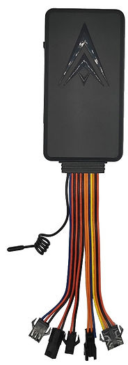

# ThingSys - TS-V6Ws

El TS-V6Ws es un rastreador GPS vehicular multifuncional pensado para despliegues a nivel mundial. Está construido alrededor de un receptor GNSS de alta sensibilidad que ofrece una captura de posición fiable, y su amplio rango de voltaje de entrada y diseño compacto lo hacen adecuado para una variedad de vehículos. El equipo incorpora conectividad celular moderna con opciones de respaldo y permite configurar los intervalos de reporte según distintos perfiles operativos.

Listado aquí como compatible con Plaspy, el TS-V6Ws se integra de forma natural en flujos de monitoreo en la nube para flotas y activos. Su combinación de seguimiento en tiempo real, modos de traza configurables y soporte para alarmas e entradas de sensores lo convierte en una opción práctica para organizaciones que desean integrar la telemetría vehicular con Plaspy para mapas, alertas e informes.

## Aspectos principales

- Rastreador compatible con Plaspy, indicado para monitoreo de flotas y activos en distintas regiones.
- Conectividad principal 4G LTE con respaldo 2G para mayor cobertura donde esté disponible.
- Posicionamiento GNSS de alta sensibilidad diseñado para captar señales satelitales rápidas y mantener la fijación en ubicaciones con señal débil.
- Amplio rango de voltaje de entrada y factor de forma compacto para adaptarse a autos, camiones y maquinaria pesada.
- Soporte para intervalos de reporte configurables que permiten equilibrar actualizaciones en tiempo real y telemetría periódica más económica.
- Entradas de eventos y alarmas integradas para exceso de velocidad, detección de vibraciones, estado de ignición y eventos SOS.
- Posibilidad de ampliar con sensores cableados de combustible y temperatura, además de integraciones opcionales de cámara y monitoreo de voz.

## Cómo funciona con Plaspy

Al emparejarse con Plaspy, el TS-V6Ws envía datos de ubicación, estado y alarmas a la plataforma de Plaspy, donde la información se vuelve accionable mediante mapas en vivo, alertas automatizadas e informes históricos. Los usuarios de Plaspy pueden elegir modos de monitoreo que se ajusten a sus necesidades operativas y de presupuesto, desde seguimiento continuo hasta subidas periódicas de trazas para análisis a largo plazo.

- Actualizaciones de ubicación y telemetría en tiempo real entregadas a Plaspy con respaldo de red para mayor cobertura.
- Reporte de estado de ignición o ACC para detección de viajes, monitoreo de actividad del conductor y registro automático de eventos.
- Alarmas por exceso de velocidad, vibración y SOS que generan notificaciones inmediatas para los operadores mediante el sistema de alertas de Plaspy.
- Intervalos de reporte configurables para optimizar uso de datos y duración de batería en el monitoreo de activos a largo plazo.
- Soporte para entradas de sensores cableados de combustible y temperatura, y opciones de cámara o voz para aportar contexto en incidentes.

## Casos de uso típicos

- Gestión de flotas con vehículos mixtos donde el amplio rango de voltaje y el hardware compacto facilitan la instalación.
- Flujos de trabajo antirobo y recuperación que utilizan alertas por vibración, entrada SOS y control tipo inmovilizador remoto cuando se combina con relés opcionales.
- Monitoreo de combustible y consumo integrando sensores de nivel de combustible cableados y utilizando los informes de Plaspy para detectar anomalías.
- Auditoría de incidentes y mejora de la conciencia situacional con cámara opcional y monitoreo bidireccional de voz para revisión después de eventos.
- Despliegues regionales que requieren variantes de conectividad configurables según la disponibilidad de redes locales.

## Por qué elegir este rastreador con Plaspy

El TS-V6Ws ofrece un equilibrio entre flexibilidad de hardware y funciones que responden a requisitos habituales de flotas y seguridad. Su soporte para conectividad celular moderna con respaldo, receptor GNSS sensible y variedad de entradas para alarmas y sensores lo convierten en un nodo telemático versátil para vehículos de distintas clases. Para los equipos que usan Plaspy, el rastreador entrega datos en formatos que la plataforma puede mostrar en mapas, alertas e informes para mejorar la visibilidad y la toma de decisiones operativas.

Si desea explorar cómo encaja el TS-V6Ws en su entorno telemático, conozca más sobre Plaspy y las capacidades de la plataforma en https://www.plaspy.com. Las especificaciones del producto, disponibilidad y detalles del fabricante pueden cambiar con el tiempo, por lo que le recomendamos verificar la información técnica vigente en la documentación oficial de ThingSys en https://www.thingsys.com/.
