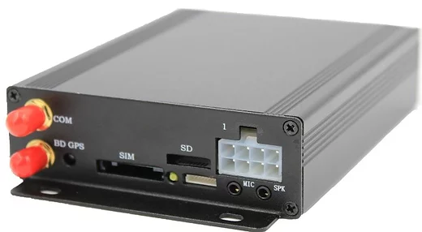

# ThingSys - TS-V7

El TS-V7 de ThingSys es un rastreador GPS profesional y compacto diseñado para la seguridad del vehículo, la protección y la gestión de flotas. Ofrece posicionamiento y seguimiento a través de redes 2G, 3G y 4G y puede supervisarse desde una plataforma en línea o mediante un smartphone. Entre las funciones principales que destaca el fabricante están un botón de alarma de emergencia con envío de alertas a números autorizados, control remoto del circuito de combustible y del encendido, monitoreo de audio remoto mediante llamada, alertas por movimiento y exceso de velocidad, geocercas, estadísticas de kilometraje, detección de encendido y corte de alimentación.

Como dispositivo compatible con Plaspy, el TS-V7 puede enviar datos de ubicación y eventos en tiempo real a Plaspy para una supervisión consolidada de la flota. Los usuarios de Plaspy pueden integrar la información del TS-V7 en mapas, paneles y reportes dentro de la plataforma para mejorar la visibilidad de vehículos y activos. Además, dado que el TS-V7 admite accesorios adicionales como sensores de combustible, sensores de temperatura, pantallas LED y lectores RFID, puede utilizarse con Plaspy para enriquecer la telemática operativa y los informes cuando esos insumos estén disponibles.

## Principales características

- Conectividad celular multigeneración para seguimiento remoto y actualizaciones de ubicación
- Alarma de emergencia con distribución de alertas a contactos preautorizados para una respuesta más rápida
- Capacidad de monitoreo de audio remoto para mayor conocimiento situacional alrededor del vehículo
- Funciones centralizadas como alertas por geocerca, notificaciones de exceso de velocidad y registro de kilometraje
- Control remoto del circuito de combustible y funciones de encendido para apoyar la gestión operativa
- Expandible con accesorios como sensores de combustible y temperatura e integración de lector RFID

## Cómo funciona con Plaspy

Al integrarse con Plaspy, el TS-V7 entrega información de posición y eventos a la plataforma, de modo que los equipos de operaciones puedan supervisar los vehículos desde una única interfaz. Plaspy agrega los datos del rastreador y los hace accionables junto con otras entradas de la flota.

- Visualización de ubicaciones en tiempo real e históricas para revisar rutas y reproducir recorridos
- Alertas y notificaciones en Plaspy para exceso de velocidad, violaciones de geocerca y alarmas de emergencia
- Paneles de flota que muestran resúmenes de kilometraje y recuentos de eventos para supervisión operativa
- Monitoreo consolidado de eventos activados por audio remoto y condiciones de alarma
- Uso de entradas de accesorios reportadas por el rastreador para mejorar los informes y la gestión de activos

## Casos de uso típicos

- Operadores de flota que requieren seguimiento de ubicación y kilometraje para programación y despacho
- Escenarios de seguridad donde la alarma de emergencia y el monitoreo de audio remoto aumentan la conciencia situacional
- Gestión de combustible mediante control remoto y sensores compatibles para supervisión del consumo
- Programas de alquiler o vehículos compartidos que necesitan geocercas y detección de encendido para hacer cumplir políticas
- Operaciones de servicio en campo o reparto que requieren seguimiento consolidado y reportes de eventos

## Por qué elegir este rastreador con Plaspy

El TS-V7 es una opción práctica para organizaciones que buscan un rastreador de vehículo con muchas funciones que se integre con una plataforma de gestión de flotas completa. Su combinación de informes de posición, alertas, control remoto y soporte de accesorios lo hace adecuado para una amplia variedad de flujos de trabajo de flota y seguridad. Al combinar el hardware TS-V7 con Plaspy, usted obtiene una vista centralizada de ubicaciones, eventos y telemetría básica que apoya las operaciones diarias y la respuesta ante incidentes.

Si está evaluando opciones, vale la pena considerar el TS-V7 cuando necesite un equipo que ofrezca las funciones comunes de rastreo de vehículos y que pueda integrarse con Plaspy para monitoreo, reportes y alertas. Para conocer más sobre Plaspy y cómo se usan los rastreadores compatibles en la plataforma visite https://www.plaspy.com. Las especificaciones del producto, la disponibilidad y los detalles del fabricante pueden cambiar con el tiempo, por lo que le recomendamos verificar las especificaciones actuales y el soporte de accesorios en el sitio oficial de ThingSys https://www.thingsys.com/
