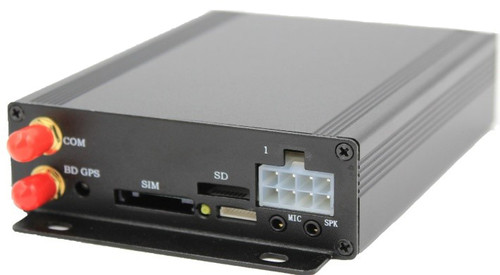

# ThingSys - TS-V9

El TS-V9 es un rastreador GPS profesional para vehículos de ThingSys, diseñado para implementaciones exigentes y orientadas al uso en unidades móviles. Está pensado para gestión de flotas, logística, vehículos de alquiler, autobuses y otras aplicaciones vehiculares especializadas. El equipo combina conectividad celular de varias generaciones con un receptor GNSS Ublox7 Compass y una serie de funciones de telemetría y seguridad vehicular para ofrecer reportes de posición continuos y datos operativos aptos para instalaciones profesionales.

Como dispositivo compatible con Plaspy, el TS-V9 puede transmitir ubicación, alertas y telemetría de vehículo a la plataforma Plaspy para soportar seguimiento en vivo, informes históricos y notificaciones automatizadas. Su combinación de reportes a plataforma y control vía SMS proporciona a las organizaciones vías de integración flexibles al incorporar el TS-V9 en una solución de monitoreo de flotas basada en Plaspy.

## Características principales

- Diseñado para uso profesional en vehículos, con protecciones robustas y alimentación de respaldo para mantener la operación ante cortes de energía.
- Conectividad celular multigeneración para reportes a la plataforma y control directo por SMS o llamadas donde esté disponible.
- Rendimiento GNSS Ublox7 Compass para posicionamiento fiable con orientación de precisión proporcionada por el fabricante.
- Soporte de telemetría vehicular, incluyendo detección de encendido, estadísticas de kilometraje, alertas por exceso de velocidad y alarma de pánico.
- Funciones de control remoto para inmovilizador y gestión de circuitos que apoyan flujos de trabajo de antirrobo y respuesta ante emergencias.
- Entradas/salidas profesionales y buses de comunicación, además de soporte opcional para sensores de combustible e integración RFID para telemetría extendida.
- Soporte de actualización de firmware OTA y opciones de configuración remota para simplificar el mantenimiento del equipo a lo largo del tiempo.

## Cómo funciona con Plaspy

El TS-V9 transmite posición y telemetría vehicular a través de enlaces celulares o mediante comandos por SMS, lo que permite a Plaspy ingerir esos flujos de datos y mostrarlos en vistas de mapa, reportes y flujos de alertas. Una vez conectado a Plaspy, el equipo habilita visibilidad operativa y manejo automatizado de eventos comunes de la flota.

- Posiciones en mapa en tiempo real y actualizaciones periódicas de ubicación para visibilidad de la flota y soporte de despacho.
- Datos de encendido y kilometraje disponibles en Plaspy para informes de utilización y planificación de mantenimiento.
- Información sobre nivel y consumo de combustible cuando se conectan sensores OEM compatibles, alimentando los paneles de Plaspy.
- Acciones de inmovilizador y control de circuitos a distancia coordinadas mediante notificaciones de Plaspy y flujos de trabajo del operador.
- Entrega automática de alertas de pánico, exceso de velocidad y geovallas a Plaspy para respuesta rápida del operador y registro.

## Casos de uso típicos

- Seguimiento de flotas comerciales para visibilidad, verificación de rutas y análisis de utilización.
- Monitoreo y recuperación de vehículos de alquiler mediante funciones de inmovilizador y alertas.
- Telemetría para autobuses y vehículos especializados cuando se requiere integración con sistemas a bordo.
- Respuesta antirrobo y inmovilización remota para vehículos de alto valor o con riesgo elevado.
- Programas de monitoreo de combustible y eficiencia cuando se integra con sensores de combustible compatibles.

## Por qué elegir este rastreador con Plaspy

El TS-V9 está indicado para organizaciones que requieren un núcleo de rastreo vehicular robusto con un conjunto amplio de funciones para telemetría y seguridad de flota. Sus protecciones de hardware, reportes celulares multigeneración y posicionamiento GNSS lo convierten en una opción práctica para despliegues que demandan actualizaciones de ubicación consistentes y datos de vehículo. Para equipos que usan Plaspy, el TS-V9 aporta entradas de telemetría y capacidades de control remoto que permiten flujos de despacho, alertas y mantenimiento dentro de la plataforma Plaspy.

Aunque el TS-V9 ofrece muchas capacidades para instalaciones profesionales, las opciones de configuración específicas e integraciones de sensores opcionales dependerán de las necesidades operativas de cada flota. Plaspy puede ingerir los datos del dispositivo y presentarlos junto con otras fuentes de la flota para proporcionar una vista operativa unificada.

Si desea conocer más sobre cómo el TS-V9 puede integrarse con Plaspy, visite https://www.plaspy.com para información sobre producto y plataforma. Las especificaciones del producto, disponibilidad y detalles del fabricante pueden cambiar con el tiempo, por lo que le recomendamos verificar la información técnica vigente y la guía de instalación en el sitio del fabricante https://www.thingsys.com/ antes de la adquisición o el despliegue.
