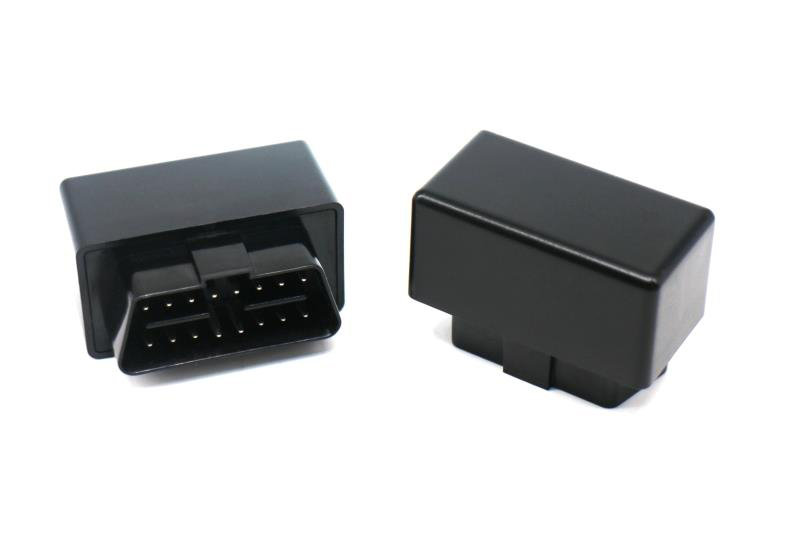

# ThingSys - TS-VB20

El TS-VB20 es un rastreador OBDII plug and play de ThingSys diseñado para instalación rápida y telemetría inmediata del vehículo. Se conecta directamente al puerto OBDII del vehículo para ofrecer posicionamiento GPS en tiempo real, opciones de posicionamiento híbrido y acceso directo a datos de diagnóstico del ECU, de modo que usted pueda monitorear ubicación, comportamiento de conducción y aspectos básicos del estado del vehículo sin configuraciones complejas.

Como dispositivo compatible con Plaspy, el TS-VB20 permite a administradores de flota y propietarios particulares integrar telemetría a nivel OBD dentro de la plataforma Plaspy. Cuando lo integre, la unidad transmite datos de ubicación y telemetría derivados del ECU a Plaspy para monitoreo en vivo, alertas e informes, lo que lo hace adecuado para supervisión de flotas, flujos de trabajo antirobo y diagnósticos básicos del vehículo dentro de los paneles de Plaspy.

## Características principales

- Factor de forma OBDII plug and play para instalación sin herramientas y despliegue rápido
- Posicionamiento en tiempo real GPS, AGPS y LBS con precisión típica alrededor de 10 metros
- Acceso directo al ECU para diagnóstico y telemetría básica que respaldan revisiones del estado del vehículo
- Detección de eventos de conducción y estimación de consumo de combustible para apoyar la seguridad y el control de costos
- Alertas de geocerca, reproducción de viajes y alarmas por manipulación para mejorar la seguridad y la visibilidad operativa
- Monitoreo del estado de batería e ignición para distinguir períodos estacionados y en circulación y generar alertas de batería
- Comunicación GPRS de grado industrial para transmisión continua de telemetría

## Cómo funciona con Plaspy

Cuando lo conecta a Plaspy, el TS-VB20 transmite ubicación y telemetría derivada del ECU a la plataforma para que usted pueda ver el estado en tiempo real, recibir alertas y generar informes históricos. Plaspy ingiere las actualizaciones de posicionamiento y diagnóstico y las presenta junto con datos de geocercas y viajes para una supervisión operativa unificada.

- Actualizaciones de posición en tiempo real para seguimiento en vivo y visualización en mapas
- Diagnósticos ECU y detección de eventos de conducción para monitoreo del comportamiento del conductor y revisiones de seguridad
- Creación de geocercas y alertas instantáneas de entrada/salida, además de reproducción de viajes para auditoría y cumplimiento
- Alertas por manipulación y monitoreo de batería del vehículo para soportar flujos antirobo y de mantenimiento
- Detección del estado de ignición para separar periodos de conducción y estacionamiento y lograr una segmentación de viajes precisa

## Casos de uso típicos

- Gestión de flotas y supervisión de rutas para vehículos de reparto y servicios
- Protección antirobo mediante geocercas, alertas por manipulación y control de batería
- Monitoreo de vehículos en garantía o financiados con ubicación continua y telemetría ECU
- Control de combustible y costos operativos mediante estimaciones basadas en datos del ECU y reportes de viajes
- Rastreo de vehículos particulares para compartir ubicación, historial de viajes e información básica del estado del vehículo

## Por qué elegir este rastreador con Plaspy

El TS-VB20 ofrece un camino de baja fricción hacia una telemetría vehicular más completa dentro de Plaspy. Su diseño plug and play OBDII reduce el tiempo de despliegue, a la vez que brinda acceso al ECU para diagnósticos y estimaciones de combustible que van más allá del seguimiento GPS básico. Este equilibrio entre simplicidad y datos prácticos del vehículo lo hace adecuado tanto para flotas como para propietarios individuales que desean información accionable sin instalaciones de hardware complejas.

Al emparejar el TS-VB20 con Plaspy, usted obtiene seguimiento en tiempo real, alertas de geocercas y antirobo, análisis de comportamiento del conductor e informes consolidados en una sola plataforma. Si necesita configuración rápida, telemetría continua y mayor visibilidad operativa, el TS-VB20 es una opción compatible con Plaspy a considerar. Conozca más sobre Plaspy en el sitio principal https://www.plaspy.com y verifique las especificaciones y disponibilidad actuales en el sitio del fabricante https://www.thingsys.com ya que los detalles y ofertas pueden cambiar con el tiempo.
