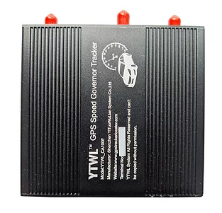

# ThingSys - YTWL_CA100F

El limitador de velocidad del vehículo YTWL\_CA100F de ThingSys es un equipo terminal inteligente que ofrece una limitación precisa de la velocidad para los vehículos. No solo es un limitador de velocidad, sino también un rastreador GPS profesional multifuncional para vehículos.

Este producto utiliza un chip inteligente ARM, lo que garantiza una alta precisión en el control de velocidad y un rendimiento confiable. No afectará el arranque del acelerador ni el par de potencia, ya que solo limita la velocidad máxima y permite que el pedal del acelerador se mueva libremente dentro del rango de velocidad correcto.

El YTWL\_CA100F cuenta con una amplia variedad de interfaces y puede funcionar junto con varios equipos externos, lo que le brinda una alta compatibilidad y rendimiento.

Características destacadas:

- Chip inteligente ARM para un control de velocidad preciso
- Rastreador GPS profesional multifuncional
- Alta compatibilidad y rendimiento con una amplia variedad de equipos externos
- Interfaz de usuario amigable
- Resistente a interferencias
- Peso ligero y dimensiones compactas
- Batería recargable de iones de litio de larga duración
- Amplio rango de voltaje de trabajo
- Amplio rango de temperatura de operación y almacenamiento
- Alta sensibilidad y precisión GPS

Especificaciones técnicas:

- Dimensiones: 117 \* 92 \* 31 mm
- Peso: 280 g
- Red: GSM / GPRS / GPS
- Banda: 850/900/1800/1900 MHz
- Chip de GPS: U-blox
- Módulo GSM / GPRS: SIM800C
- Módulo Bluetooth: BT360I
- UPC: STM32F105RBT6
- IC de potencia: TD1509-ADJ
- Eliminación de interferencias: Dispositivo completo reforzado Anti-jamming
- Sensibilidad GPS: -159dBm
- Precisión GPS: aproximadamente 5 m
- Voltaje de trabajo: DC 9V - 36V
- Batería: Batería recargable de iones de litio de 3,7 V / 1000 mAh \(personalizable\)
- Corriente de trabajo en espera: \<40 mA
- Temperatura de almacenamiento: -40 °C hasta + 85 °C
- Temperatura de operación: -20 °C hasta + 70 °C
- Humedad: 5% - 95% sin condensación

