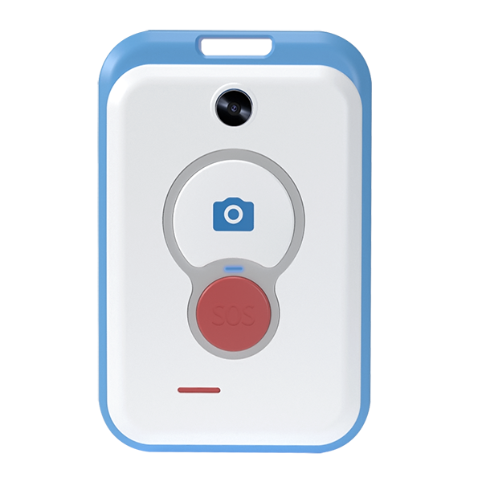

# ThinkRace - Traxbean Palm

El Traxbean Palm es un rastreador GPS compacto y de mano, diseñado para la seguridad del personal y la conciencia situacional. Compatible con Plaspy desde el primer momento, el Palm ofrece posicionamiento GPS preciso junto con localización asistida mediante triangulación Wi‑Fi y celular y posicionamiento interior basado en RF, para brindar rastreo fiable en tiempo real y un contexto claro de incidentes para familiares, centros de control o equipos de operaciones.

El Palm está diseñado para una respuesta rápida e informada: un botón SOS de un solo toque establece una llamada de voz bidireccional manos libres de inmediato, y una cámara de alta resolución puede transmitir o capturar fotos y video a demanda o automáticamente cuando se activa un SOS. Con conectividad 4G/LTE, alertas de audio, sirena y alarmas por vibración, además de opciones SDK/Open API y soporte de la plataforma ThinkRace, el Traxbean Palm es un dispositivo de monitoreo práctico y de menor costo para servicios que requieren confirmación rápida y visual y telemetría continua.

## Aspectos clave

- Rastreador GPS de mano compatible con Plaspy para un seguimiento claro y fiable en tiempo real de personas y personal de campo.
- Posicionamiento multimodo: posicionamiento por GPS, además de triangulación por Wi‑Fi y celular para fijaciones más rápidas y localización interior por RF cuando GPS es débil.
- SOS instantáneo con voz bidireccional manos libres y captura automática de cámara para entregar contexto de audio y visual a contactos de emergencia y centros de control.
- Conectividad 4G/LTE para actualizaciones continuas, alertas de empuje y telemetría de baja latencia en el campo.
- Sirena audible integrada, alertas de audio y vibración para aumentar la seguridad del usuario y facilitar intervenciones rápidas.
- SDK y Open API para una fácil integración en los flujos de trabajo de Plaspy, paneles empresariales y apps personalizadas.
- Compatible con la plataforma web ThinkRace y apps nativas para Android/iOS para monitoreo, configuración y gestión del dispositivo.

## Cómo funciona con Plaspy

Al registrarse en Plaspy, el Traxbean Palm transmite datos de posición y eventos a través de 4G/LTE, de modo que los equipos de operaciones obtienen un seguimiento casi en tiempo real y actualizaciones de incidentes. Plaspy ingiere fijaciones GPS, señales de ubicación asistida y eventos SOS, y luego utiliza reglas, geocercas y flujos de notificaciones para enrutar alertas y datos visuales a los respondedores designados. La integración se simplifica mediante el soporte SDK y Open API del Palm, lo que permite paneles de telemetría personalizados, flujos de incidentes automatizados y gestión remota segura.

- Actualizaciones de ubicación y telemetría en tiempo real: fijaciones GPS junto con posiciones asistidas por Wi‑Fi y celular para una mejor disponibilidad en entornos urbanos e interiores.
- Manejo de voz bidireccional y eventos SOS: llamadas manos libres inmediatas y señales de evento enrutadas a los flujos de incidentes de Plaspy.
- Verificación visual: captura remota de fotos/videos desde la cámara del dispositivo para decisiones más rápidas y mejor informadas durante emergencias.
- Inclusión/exclusión de geocercas: alertas de entrada/salida enviadas a Plaspy para monitoreo por zonas y notificaciones automatizadas.
- Ignición/inmovilizador/monitoreo de combustible y sensores Bluetooth: estas funciones de telemetría centradas en vehículos no están disponibles de forma nativa en este dispositivo de mano; sin embargo, Plaspy puede combinar los datos del Palm con rastreadores de vehículos que suministran la ignición, el inmovilizador y el monitoreo de combustible para proporcionar una vista operativa unificada.

## Resumen técnico

| Conectividad | 4G/LTE; triangulación Wi‑Fi y celular para localización asistida |
| --- | --- |
| Bandas | No especificadas en la descripción del dispositivo |
| Potencia y batería | Dispositivo de mano alimentado por batería; capacidad de la batería y duración no especificadas |
| Interfaces | Botón SOS de un solo toque, voz en vivo bidireccional, alertas de audio, sirena, vibración, control remoto de la cámara |
| GNSS / Posicionamiento | Posicionamiento GPS más localización asistida vía triangulación Wi‑Fi y celular; posicionamiento interior basado en RF |
| Cámara | Cámara de alta resolución para captura remota de fotos/video y streaming activado por SOS |
| Bluetooth | No especificado; el dispositivo admite posicionamiento interior por RF \(sensores Bluetooth no confirmados\) |
| Gestión remota | SDK y Open API disponibles; compatible con la plataforma web ThinkRace y apps nativas para Android/iOS |
| Forma y tamaño | De mano, diseñado para uso en campo y monitorización de personal |

## Casos de uso

- Seguimiento de emergencias de personas mayores: SOS de un solo toque, voz en vivo y flujo de cámara para ayudar a cuidadores y servicios de emergencia a actuar con rapidez con contexto visual.
- Seguridad de la fuerza de trabajo y protección de trabajadores aislados: seguimiento continuo en tiempo real y alertas instantáneas mejoran la seguridad del personal en campo.
- Supervisión de guardias de seguridad: monitorizar rutas de patrulla, verificar incidentes con fotos/video y coordinar respuestas a través de Plaspy.
- Monitoreo electrónico y cumplimiento: alertas de geocerca y registros de eventos que proporcionan registros auditable para aplicaciones de supervisión.
- Respuesta rápida a incidentes: telemetría visual y de audio acelera la evaluación de alarmas para intervenciones más rápidas y mejor informadas.

## Por qué elegir este rastreador con Plaspy

El Traxbean Palm es un rastreador GPS diseñado específicamente para combinarse con Plaspy cuando las organizaciones requieren monitoreo centrado en las personas, en lugar de telemetría centrada en vehículos. Aporta seguimiento en tiempo real, verificación visual y comunicaciones de voz en una única unidad de mano que es fácil de desplegar y gestionar a través de la plataforma de Plaspy. Para operaciones que ya utilizan Plaspy para la gestión de flotas o telemetría de vehículos \(encendido, inmovilizador, monitorización de combustible\), el Palm complementa esas capacidades al añadir datos fiables de seguridad del personal y contexto visual sin reemplazar a los rastreadores de vehículos.

Elija el Palm con Plaspy cuando su prioridad sea una comunicación fiable en campo, escalamiento rápido de emergencias e integración sencilla. El SDK/Open API incluidos y el soporte de la plataforma ThinkRace reducen el tiempo de despliegue, mientras que los flujos de trabajo de Plaspy convierten los datos brutos del rastreador GPS en alertas accionables, telemetría histórica y supervisión escalable para flotas mixtas de vehículos y dispositivos de mano.

