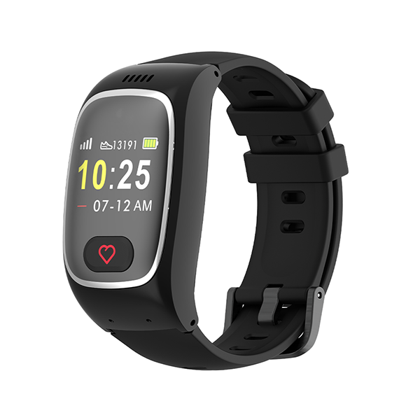

# ThinkRace - Traxbean ST2

# Traxbean ST2 — reloj inteligente para el cuidado de personas mayores compatible con Plaspy

El Traxbean ST2 de ThinkRace es un rastreador GPS ponible diseñado para el cuidado de personas mayores y la supervisión institucional. Construido para un monitoreo de salud continuo y una respuesta rápida ante incidentes, el ST2 combina un posicionamiento cuádruple \(GPS, LBS, Wi‑Fi y Bluetooth\) con telemetría de signos vitales y comunicación bidireccional por voz. Su integración compatible con Plaspy facilita incorporar la telemetría de salud y seguridad a un entorno de monitoreo centralizado.

La compatibilidad con Plaspy garantiza que el seguimiento en tiempo real, las alertas SOS y los datos fisiológicos se integren con sus tableros existentes o con flujos de monitoreo impulsados por Plaspy. Ya sea que opere un programa de atención domiciliaria, una residencia de ancianos o un despliegue mixto de dispositivos, el ST2 ofrece ubicaciones confiables y datos de salud, al tiempo que permite a los integradores utilizar APIs RESTful, empuje directo al servidor o el canal SaaS de ThinkRace para una implementación rápida.

## Aspectos clave

- Posicionamiento cuádruple de alta precisión: GPS, LBS, Wi‑Fi y Bluetooth para mejorar la precisión de ubicación en interiores y exteriores.
- Telemetría continua de salud: frecuencia cardíaca, oxígeno en sangre \(SpO2\), presión arterial y conteo de actividad/pasos.
- Seguridad y manejo de incidentes: detección automática de caídas, alertas de inmovilidad y activación de alarmas SOS.
- Comunicación multimodal: llamadas de voz bidireccionales, mensajes de texto y envío de mensajes de voz para contacto inmediato con el cuidador.
- Compatible con Plaspy: listo para enviar telemetría y ubicación en tiempo real a Plaspy para monitoreo y alertas unificados.
- Opciones de integración para desarrolladores: API RESTful, empuje directo al servidor, SDK y canal SaaS de marca blanca para la personalización.
- Gestión móvil y web: aplicaciones de cliente para Android e iOS, además de una plataforma de monitoreo web para la administración del dispositivo.

## Cómo funciona con Plaspy

Cuando se empareja con Plaspy, el Traxbean ST2 pasa a formar parte de una plataforma unificada de seguimiento y supervisión en tiempo real. Los eventos del dispositivo y la telemetría se transmiten por canales celulares e inalámbricos al backend de ThinkRace o directamente a su servidor, y Plaspy procesa estos datos para ofrecer mapas en vivo, alertas e informes históricos. La configuración compatible con Plaspy admite tanto la visualización inmediata como notificaciones automáticas para cuidadores o equipos de operaciones.

- Actualizaciones de ubicación y telemetría en tiempo real: GPS más LBS/Wi‑Fi/Bluetooth mejoran la precisión en interiores y exteriores para el seguimiento en vivo en los mapas de Plaspy.
- Telemetría de salud y eventos: frecuencia cardíaca continua, SpO2, presión arterial, conteo de pasos, detección de caídas y alertas de inmovilidad se integran en Plaspy para reglas de alerta y paneles.
- SOS y comunicaciones: disparadores de SOS y mensajes de voz/texto bidireccionales generan alertas en Plaspy para que los cuidadores respondan de inmediato.
- Sensores Bluetooth: el soporte BLE permite refinar la ubicación por proximidad e integrarse con beacons Bluetooth u otros sensores auxiliares.
- Rutas de integración flexibles: API RESTful, reenvío directo de datos del dispositivo al servidor o el canal SaaS de marca blanca de ThinkRace permiten a Plaspy recibir los datos de la forma que mejor se adapte a su modelo de despliegue.

## Visión técnica

| Conectividad | Voz y datos celulares para llamadas y envío de mensajes; GPS, LBS, Wi‑Fi y Bluetooth para posicionamiento |
| --- | --- |
| Bandas | No especificado por el fabricante en la descripción proporcionada |
| Potencia & Batería | Batería ponible recargable diseñada para monitorización continua; capacidad y autonomía no especificadas |
| Interfaces | Botón SOS, altavoz y micrófono para voz bidireccional; sensores integrados para frecuencia cardíaca, SpO2, presión arterial y conteo de pasos/actividad; detección de caídas y\_alertas de inmovilidad |
| GNSS | Posicionamiento GPS con complementos LBS, Wi‑Fi y Bluetooth para mejor precisión en interiores |
| Bluetooth | Bluetooth Low Energy \(BLE\) para soporte de sensores y beacons |
| Gestión remota | API RESTful, reenvío directo de datos del dispositivo a servidores de clientes, canal ThinkRace SaaS \(marca blanca\), SDK, apps Android/iOS y plataforma de monitoreo web |
| Forma | Reloj para muñeca destinado a cuidado en el hogar y entornos institucionales |

## Casos de uso

- Cuidado domiciliario y supervisión remota — monitoreo continuo de signos vitales y alertas SOS para personas mayores independientes.
- Residencias y asistencia — monitoreo centralizado de residentes con detección de caídas y alertas de inmovilidad dirigidas al personal a través de Plaspy.
- Navegación en hospitales y centros — mejora del posicionamiento en interiores y exteriores para rastrear pacientes en entornos complejos como hospitales y centros comerciales.
- Comunicación con el cuidador — voz bidireccional y mensajes para una rápida coordinación entre la persona que lleva el dispositivo y los equipos de atención.
- Programas de telemetría integrados — enviar datos fisiológicos y de ubicación a Plaspy para informes, análisis y flujos de cumplimiento.

## Por qué elegir este rastreador con Plaspy

El Traxbean ST2 se centra en la seguridad, telemetría de salud continua y una implementación fácil en entornos supervisados. Elegir el ST2 como dispositivo compatible con Plaspy ofrece claras ventajas: una integración rápida a través de APIs RESTful o del canal SaaS de ThinkRace, valor operativo inmediato gracias al seguimiento en tiempo real y las alertas, y la flexibilidad para personalizar flujos de trabajo usando el SDK proporcionado. Aunque el ST2 está optimizado para el cuidado de personas mayores y no para la gestión de flotas o telemetría de vehículos \(p. ej., encendido, controles del inmovilizador, monitoreo de combustible o soluciones antirobos para vehículos\), la compatibilidad con Plaspy permite a las organizaciones que gestionan flotas y activos mixtos administrar rastreadores de salud portátiles junto a rastreadores GPS tradicionales en una única plataforma. El resultado es operaciones más eficientes, respuesta ante incidentes confiable y telemetría más rica tanto de personas como de activos.

