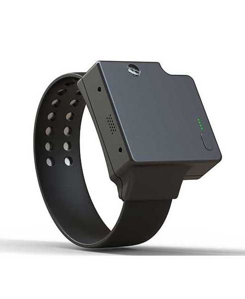

# ThinkRace - Traxbean Tracker

El Traxbean Tracker es un rastreador GPS de grado judicial diseñado como pulsera de tobillo para programas de correcciones comunitarias, arresto domiciliario y control de toque de queda. Concebido para monitoreo electrónico supervisado, Traxbean ofrece posicionamiento GPS exterior preciso y ubicación asistida en interiores mediante Wi‑Fi, triangulación celular y señales RF cuando se emplea con una estación base doméstica opcional. El dispositivo pone énfasis en la resistencia a la manipulación, una larga autonomía y capacidades directas de voz y alertas apropiadas para flujos de trabajo de correcciones y fuerzas del orden.

Como dispositivo compatible con Plaspy, Traxbean actúa como un endpoint seguro que alimenta datos de ubicación, eventos y voz hacia Plaspy para supervisión e informes en tiempo real. Las agencias pueden usar Traxbean junto con Plaspy para centralizar el monitoreo, recibir alertas instantáneas, ejecutar reportes de cumplimiento y aplicar reglas de geocercas y horarios por caso, aprovechando las opciones de SDK y API abierta para alinear el comportamiento del dispositivo con los sistemas operativos existentes.

## Características principales

- Compatible con Plaspy para seguimiento y telemetría en tiempo real en programas de monitoreo de infractores
- Pulsera de tobillo grado judicial con carcasa impermeable y correa resistente al corte para uso rudo en campo
- Posicionamiento GPS exterior preciso más ubicación asistida en interiores mediante Wi‑Fi, triangulación celular y RF con estación base doméstica opcional
- Larga autonomía diseñada para soportar periodos prolongados de monitoreo entre cargas
- Detección activa de manipulación con notificaciones instantáneas al personal de monitoreo para facilitar una respuesta rápida
- Comunicación de voz bidireccional en vivo, además de alertas de audio, sirena y vibración para contacto inmediato y escalamiento
- SDK amigable para desarrolladores y API abierta para integración con sistemas de agencia y flujos de trabajo de Plaspy

## Cómo funciona con Plaspy

Al integrarse con Plaspy, el Traxbean Tracker se convierte en un endpoint gestionado que transmite posiciones, eventos y canales de audio a la plataforma Plaspy. Supervisores y gestores de caso pueden visualizar ubicaciones en mapas, configurar alertas y generar informes listos para auditoría, mientras Plaspy aplica geocercas, horarios y reglas de notificación vinculadas a cada caso monitoreado.

- Actualizaciones en tiempo real de ubicación y eventos entregadas en Plaspy para visibilidad continua y trazabilidad de auditoría
- Alertas de manipulación y seguridad enviadas al instante mediante notificaciones de Plaspy como SMS, correo electrónico y push
- Comunicación de voz bidireccional y alertas de audio que permiten el contacto directo entre las personas monitoreadas y el personal a través de las interfaces de Plaspy
- Geocercas configurables con horarios por zona y registro de violaciones gestionados de forma centralizada en Plaspy
- Soporte de SDK y API abierta para reenviar eventos, crear flujos de trabajo personalizados y sincronizar datos con los sistemas de la agencia dentro del entorno Plaspy

## Casos de uso típicos

- Programas de correcciones comunitarias y libertad supervisada que requieren monitoreo continuo de cumplimiento
- Aplicación de arresto domiciliario y control de toque de queda con horarios por zona y alertas instantáneas de violación
- Revisiones de bienestar e intervenciones de oficiales utilizando comunicación bidireccional y notificaciones de manipulación
- Despliegues escalables para agencias que necesitan una solución integrada de hardware y software para monitoreo
- Gestión de casos e informes de auditoría donde se requiere historial de ubicación seguro y registros de eventos

## Por qué elegir este rastreador con Plaspy

Traxbean está diseñado específicamente para monitoreo electrónico personal y ofrece características de hardware y opciones de notificación que se alinean con los flujos de trabajo de correcciones. Combinado con Plaspy, puede reducir la fricción operativa al entregar datos consistentes de ubicación y eventos a una plataforma pensada para supervisión, informes y alertas. Las protecciones contra manipulación, la capacidad de voz bidireccional y la optimización de batería del dispositivo favorecen un monitoreo fiable en el día a día, mientras que las opciones de integración permiten a las agencias adaptar los flujos de datos a sus procedimientos internos.

Para más detalles sobre cómo Traxbean puede encajar en su programa de monitoreo y para explorar las opciones de integración con Plaspy visite https://www.plaspy.com. Las especificaciones del producto, disponibilidad y las características que proporciona el fabricante pueden cambiar con el tiempo, por lo que verifique los detalles técnicos y la información de soporte actual en el sitio oficial de ThinkRace https://www.thinkrace.com/.
