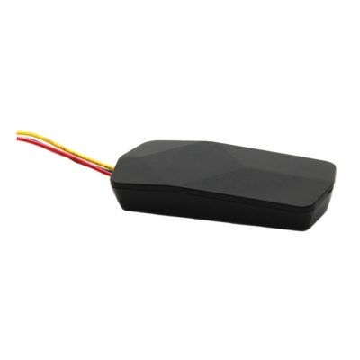

# ThinkRace - VT06

El ThinkRace VT06 es un rastreador vehicular compacto diseñado para ofrecer posicionamiento continuo y preciso. Proporciona seguimiento en tiempo real, reproducción de recorridos, soporte de geocerca, y estadísticas de datos, junto con un conjunto de alarmas que cubren fallo de alimentación, batería baja, vibración, desplazamiento, exceso de velocidad y violaciones de geocerca. Estas capacidades hacen del VT06 una opción práctica para supervisar la ubicación y la actividad de vehículos de distintos tipos.

Como dispositivo compatible con Plaspy, el VT06 puede transmitir datos de ubicación y eventos a la plataforma para un monitoreo y generación de reportes unificados. Los usuarios de Plaspy pueden incorporar unidades VT06 en los paneles de la flota para ver el historial de posiciones, generar informes de uso y recibir alertas configurables, lo que facilita una supervisión operativa más eficaz sin alterar las capacidades de rastreo principales del dispositivo.

## Características principales

- Posicionamiento continuo y preciso para visibilidad permanente de la flota
- Seguimiento en tiempo real con reproducción de recorridos para revisar rutas históricas
- Soporte de geocerca para detectar y notificar salidas o entradas no autorizadas
- Sistema de alarmas integral que incluye alertas por energía y movimiento
- Estadísticas integradas para respaldar informes y análisis operativos
- Diseñado para integrarse en sistemas de despacho y comando vehicular

## Cómo funciona con Plaspy

Al integrarse con Plaspy, el VT06 envía su información de posición y eventos a la plataforma para que los operadores gestionen dispositivos y flotas desde una sola interfaz. Plaspy consolida los datos entrantes para ofrecer conciencia situacional y controles operativos adecuados tanto para flotillas pequeñas como para despliegues mayores.

- Vista centralizada en mapa en vivo mostrando ubicaciones VT06 y movimientos recientes
- Reenvío de eventos y alarmas para que Plaspy muestre alertas de energía, vibración y geocerca
- Reproducción de recorridos dentro de Plaspy para revisar rutas y actividad histórica
- Estadísticas agregadas para reportes sobre patrones de uso y comportamiento vehicular
- Reglas de notificación y alertas configurables para mantener informados a los gestores de flota

## Casos de uso típicos

- Rastreo de vehículos de flota para operaciones de entrega y servicios
- Monitoreo en tiempo real de autos de empresa y vehículos comerciales ligeros
- Revisión de rutas y análisis de comportamiento del conductor mediante reproducción y estadísticas
- Seguridad de activos mediante geocercas y alarmas por movimiento
- Integración en flujos de despacho para consultas de estado y ubicación

## Por qué elegir este rastreador con Plaspy

El VT06 ofrece un equilibrio entre funciones de rastreo esenciales y alertas de eventos que se alinean bien con las capacidades de visibilidad y monitoreo de Plaspy. Su conjunto de funciones cubre necesidades operativas comunes como rastreo en vivo, notificaciones por geocerca y reproducción histórica, lo que permite a las organizaciones usar Plaspy para la supervisión diaria y la generación de informes mientras confían en el VT06 para datos de posición y eventos confiables.

Si desea obtener más información sobre cómo los dispositivos VT06 pueden utilizarse dentro de Plaspy y explorar las funcionalidades de la plataforma, visite Plaspy en el sitio web principal https://www.plaspy.com. Las especificaciones del producto, la disponibilidad y los detalles del fabricante pueden cambiar con el tiempo, por lo que le recomendamos verificar la información técnica y el firmware actual con la documentación oficial del fabricante en https://www.thinkrace.com/.
