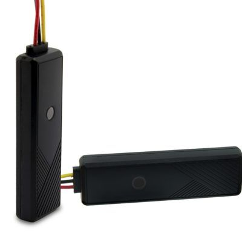

# ThinkRace - VT07

El ThinkRace VT07 es un rastreador vehicular diseñado para ofrecer información de ubicación precisa mediante avanzada tecnología de posicionamiento en 3 modos. Combina seguimiento continuo con un sistema de múltiples alarmas —incluyendo exceso de velocidad, corte de alimentación, vibración y alertas similares— para ayudar a proteger los vehículos frente a usos no autorizados o eventos imprevistos. El VT07 está construido para operar en un amplio rango de temperaturas, por lo que resulta adecuado para despliegues en climas exigentes.

Como dispositivo compatible con Plaspy, el VT07 puede enviar señales de ubicación y alarmas a la plataforma de gestión de flotas de Plaspy, proporcionando visibilidad centralizada y registros históricos. La compatibilidad con Plaspy permite incorporar el VT07 en flujos de trabajo modernos de rastreo para monitoreo de ubicación, alertas y supervisión operativa sin requerir cambios significativos en los procesos de la flota.

## Características principales

- Informes de ubicación precisos basados en posicionamiento GPS de 3 modos para un rastreo confiable
- Protección mediante múltiples alarmas que cubren exceso de velocidad, pérdida de energía, vibración y otros eventos
- Diseño resistente para soportar temperaturas altas y bajas y ofrecer rendimiento fiable en campo
- Adecuado tanto para operadores de flotas como para propietarios individuales que requieren monitoreo continuo
- Integración con plataformas de rastreo para centralizar la visibilidad y las alertas de los vehículos
- Práctico para implementaciones donde la durabilidad ambiental y el seguimiento consistente son fundamentales

## Cómo funciona con Plaspy

Al integrarse con Plaspy, el ThinkRace VT07 entrega actualizaciones de ubicación y eventos de alarma que Plaspy utiliza para ofrecer visibilidad en tiempo real y reproducción histórica. Plaspy procesa los datos del rastreador para soportar flujos de trabajo de monitoreo, reportes y notificaciones que permiten a los equipos operativos reaccionar rápidamente ante incidentes.

- Vista centralizada en el mapa de las ubicaciones reportadas por el VT07 para seguimiento en tiempo real
- Alertas configurables en Plaspy basadas en los eventos de alarma del VT07 para notificaciones oportunas
- Registros históricos de viajes y posiciones para revisión y reportes operativos
- Herramientas de supervisión de flotas en Plaspy para agrupar y monitorear vehículos equipados con VT07
- Integración con los reportes de Plaspy para analizar eventos como incidentes de exceso de velocidad y fallas de alimentación

## Casos de uso típicos

- Rastreo de ubicación y supervisión de rutas para flotas pequeñas y medianas
- Monitoreo de autos de alquiler o vehículos compartidos para detectar usos no autorizados
- Protección de activos móviles que operan en entornos con temperaturas extremas
- Vehículos de reparto y de servicio que requieren visibilidad de posición en tiempo real
- Rastreo de vehículos particulares para propietarios que desean informes continuos de ubicación y alarmas

## Por qué elegir este rastreador con Plaspy

El ThinkRace VT07 es una opción práctica para organizaciones y personas que necesitan una solución de rastreo vehicular sencilla, con énfasis en posicionamiento confiable y notificaciones de alarma. Su resistencia a temperaturas extremas y su diseño con múltiples alarmas lo hacen adecuado para diversas condiciones de operación, mientras que la compatibilidad con Plaspy asegura que los datos del rastreador sean utilizables dentro de un entorno completo de gestión de flotas.

Para equipos que evalúan rastreadores, el VT07 combinado con Plaspy ofrece un equilibrio entre seguimiento fiable, alertas y gestión centralizada sin complejidad innecesaria. Plaspy añade visibilidad y reportes sobre los datos del VT07 para que los equipos de operaciones, seguridad y despacho puedan tomar decisiones informadas basadas en información vehicular consistente.

Para conocer más sobre Plaspy y cómo funciona con dispositivos compatibles visite https://www.plaspy.com. Las especificaciones y la disponibilidad del producto pueden cambiar con el tiempo, por lo que le recomendamos verificar los detalles técnicos actuales del VT07 en el sitio del fabricante https://www.thinkrace.com/ para obtener la información más actualizada.
