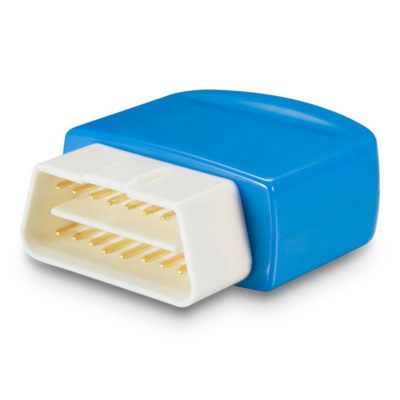

# ThinkRace - VT200

El rastreador GPS VT200 de ThinkRace es un dispositivo OBD profesional diseñado para realizar un seguimiento en tiempo real de vehículos como taxis, ambulancias y vehículos de ingeniería. Con este rastreador OBD2, puede tener un control total sobre la ubicación de su automóvil en todo momento.

El VT200 ofrece una amplia gama de funciones y características que lo convierten en uno de los mejores dispositivos de seguimiento de vehículos OBD en el mercado. Con su función de prueba móvil, puede realizar pruebas de diagnóstico en su vehículo de forma remota, lo que le permite mantener su automóvil en óptimas condiciones.

Además, el VT200 cuenta con un rastreador de kilometraje que registra y muestra la distancia recorrida por su vehículo. Esto puede ser útil para el seguimiento de gastos de combustible y mantenimiento, así como para el control de flotas.

Otra característica destacada del VT200 es su capacidad de detectar y enviar alarmas en caso de comportamiento anormal, como exceso de velocidad, frenado brusco o aceleración brusca. Esto puede ayudar a mejorar la seguridad en la carretera y prevenir accidentes.

El VT200 también cuenta con una función de suplemento de zona muerta, que le permite recibir notificaciones cuando su vehículo entra o sale de una zona predefinida. Esto puede ser útil para el control de flotas y la seguridad de los vehículos.

Además, el VT200 tiene un acelerómetro interno de 3 ejes que permite la detección de movimiento y el análisis del comportamiento de conducción. Esto puede ayudar a identificar patrones de conducción y mejorar la eficiencia y seguridad en la carretera.

En resumen, el rastreador GPS VT200 de ThinkRace es una opción confiable y versátil para el seguimiento de vehículos. Con su amplia gama de funciones y características, este dispositivo es ideal para empresas de transporte, servicios de emergencia y cualquier persona que desee tener un control total sobre la ubicación y el rendimiento de su vehículo.

### Características destacadas:

- Seguimiento GPS en tiempo real
- Función de prueba móvil
- Rastreador de kilometraje
- Alarma de comportamiento anormal
- Suplemento de zona muerta
- Actualización remota
- Acelerómetro interno de 3 ejes

