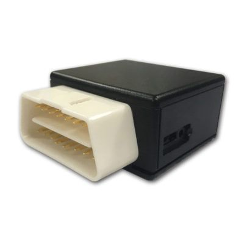

# ThinkRace - VT400

El ThinkRace VT400 es un rastreador GPS OBD compacto diseñado para automóviles. Conectado al puerto OBD II del vehículo, el VT400 ofrece localización continua, reproducción de historial, alertas por geovalla e informes de viaje. Su conectividad 4G y el WiFi integrado permiten actualizaciones frecuentes de posición y revisión de rutas, ideal tanto para la supervisión de vehículos individuales como para operaciones de flota.

Como dispositivo compatible con Plaspy, el VT400 puede enviar datos de ubicación y del vehículo a la plataforma Plaspy para monitorización y generación de reportes centralizados. Esa compatibilidad permite que usted y su equipo vean los vehículos rastreados con VT400 junto a otros dispositivos en Plaspy, reciban alertas configurables e incluyan los datos del VT400 en los informes operativos sin necesidad de sistemas separados.

## Características principales

- Diseñado para uso en automóviles con conexión OBD II para alimentación y acceso sencillo a datos del vehículo.
- Soporte de red 4G para actualizaciones de ubicación en tiempo real y seguimiento fiable.
- Reproducción del historial para revisar rutas pasadas y analizar detalles de los viajes.
- Funcionalidad de geovallas para definir límites virtuales y recibir notificaciones al entrar o salir.
- Informes de viaje que resumen distancia recorrida, velocidad promedio y duración del trayecto para obtener información operativa.
- Alarmas múltiples para eventos como exceso de velocidad, frenadas bruscas e ignición encendida o apagada.

## Cómo funciona con Plaspy

Al integrarse con Plaspy, el VT400 envía información de ubicación y viajes a una única interfaz de gestión de flotas, de modo que usted puede monitorear activos, configurar alertas y generar reportes. La integración se enfoca en visibilidad y supervisión operativa más que en detalles de configuración a bajo nivel.

- Visualización centralizada de la ubicación en vivo dentro de Plaspy para conciencia situacional de la flota.
- Alertas configurables de geovallas y notificaciones de alarma enviadas a los usuarios pertinentes a través de Plaspy.
- Reproducción de viajes e historial accesible desde los reportes de Plaspy para revisar rutas y comportamiento del conductor.
- Informes agregados de viajes y resúmenes que facilitan el control de kilometraje y el análisis operativo.
- Datos de salud del vehículo y lecturas OBD II disponibles junto con los registros de ubicación para una supervisión combinada.

## Casos de uso típicos

- Gestores de flota que supervisan automóviles para optimizar rutas y controlar desempeño de conductores.
- Propietarios de vehículos y pequeños operadores que desean monitorizar ubicación y seguridad.
- Equipos de operaciones que usan informes de viaje para conciliar kilometraje y duración de trayectos.
- Responsables que establecen geovallas para proteger activos o restringir movimiento de vehículos.
- Planificadores de mantenimiento que revisan tendencias en datos OBD II junto con el uso del vehículo.

## Por qué elegir este rastreador con Plaspy

El VT400 es una opción práctica para organizaciones e individuos que buscan un rastreador para automóviles, basado en OBD, que se integre en una solución de gestión de flotas más amplia. Su combinación de seguimiento en tiempo real, reproducción de historial, alertas por geovalla e informes de viaje cubre necesidades habituales en monitoreo vehicular y reportes operativos básicos.

Usar el VT400 con Plaspy permite a su equipo consolidar seguimiento, alertas e informes en una sola plataforma, simplificando la supervisión y acelerando la toma de decisiones basadas en datos de ubicación y viaje. Para quienes requieren un dispositivo conectado al OBD para automóviles, el VT400 ofrece un conjunto equilibrado de funciones que complementan de forma natural las capacidades de monitoreo y reporte de Plaspy.

Para obtener más información sobre el uso de Plaspy con rastreadores compatibles como el ThinkRace VT400 visite https://www.plaspy.com. Las especificaciones del producto y la disponibilidad de funciones pueden cambiar con el tiempo, por lo que le recomendamos verificar los detalles actuales en el sitio del fabricante https://www.thinkrace.com/ antes de tomar decisiones de compra o despliegue.
