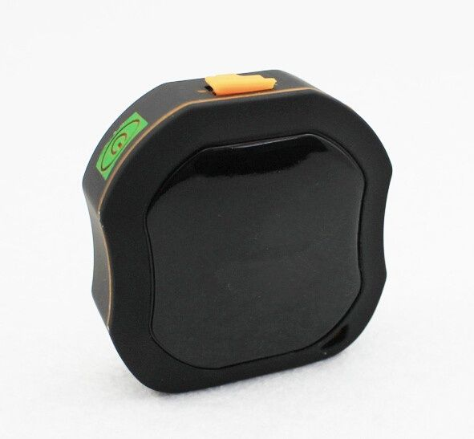

# TK-Star - LK109

El rastreador GPS portátil LK109 de TK-Star es una solución versátil para diversas aplicaciones. Ya sea que necesite rastrear vehículos privados, alquiler de automóviles, equipos al aire libre o proteger a sus seres queridos, este dispositivo puede brindarle tranquilidad y seguridad.

Con el LK109, puede realizar un seguimiento en tiempo real de la ubicación de su vehículo o persona de interés. Además, cuenta con la función de auto-seguimiento, lo que significa que recibirá actualizaciones automáticas sobre la ubicación sin tener que solicitarlas manualmente.

Una característica destacada del LK109 es la comprobación de dirección de correo por SMS. Esto le permite recibir información sobre la dirección exacta en la que se encuentra el rastreador GPS, lo que puede ser útil en situaciones de emergencia o cuando necesita localizar rápidamente un vehículo o persona.

Otra función útil es el seguimiento del ángulo muerto, que le alertará si el rastreador GPS se encuentra en una zona sin cobertura de GPS o GSM. Esto garantiza que siempre tenga una visión clara de la ubicación de su vehículo o persona, incluso en áreas con mala señal.

El LK109 utiliza tecnología de seguimiento GPS y GSM para proporcionar una precisión y cobertura confiables. También ofrece características adicionales como historial de cheques-trace, geo-cerca, alerta de movimiento, alerta de exceso de velocidad, alerta de batería baja y monitoreo remoto.

Además, el LK109 cuenta con una clasificación de resistencia al agua IP65, lo que significa que puede soportar condiciones climáticas adversas sin comprometer su rendimiento.

En resumen, el rastreador GPS portátil LK109 de TK-Star es una opción confiable y versátil para diversas aplicaciones, brindando seguimiento en tiempo real, funciones de seguridad y tranquilidad en un solo dispositivo.

### Características destacadas:

- Seguimiento en tiempo real
- Auto-seguimiento
- Comprobación de dirección de correo por SMS
- Seguimiento del ángulo muerto
- GPS + GSM de seguimiento
- Historial de cheques-trace
- Geo-cerca
- Alerta de movimiento
- Alerta de exceso de velocidad
- Alerta de batería baja
- Monitoreo remoto
- Alerta del sensor de sacudida
- SOS
- Modo de trabajo de albergue
- IP65 a prueba de agua

