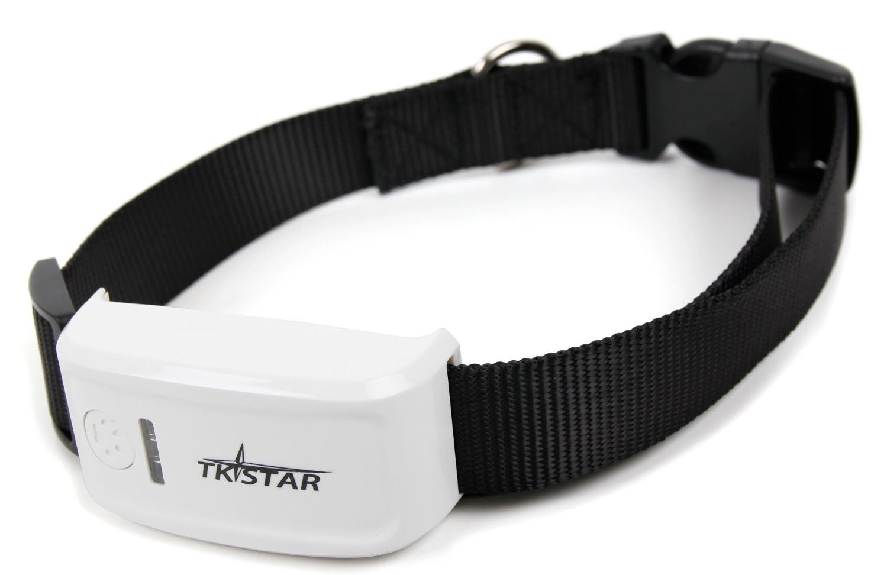

# TK-Star - Rastreador para mascotas

El TK-Star Pet Tracker es un rastreador GPS compacto diseñado específicamente para animales. Pensado para fijarse al collar, combina un formato liviano con funciones de monitoreo de ubicación, incluyendo seguimiento en vivo, reportes periódicos de posición y alertas por geocerca. El equipo se entrega con una tarjeta SIM y puede enviar la posición por mensaje de texto con un enlace al mapa, o bien monitorearse mediante la aplicación del fabricante para reproducción de rutas y actualizaciones en tiempo real.

Como dispositivo compatible con Plaspy, el TK-Star Pet Tracker puede enviar datos de ubicación a la plataforma Plaspy para que usted, como propietario u operador, obtenga visibilidad centralizada. Integrar este rastreador con Plaspy le permite ver posiciones en un mapa común, recibir alertas cuando la mascota abandona una zona definida e incluir las unidades de mascotas en flujos de trabajo de monitoreo e informes más amplios. Esta compatibilidad lo hace útil tanto para particulares como para organizaciones que desean hardware específico para mascotas con supervisión operativa a través de Plaspy.

## Características principales

- Diseñado para mascotas, con diseño pequeño y liviano apto para montaje en collar
- Incluye tarjeta SIM para envío directo de ubicación por SMS con enlace al mapa
- Función de seguimiento en vivo con reportes de ubicación a intervalos cortos para monitoreo activo
- Precisión de ubicación aproximada de hasta 5 metros para posicionamiento general
- Soporte de geocerca para generar alertas cuando el dispositivo sale de una zona segura establecida
- Más de 24 horas de autonomía para sesiones de monitoreo prolongadas

## Cómo funciona con Plaspy

Al usarse con Plaspy, el TK-Star Pet Tracker aporta actualizaciones continuas de ubicación y notificaciones de eventos que Plaspy procesa para visualización y gestión. Plaspy puede mostrar el rastreador en mapas compartidos, incorporar sus recorridos en informes y reenviar alertas a los destinatarios seleccionados, lo que facilita el monitoreo de mascotas junto con otros activos rastreados.

- Mostrar la posición en tiempo real de la mascota en los mapas de Plaspy para conocimiento situacional inmediato
- Almacenar y revisar rutas históricas para reproducción y auditorías de actividad
- Recibir alertas de geocerca en Plaspy cuando el rastreador abandona un área segura configurada
- Configurar reglas de notificación en Plaspy para dirigir alertas a equipos o cuidadores
- Incluir los datos del rastreador en informes programados para supervisión rutinaria y registro

## Casos de uso habituales

- Monitoreo de la ubicación en tiempo real de mascotas domésticas durante paseos o actividades al aire libre
- Seguimiento de animales en pequeñas fincas o propiedades donde las mascotas pueden desplazarse en áreas más amplias
- Supervisión de mascotas durante viajes o estancias en pensión para verificar ubicación y movimiento
- Proveer a cuidadores o paseadores de visibilidad compartida de la ubicación y alertas
- Control de animales de trabajo que requieren comprobaciones regulares de ubicación en campo

## Por qué escoger este rastreador con Plaspy

El TK-Star Pet Tracker combina un diseño pensado para mascotas con las capacidades operativas de Plaspy, ofreciendo una solución de monitoreo sencilla. Su montaje ligero en el collar y la opción de retorno de ubicación por SMS o app lo hacen accesible para propietarios, mientras que Plaspy añade mapeo centralizado, alertas e informes que resultan beneficiosos en escenarios multiusuario o para organizaciones que gestionan varios animales rastreados.

Si usted busca un rastreador compacto que ya es compatible con Plaspy, este modelo brinda un equilibrio práctico entre portabilidad y funcionalidad de monitoreo. La combinación es especialmente útil cuando la prioridad es visibilidad, notificaciones por geocerca y un historial de rutas sencillo.

Para obtener más información sobre cómo Plaspy puede presentar y gestionar los datos del TK-Star Pet Tracker visite https://www.plaspy.com. Las especificaciones del producto y la disponibilidad pueden cambiar con el tiempo, por lo que verifique los detalles técnicos más recientes y las indicaciones del fabricante en el sitio de TK-Star https://www.tk-star.com/.
