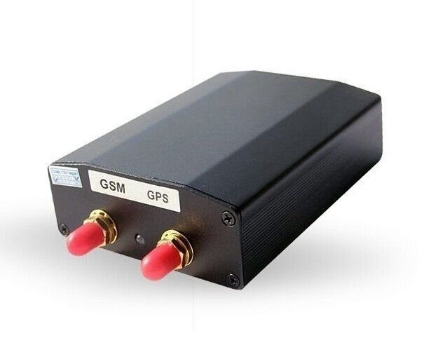

# TK-Star - TK103

El TK-Star TK103 es un rastreador GPS versátil para vehículos, diseñado para localizar y monitorear objetivos remotos mediante satélites GPS junto con la red móvil GSM/GPRS. Ofrece funciones básicas de rastreo y una serie de características prácticas, como notificaciones de alarma de emergencia, control remoto por SMS, escucha remota, alertas de movimiento y exceso de velocidad, geocercas y estadísticas básicas de kilometraje y estado. Estas capacidades hacen que el TK103 sea adecuado para la gestión de vehículos y la protección de activos móviles.

Como dispositivo compatible con Plaspy, el TK103 puede configurarse para reportar posiciones y eventos a la plataforma Plaspy, proporcionando visibilidad en tiempo real e informes históricos. La compatibilidad permite a las organizaciones combinar el hardware TK103 con las herramientas de Plaspy para centralizar el seguimiento de ubicaciones, alertas y supervisión operativa sin necesidad de reemplazar los rastreadores existentes.

## Características principales

- Posicionamiento y rastreo por GPS con envío de datos a través de redes GSM/GPRS
- Seguimiento en línea y desde dispositivos móviles mediante acceso a la plataforma o consultas directas por teléfono
- Función de alarma de emergencia que notifica a números autorizados al activarse
- Opciones de control remoto, incluyendo corte de alimentación o del circuito del motor vía SMS
- Alertas por movimiento, exceso de velocidad y violación de geocercas para una vigilancia proactiva
- Capacidad de escucha remota para captar audio cerca del dispositivo y mejorar la conciencia situacional
- Estadísticas básicas de kilometraje, detección de ACC (encendido/apagado) y compatibilidad con alarmas antirrobo originales

## Cómo funciona con Plaspy

Al configurarse para comunicarse con Plaspy, el TK103 envía mensajes de ubicación y eventos a la plataforma, donde se integran en los registros de activos y en los paneles de control de la flota. Plaspy agrega esos mensajes para ofrecer mapeo, alertas e informes, manteniendo al mismo tiempo la funcionalidad propia del rastreador, como los controles y alarmas vía SMS.

- Visualización en vivo de la ubicación y del mapa para cada vehículo equipado con TK103 en Plaspy
- Configuración de geocercas y notificaciones de incumplimiento gestionadas desde Plaspy
- Eventos de movimiento y exceso de velocidad enviados a Plaspy para alerta inmediata del operador
- Datos de viajes y kilometraje disponibles en los informes de Plaspy para revisión operativa
- Eventos de alarma de emergencia encaminados a Plaspy para priorizar incidentes y respuesta
- Identificación y estado del dispositivo visibles en Plaspy para apoyar la supervisión de la flota

## Casos de uso típicos

- Monitoreo de flotas para operaciones de vehículos pequeñas y medianas
- Rastreo y control de vehículos de alquiler para proteger activos y gestionar devoluciones
- Protección de activos y flujos de trabajo antirrobo con alertas y opciones de corte remoto
- Supervisión de vehículos ejecutivos o de alto valor para mayor tranquilidad
- Localización de personal o trabajadores de campo cuando se requiere seguimiento vehicular

## Por qué elegir este rastreador con Plaspy

El TK103 ofrece un conjunto equilibrado de funciones de rastreo y alertas que se alinean con las necesidades comunes de seguridad y gestión de flotas. Su combinación de posicionamiento, reporte, alertas, control remoto y estadísticas básicas lo convierte en una opción práctica cuando se requieren capacidades claras de seguimiento y control operativo. Integrar unidades TK103 con Plaspy lleva los eventos a nivel de dispositivo a una plataforma consolidada para monitoreo, análisis e informes.

Si desea saber más sobre cómo Plaspy puede integrarse con dispositivos TK103 visite https://www.plaspy.com. Product specifications availability and manufacturer details can change over time so please verify current technical information on the official TK Star website https://www.tk-star.com/.
