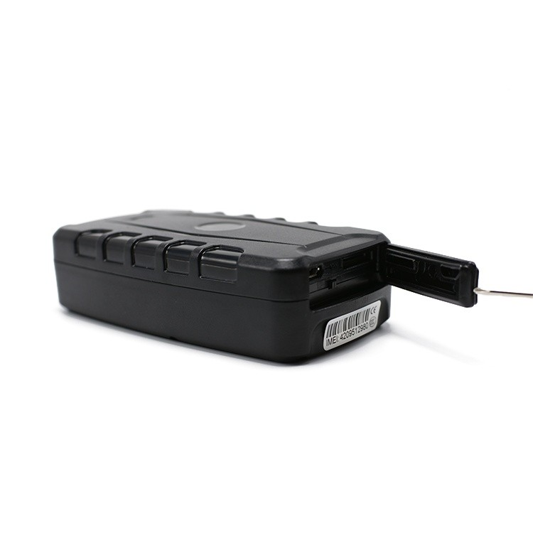

# TK-Star - TK209B

El TK209B es un rastreador GPS 4G robusto diseñado para el monitoreo prolongado de activos y vehículos. Orientado a la gestión comercial de flotas, servicios de alquiler y logística, combina posicionamiento multimodal —GNSS, LBS y Wi‑Fi— con una batería recargable de alta capacidad de 10000 mAh para ofrecer actualizaciones de ubicación y alertas confiables durante días o semanas de funcionamiento. El equipo cuenta además con protección IP65 y un sensor de vibración integrado para detección de manipulación y movimiento en entornos exteriores.

Como dispositivo compatible con Plaspy, el TK209B puede enviar ubicación y telemetría a la plataforma de Plaspy para mapas en vivo, notificaciones y almacenamiento histórico de rutas. Plaspy puede aprovechar las fuentes de posicionamiento y las señales de movimiento del dispositivo para mejorar la visibilidad de la flota, activar notificaciones de geocerca y exceso de velocidad, y conservar el historial de rutas para informes y control operativo, lo que convierte al TK209B en una opción práctica para organizaciones que ya usan o evalúan Plaspy para la gestión de flotas y activos.

## Características principales

- Batería de larga duración: 10000 mAh recargable para prolongar el tiempo en espera y permitir varios días de operación entre cargas.
- Posicionamiento multimodal que combina GNSS con LBS y Wi‑Fi para mejorar el rastreo tanto en exteriores como en entornos difíciles.
- Carcasa resistente con certificación IP65 y amplio rango de temperatura de operación, apta para vehículos y equipos en exteriores.
- Sensor de vibración integrado para detección de movimiento y manipulación con capacidad de generar alertas inmediatas.
- Soporte 4G regional mediante variantes con módulo SIM7600 para ajustar la conectividad celular a distintos mercados.
- Almacenamiento histórico de rutas en servidor para informes operativos y auditorías cuando se utiliza con Plaspy.

## Cómo funciona con Plaspy

Cuando se integra con Plaspy, el TK209B envía paquetes periódicos de ubicación y telemetría a través de su conexión celular a los servidores de Plaspy. La plataforma consolida los datos de posicionamiento de múltiples fuentes, muestra la ubicación en tiempo real en mapas, genera alertas de geocercas y movimiento, y conserva el historial de rutas para informes y cumplimiento.

- Actualizaciones en tiempo real de ubicación y telemetría, incluyendo posición GNSS, nivel de batería, estado de señal y eventos de movimiento.
- Alertas de geocerca y movimiento dirigidas a Plaspy para notificaciones inmediatas y flujos de trabajo operativos.
- Almacenamiento histórico de rutas e informes para apoyar auditorías, análisis de rutas y seguimiento de desempeño.
- Visibilidad a nivel de flota y paneles de monitoreo en Plaspy para múltiples dispositivos en distintas regiones.
- Posibilidad de integrar entradas externas y sensores de terceros cuando el despliegue los provea, permitiendo que Plaspy combine la telemetría del TK209B con datos adicionales del vehículo.

## Casos de uso típicos

- Gestión de flotas para rastreo en tiempo real, supervisión de rutas e informes operativos.
- Servicios de alquiler y control de equipos donde la larga autonomía de la batería y las geocercas ayudan a proteger los activos.
- Logística y seguimiento de carga para mantener visibilidad durante tránsito y puntos de transferencia.
- Monitoreo de contenedores y terminales donde el posicionamiento multimodo puede mejorar la precisión en áreas semi interiores.
- Despliegues remotos o estacionales que requieren carcasas duraderas y largos periodos de autonomía entre cargas.

## Por qué elegir este rastreador con Plaspy

El TK209B ofrece una combinación práctica de autonomía, flexibilidad de posicionamiento y robustez que se adapta a varios casos de uso en Plaspy. Su batería de alta capacidad y el soporte para múltiples fuentes de posicionamiento contribuyen a mantener actualizaciones fiables durante despliegues prolongados, mientras que la detección de movimiento integrada permite alertas oportunas y flujos de trabajo anti robo dentro de Plaspy. Las opciones regionales del módulo celular facilitan la adaptación a los requisitos de red en distintos mercados.

Para operaciones que requieran señales adicionales del vehículo, como ignición o telemetría de combustible, Plaspy puede combinar los datos de ubicación del TK209B con interfaces externas o entradas de sensores cuando estén disponibles para construir flujos de trabajo más avanzados. Si su despliegue demanda sensores Bluetooth o E/S adicionales, consulte variantes compatibles u opciones de gateway para asegurar que obtenga el conjunto completo de telemetría que necesita en Plaspy.

Para obtener más información sobre el uso de Plaspy con dispositivos compatibles visite https://www.plaspy.com. Las especificaciones del producto, la disponibilidad y los datos del fabricante pueden cambiar con el tiempo, por lo que le recomendamos verificar la información técnica actual en el sitio del fabricante https://www.tk-star.com/ antes de tomar decisiones finales sobre el hardware.
