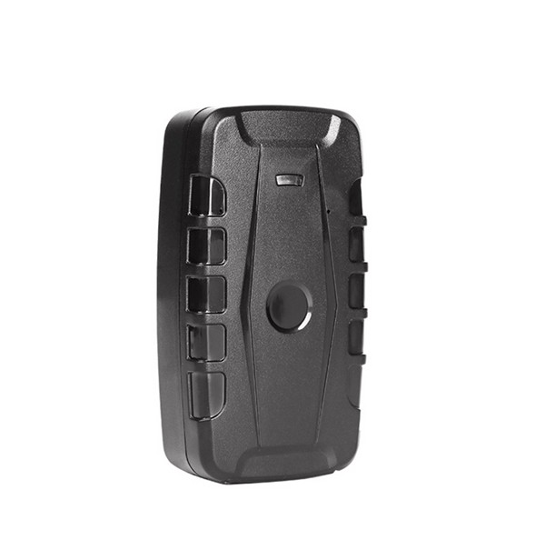

# TK-Star - TK209C

# TK209C GPS Tracker

El TK209C es un rastreador GPS de alta resistencia y larga duración, diseñado para aplicaciones exigentes de seguimiento de vehículos y activos, y es compatible con Plaspy para una integración de plataforma sencilla. Construido alrededor de un módulo GNSS UBLOX, el TK209C combina posicionamiento GPS, BeiDou \(BD\), GLONASS, LBS y Wi‑Fi para ofrecer seguimiento preciso en exteriores y una mejora en el posicionamiento en interiores/multimodal para flotas en alquiler, contenedores de carga y equipos remotos.

La carcasa con clasificación IP65 y un sensor de vibración integrado y sensible hacen del TK209C una opción ideal para monitoreo anti-robo y alertas de movimiento. Con una batería recargable de 3,7 V y 20000 mAh Li‑ion y múltiples opciones de energía, el TK209C está diseñado para largos intervalos de espera y un seguimiento en tiempo real confiable cuando se utiliza con la plataforma Plaspy.

## Aspectos clave

- Rastreador GPS compatible con Plaspy: se integra con Plaspy para seguimiento en tiempo real, alertas y reproducción de rutas.
- Gran autonomía: batería Li‑ion recargable de 3,7 V y 20000 mAh con hasta 150 días en espera, reduciendo el mantenimiento y los ciclos de carga.
- Posicionamiento multimodal: GNSS UBLOX con GPS, BeiDou \(BD\) y GLONASS, además de LBS y Wi‑Fi para una mejor cobertura interior/exterior y una precisión GPS de aproximadamente 5 m.
- Diseño robusto: carcasa con clasificación IP65 que admite uso en exteriores sobre vehículos, contenedores y equipos \(rango de operación de -20 °C a +55 °C\).
- Detección de movimiento avanzada: sensor de vibración integrado y sensible, alertas de movimiento y de sobrevelocidad para apoyar la gestión de flotas y flujos de trabajo de anti-robo.
- Opciones de energía flexibles: entrada de cargador de coche 12–24 V \(5 V de salida\) y carga en pared 110–220 V \(5 V de salida\) para un despliegue versátil.
- Datos históricos: el servidor almacena el historial de rutas durante hasta seis meses, permitiendo informes de cumplimiento y reproducción de rutas en la app móvil y en la web.

## Cómo funciona con Plaspy

Cuando se empareja con Plaspy, el TK209C envía datos de ubicación y eventos con frecuencia, que la plataforma utiliza para el seguimiento en tiempo real, geocercas, alertas y análisis histórico. Plaspy ingiere señales GNSS multimodo, LBS y Wi‑Fi reportadas por el dispositivo y las transforma en vistas de mapa, paneles de telemetría y notificaciones configurables para los equipos de operaciones.

- Actualizaciones de ubicación y telemetría en tiempo real a través de GSM/GPRS a Plaspy para seguimiento en mapa y monitoreo de la flota.
- Eventos de geocercas: alertas de entrada/salida cuando el rastreador cruza zonas predefinidas en Plaspy.
- Alertas de movimiento y vibración: notificaciones inmediatas ante pequeños golpes, movimiento más allá de la distancia establecida y incidentes de sobrevelocidad.
- Reproducción de rutas: hasta seis meses de historial de rutas almacenado disponible en la app móvil y portal web de Plaspy para auditorías y análisis de comportamiento del conductor.
- Telemetría complementaria: Plaspy puede correlacionar la posición y los datos de movimiento del TK209C con telemetría del vehículo \(señales de encendido, monitoreo de combustible o flujos de trabajo del inmovilizador\) cuando esas señales estén disponibles desde el vehículo o interfaces adicionales.

## Visión técnica

| Modelo | TK209C |
| --- | --- |
| Conectividad | GSM/GPRS \(850/900/1800/1900 MHz\) |
| GNSS | Módulo UBLOX GPS; admite GPS, BeiDou \(BD\) y GLONASS; ayuda de LBS y Wi‑Fi |
| Precisión GPS | Aproximadamente 5 metros |
| Sensibilidad GPS | -159 dBm |
| Tiempo para la Primera Fijación \(TTFF\) | Frío 35–80 s; Templado ~35 s; Caliente ~1 s |
| Batería | Li‑ion recargable de 3,7 V y 20000 mAh; tiempo de espera de hasta 150 días \(depende del intervalo de reporte y del uso\) |
| Opciones de alimentación | Entrada de cargador de coche 12–24 V \(5 V de salida\); Cargador de pared 110–220 V \(5 V de salida\) |
| Movimiento y sensores | Sensor de vibración sensible integrado; alertas de sobrevelocidad y movimiento |
| Almacenamiento de datos | El servidor almacena datos históricos de rutas de hasta seis meses; reproducción en la app móvil y web |
| Carcasa y dimensiones | Dimensiones 120 x 65 x 48 mm; Peso 365 g; Resistencia IP65 al agua y al polvo |
| Ambiente de operación | Temperatura de operación -20 °C a +55 °C; Almacenamiento -40 °C a +85 °C; Humedad 5%–95% sin condensación |
| Formato | Rugged, rastreador independiente para montaje en vehículos/activos |

## Casos de uso

- Gestión de flotas: seguimiento en tiempo real, alertas de sobrevelocidad y reproducción de rutas para optimizar la asignación y el rendimiento del conductor.
- Protección anti-robo: alarmas de vibración, alertas de movimiento y notificaciones de intrusión en geocerca para una intervención rápida.
- Monitorización de carga y contenedores: larga duración de la batería y durabilidad IP65 para despliegues prolongados y almacenamiento al aire libre.
- Rastreo de vehículos de alquiler: larga autonomía y posicionamiento multimodal para informes de ubicación precisos incluso cuando los vehículos están estacionados o fuera de la vista en interiores.
- Supervisión de equipos remotos: monitorizar equipos al aire libre y activos temporales donde no hay suministro eléctrico.

## Por qué elegir este rastreador con Plaspy

El TK209C está diseñado para ofrecer fiabilidad y autonomía a largo plazo para negocios que necesitan un seguimiento GPS robusto y telemetría confiable. Como rastreador GPS compatible con Plaspy, proporciona seguimiento en tiempo real, geocercas e integración de alarmas para apoyar la gestión de flotas y las estrategias de anti-robo. La batería de larga duración de 20000 mAh y las opciones de carga versátiles reducen las cargas operativas para despliegues que requieren operación prolongada sin conexión.

La plataforma de Plaspy mejora las capacidades del TK209C al agregar datos de ubicación, movimiento y eventos en un panel unificado para los equipos de operaciones. Mientras que el TK209C se centra en un posicionamiento multimodal preciso y alertas de movimiento, Plaspy puede correlacionar estos datos con telemetría del vehículo \(para encendido, monitoreo de combustible o flujos de trabajo del inmovilizador\) cuando esas señales están disponibles en el entorno del vehículo. Cabe señalar que los sensores Bluetooth no figuran entre las especificaciones del TK209C; sin embargo, el posicionamiento GNSS, LBS y Wi‑Fi del dispositivo, junto con las funciones de telemetría de Plaspy, crean una solución integral para rastreo, informes y seguridad.

Si necesita opciones OEM o al por mayor para el TK209C, hay un formulario de consulta comercial disponible para clientes empresariales que buscan adquisiciones en volumen y soporte de integración para despliegues compatibles con Plaspy.

