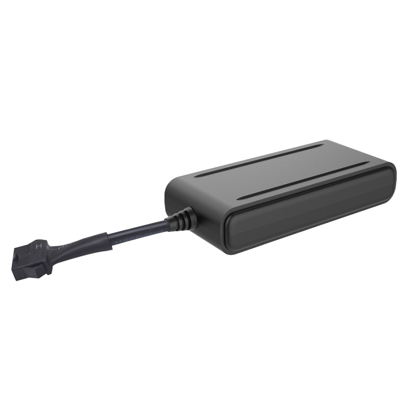

# TK-Star - TK750

El TK-Star TK750 es un rastreador GPS 4G compacto de un fabricante de telemática consolidado, pensado para motocicletas, autos particulares, vehículos eléctricos, flotas de alquiler y camionetas ligeras. Combina posicionamiento con múltiples constelaciones, asistencia por LBS y Wi‑Fi, y un amplio soporte celular para ofrecer posicionamiento confiable en exteriores, mejor cobertura en interiores y opciones prácticas tanto para instalaciones ocultas como empotradas.

Como dispositivo compatible con Plaspy, el TK750 se integra rápidamente en la plataforma para seguimiento en vivo, paneles de control de flota y flujos de trabajo antirrobo. Sus reportes de eventos y funciones de inmovilización lo convierten en una opción relevante para operadores que necesitan supervisar el movimiento del vehículo, recibir alertas y revisar rutas históricas dentro de Plaspy.

## Aspectos destacados

- Compatible con Plaspy para seguimiento en tiempo real y paneles de gestión de flotas
- Posicionamiento con múltiples constelaciones (GPS, GLONASS y BeiDou) más asistencia por LBS y Wi‑Fi
- Amplio soporte celular, incluyendo 4G, WCDMA y GSM, con NB‑IoT y Cat M1 donde estén disponibles
- Funciones antirrobo como sensor de vibración sensible, alertas por geocerca y alarmas de movimiento
- Controles remotos de corte y restablecimiento de motor para inmovilización y apoyo en recuperación
- Diseño compacto y discreto, adecuado para motocicletas, vehículos de alquiler y lugares de instalación reducida
- Integración con servidor y almacenamiento del historial de rutas, útil para cumplimiento y revisión de incidentes

## Cómo funciona con Plaspy

Cuando el TK750 está conectado a Plaspy, transmite datos de ubicación y eventos a su cuenta para que usted pueda visualizar posiciones en vivo, recibir alertas y analizar viajes históricos. Plaspy utiliza la telemetría del dispositivo y los eventos de alarma para proporcionar visibilidad operativa y control en flotas mixtas.

- Actualizaciones de ubicación en tiempo real y visualización en mapa en Plaspy para supervisión en vivo
- Alertas por vibración y movimiento enviadas a Plaspy para notificaciones antirrobo
- Alertas de geocerca y de exceso de velocidad gestionadas en Plaspy para manejo automatizado de alarmas
- Comandos de inmovilización remota disponibles vía Plaspy cuando estén autorizados y configurados
- Reproducción y reportes del historial de rutas en Plaspy para revisión de incidentes y análisis de flota

## Casos de uso típicos

- Antirrobo e inmovilización en flotas donde se requiere respuesta rápida y corte remoto del motor
- Protección y seguimiento discreto de motocicletas para recuperación y tranquilidad del propietario
- Supervisión de vehículos de alquiler con alertas por geocerca, notificaciones de exceso de velocidad e historial de rutas para devoluciones
- Rastreo de camionetas ligeras y equipos en regiones con cobertura de red variable
- Gestión de flotas urbanas y regionales para operaciones pequeñas y medianas mediante paneles de Plaspy

## Por qué elegir este rastreador con Plaspy

El TK750 combina dimensiones reducidas con posicionamiento por múltiples constelaciones y varios métodos de asistencia de ubicación para mejorar la fiabilidad en entornos urbanos y adyacentes a interiores. Para organizaciones que usan Plaspy, el dispositivo ofrece reportes de eventos y opciones de inmovilización que se integran en los flujos de trabajo estándar de flota.

Si usted necesita un rastreador de factor de forma pequeño que soporte seguimiento en vivo, alertas por geocerca e inmovilización remota dentro de la plataforma Plaspy, el TK750 es una opción capaz a considerar. Conozca más sobre Plaspy en el sitio principal https://www.plaspy.com. Las especificaciones del producto, su disponibilidad y los datos del fabricante pueden cambiar con el tiempo, por lo que verifique la información actual en el sitio oficial de TK Star https://www.tk-star.com/
