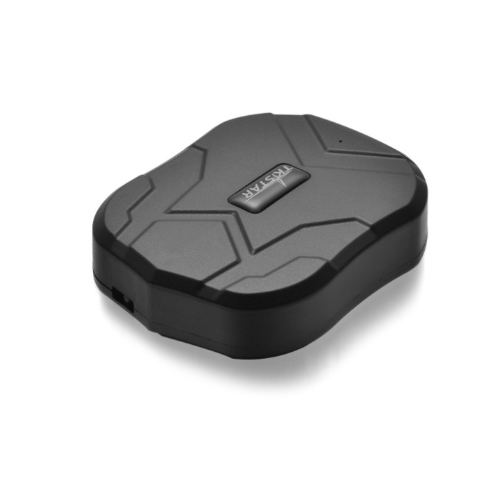

# TK-Star - TK905

El TK905 de TK-Star es un rastreador GPS 4G resistente, diseñado para ofrecer seguimiento fiable de vehículos y activos. Pensado para automóviles, flotas de alquiler, contenedores de carga y equipos exteriores, este equipo destaca por su gran autonomía, opciones de posicionamiento multimodo y alertas por movimiento que mantienen la visibilidad en despliegues de campo.

Como dispositivo compatible con Plaspy, el TK905 suministra las posiciones y eventos esenciales que necesitan los gestores y operadores de flota. Su posicionamiento con múltiples constelaciones, larga vida en espera y notificaciones activadas por vibración lo convierten en una opción práctica para alimentar Plaspy con datos para monitoreo en tiempo real, geocercas, historial de rutas y flujos de trabajo antirrobo.

## Características principales

- Rastreador compatible con Plaspy que proporciona actualizaciones de ubicación en tiempo real para vehículos y activos móviles
- Posicionamiento multimodo con soporte de múltiples constelaciones GNSS para mejorar la cobertura en entornos mixtos
- Gran batería de 5000 mAh pensada para larga duración en espera y despliegues prolongados
- Carcasa con clasificación IP65 y sensor de vibración sensible para alertas por movimiento y antirrobo
- Conjunto integral de alertas que incluye geocercas, exceso de velocidad y notificaciones de movimiento
- Almacenamiento histórico de rutas en el servidor para revisión retrospectiva e informes

## Cómo funciona con Plaspy

Al conectarse a Plaspy, el TK905 transmite su ubicación y los datos de eventos a la plataforma para que los equipos puedan monitorear activos en mapas, recibir alertas y generar reportes operativos. Plaspy ingiere las posiciones y las banderas de eventos del rastreador, haciendo esa información accesible en paneles y flujos automáticos.

- Actualizaciones de ubicación en vivo y mapeo para conciencia situacional inmediata
- Alertas de geocercas y exceso de velocidad enviadas a Plaspy para notificación rápida al operador
- Eventos de movimiento y vibración que aparecen como alertas discretas para apoyar la respuesta antirrobo
- Datos históricos de rutas almacenados en el servidor y accesibles vía Plaspy para análisis
- Información utilizada por Plaspy para generar informes operativos y apoyar la vigilancia de la flota

## Casos de uso típicos

- Gestión de flotas para supervisión de rutas, control de utilización y apoyo a despacho
- Protección de vehículos de alquiler mediante geocercas y notificaciones de movimiento para control de activos
- Monitoreo antirrobo con detección por vibración y alertas instantáneas ante movimiento no autorizado
- Seguimiento de contenedores y carga donde se requiere larga duración de batería y fiabilidad en exteriores
- Monitoreo de equipos remotos para mantener visibilidad de activos e instalaciones fuera de sitio

## Por qué elegir este rastreador con Plaspy

El TK905 combina durabilidad en campo con la telemetría que Plaspy necesita para ofrecer una gestión unificada de flota y activos. Su batería de larga autonomía y la protección IP65 favorecen despliegues prolongados, mientras que el posicionamiento por múltiples constelaciones y los modos de ubicación basados en red ayudan a mantener cobertura en condiciones variadas. Alimentar esos datos en Plaspy brinda a los operadores una interfaz única para seguimiento en vivo, alertas y revisión histórica.

Para organizaciones que buscan datos de ubicación confiables y visión operativa clara, el TK905 puede ser un componente útil dentro de una solución gestionada por Plaspy. Plaspy puede ingerir la ubicación y los eventos básicos del rastreador e integrarlos en flujos de trabajo, reportes y estrategias de alerta más amplias para apoyar las operaciones diarias y las necesidades de seguridad.

Para saber más sobre Plaspy y cómo se usan los rastreadores compatibles en la plataforma visite https://www.plaspy.com. Product specifications and availability can change over time so please verify current technical details and documentation on the manufacturer site https://www.tk-star.com/.
