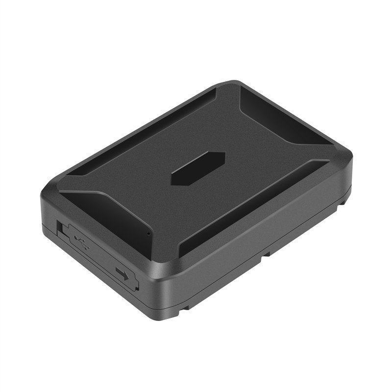

# TK-Star - TK920

El TK920 es un rastreador GPS 4G de uso intensivo para monitoreo a largo plazo de vehículos y activos. Con una carcasa robusta IP65, una batería recargable de 10000 mAh y posicionamiento multiconstelación \(GPS, BeiDou, GLONASS, LBS y Wi‑Fi\), el TK920 es compatible con Plaspy para un seguimiento en tiempo real fiable y gestión de flota en condiciones de campo exigentes.

Diseñado para automóviles privados, flotas de alquiler, contenedores, equipos de construcción y otros activos remotos, el TK920 combina una larga autonomía \(hasta 60 días en condiciones típicas\) con un conjunto amplio de alertas — detección de vibraciones, geocercas, movimiento/arranque y alertas de sobrevelocidad —, además de almacenamiento de rutas históricas accesible desde la web y móvil. Cuando se integra con Plaspy, este rastreador GPS proporciona telemetría accionable y visibilidad anti‑robo para operaciones que requieren resistencia y datos de ubicación fiables.

## Aspectos Clave

- Larga autonomía de la batería: batería Li‑ion de 3.7V y 10000 mAh que ofrece hasta 60 días en espera en condiciones típicas para despliegue remoto prolongado.
- Posicionamiento robusto: GNSS multiconstelación \(GPS, BeiDou, GLONASS\) más LBS y Wi‑Fi para mejor fiabilidad de ubicación en exteriores e interiores.
- Construcción robusta y resistente a la intemperie: clasificación IP65 que permite operar en entornos húmedos y condiciones de campo.
- Alertas en tiempo real integrales: detección de vibraciones \(alarma de movimiento tras 3 segundos\), geocercas, movimiento/arranque y alarmas de sobrevelocidad para apoyar flujos de anti‑robo y seguridad.
- Conectividad flexible: 4G FDD más opciones WCDMA, GSM y IoT \(NB‑IoT y Cat‑M1\) para telemetría global de bajo consumo y mayor cobertura.
- Datos históricos extendidos: almacenamiento en servidor de rutas históricas \(hasta 6 meses\); acceso a través de la plataforma web y la app móvil para análisis y cumplimiento normativo.
- Carga de vehículos y activos: admite entrada de cargador de coche \(12–24V\) y carga por toma de pared \(110–220V → 5V\) para recargas convenientes y operación continua.

## Cómo Funciona con Plaspy

Cuando se utiliza con Plaspy, el TK920 transmite datos de ubicación y estado a la plataforma de Plaspy a través de redes celulares \(4G, NB‑IoT o Cat‑M1 cuando esté disponible\). Plaspy ingiere coordenadas GNSS, movimientos y eventos de alarma y los presenta en paneles, aplicaciones móviles e informes para seguimiento en tiempo real, gestión de flotas y monitorización de seguridad.

- Actualizaciones de ubicación y telemetría en tiempo real entregadas a Plaspy para monitorización y enrutamiento.
- Alertas de vibración y movimiento \(sensor de vibración sensible que activa la alarma tras ~3 s de movimiento\) para anti‑robo y detección de manipulación.
- Geocercas, alertas de movimiento/arranque y de sobrevelocidad reenviadas a Plaspy para notificaciones instantáneas y reglas de escalamiento.
- Almacenamiento de rutas históricas \(hasta seis meses\) accesible en Plaspy para auditorías, reproducción de recorridos y cumplimiento normativo.
- Telemetría de bajo consumo vía NB‑IoT y Cat‑M1 para despliegues de larga vida y bajo costo.
- Estado de batería y carga \(entrada de cargador de coche/cargador de pared\) reportado a Plaspy para ayudar a programar mantenimiento y reducir el tiempo de inactividad.

## Visión Técnica

| Conectividad | 4G \(FDD\), WCDMA, GSM; NB‑IoT y Cat‑M1 compatibles para redes IoT |
| --- | --- |
| Bandas | Varios listados de bandas regionales compatibles con FDD/WCDMA/GSM \(bandas regionales según suministrador\) |
| Alimentación y batería | Batería Li‑ion recargable de 3.7V y 10000 mAh; entrada de cargador de coche 12–24V \(salida 5V\); carga de pared 110–220V → 5V; hasta 60 días en espera \(típico\) |
| Interfaces | Entrada de cargador de coche, entrada de cargador de pared; no se especifican I/O adicionales en la descripción del producto |
| GNSS | Conjunto de chips SC9820E, 66 canales, sensibilidad −165 dBm, precisión típica ~10 m; TTF: frío 35–80 s, tibio ~35 s, caliente ~1 s |
| Bluetooth | No especificado en la descripción del dispositivo |
| Gestión remota | Almacenamiento en servidor de rutas históricas \(hasta 6 meses\); acceso a través de plataforma web y app móvil |
| Factor de forma y entorno | 112 × 78 × 26 mm; ~315 g; clasificación IP65 a prueba de agua; operación −20 °C a +55 °C; almacenamiento −40 °C a +85 °C; humedad 5%–95% sin condensación; Descargas electrostáticas \(ESD\) de contacto ±7 kV, en aire ±14 kV |

## Casos de Uso

- Gestión de flotas para flotas de vehículos de alquiler y comerciales donde la larga vida de la batería y el seguimiento en tiempo real fiable son esenciales.
- Protección anti‑robo en vehículos estacionados y contenedores mediante detección de vibraciones, geocercas y alertas instantáneas de movimiento/arranque.
- Monitoreo remoto de equipos y contenedores en obras o en tránsito donde se requiere una protección IP65 robusta.
- Monitoreo a largo plazo de activos estacionales o de uso intermitente que se beneficia de una autonomía prolongada y telemetría de bajo consumo.

## Por qué Elegir Este Rastreador con Plaspy

Combinar el TK920 con Plaspy ofrece un equilibrio práctico entre autonomía, robustez y posicionamiento preciso multiconstelación para gestión profesional de flotas y seguridad de activos. La batería de 10000 mAh del TK920 minimiza las visitas de mantenimiento, mientras que el soporte NB‑IoT y Cat‑M1 proporciona opciones de conectividad flexibles para despliegues a gran escala. Plaspy consolida el seguimiento en tiempo real, las alarmas y las rutas históricas del TK920 en una plataforma centralizada para telemetría, informes y flujos de trabajo operativos.

Para las empresas que necesiten correlacionar los datos de ubicación con telemetría más amplia de vehículos, Plaspy puede combinar la posición y las alarmas del TK920 con fuentes de telemetría de terceros — por ejemplo, monitoreo de combustible, entradas de ignición o inmovilizador y sensores Bluetooth — cuando esas entradas adicionales estén presentes en la arquitectura de la flota. Esto convierte al TK920 en una opción práctica y compatible con Plaspy para equipos que priorizan fiabilidad, telemetría escalable y una funcionalidad anti‑robo clara sin sacrificar la duración de la batería ni la durabilidad.

