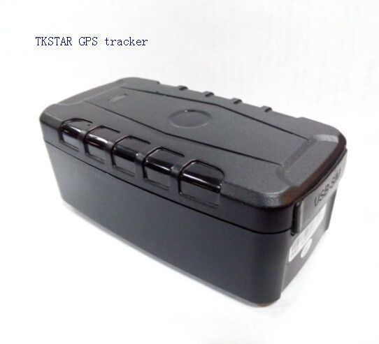

# TK-Star - XE209

El rastreador GPS portátil TK-Star XE209 es una solución confiable para rastrear vehículos, equipos y contenedores. Con su capacidad de seguimiento en tiempo real, este dispositivo le permite monitorear la ubicación de sus activos en todo momento. Ya sea que esté rastreando su flota de vehículos privados o alquilados, equipos al aire libre o contenedores de carga, el XE209 es una opción ideal.

El rastreador GPS XE209 ofrece una serie de características destacadas que lo convierten en una herramienta poderosa para el seguimiento y la seguridad. Con la función de auto-seguimiento, el dispositivo puede enviar actualizaciones periódicas de ubicación, lo que le permite mantenerse al tanto de la ubicación de sus activos sin tener que realizar un seguimiento manual. Además, el XE209 también cuenta con seguimiento del ángulo muerto, lo que significa que puede recibir alertas cuando un vehículo o activo se desvía de su ruta predefinida.

Otras características notables del rastreador GPS XE209 incluyen el seguimiento GPS + GSM, que garantiza una cobertura confiable en todo momento, y la capacidad de verificar el historial de seguimiento para analizar patrones y tendencias. Además, el dispositivo también ofrece la función de geo-cerca, que le permite establecer límites geográficos y recibir alertas cuando un activo sale de esa área designada.

El XE209 también está equipado con una serie de alertas útiles, como la alerta de abandono, que le notifica cuando un vehículo o activo se detiene en un lugar no autorizado, la alerta de exceso de velocidad, que le avisa cuando un activo supera un límite de velocidad predefinido, y la alerta de batería baja, que le informa cuando la batería del dispositivo está por agotarse. Además, el rastreador GPS XE209 también ofrece la función de monitoreo remoto, lo que le permite acceder a la ubicación y los datos del dispositivo de forma remota.

Con una batería de larga duración de 20000 mAh, el rastreador GPS XE209 puede funcionar durante largos períodos de tiempo sin necesidad de recargar. Esto lo convierte en una opción ideal para aquellos que necesitan un seguimiento confiable y continuo de sus activos sin interrupciones.

En resumen, el rastreador GPS portátil TK-Star XE209 es una solución confiable y versátil para el seguimiento de vehículos, equipos y contenedores. Con su amplia gama de características y su batería de larga duración, este dispositivo le brinda la tranquilidad de saber dónde se encuentran sus activos en todo momento.

### Características destacadas:

- Seguimiento en tiempo real
- Auto-tracking
- Seguimiento del ángulo muerto
- GPS + GSM de seguimiento
- Historia de cheques-trace
- Geo-cerca
- Alerta abandonado
- Alerta de exceso de velocidad
- Alerta de batería baja
- Monitoreo remoto
- Sacudir alerta del sensor
- Modo de trabajo de albergue
- Batería de larga duración de 20000 mAh

