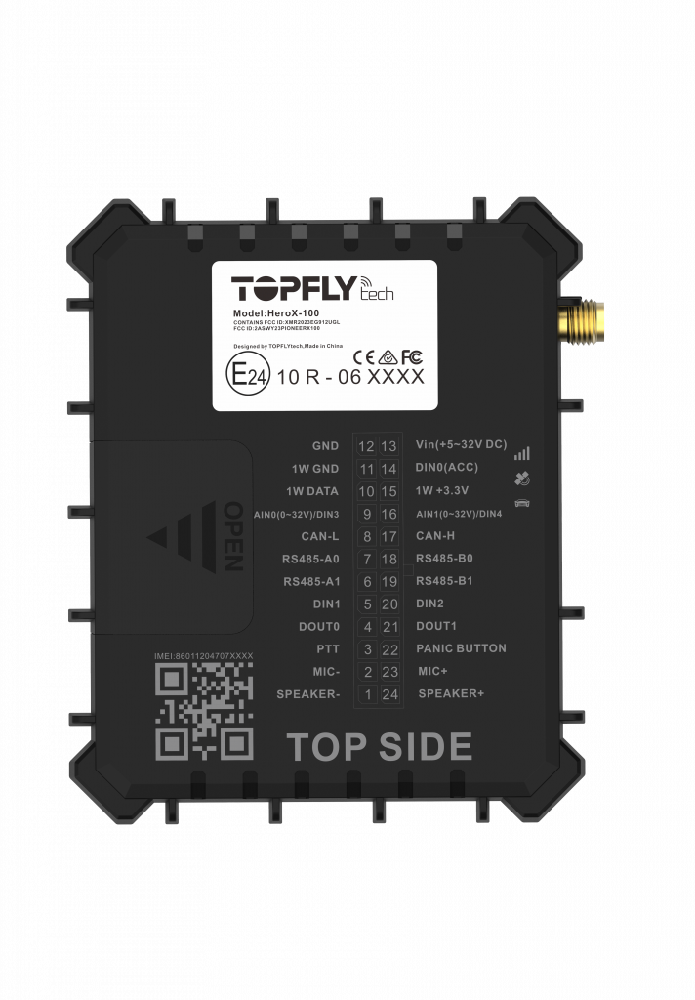

# TopFly - HeroX 100

El TopFly HeroX 100 es un rastreador GPS de instalación fija diseñado para implementaciones exigentes de seguimiento de vehículos y activos. Ofrece posicionamiento multi GNSS de alta precisión con un CEP autónomo por debajo de 1,5 m y utiliza conectividad 4G CAT 1 con retroceso a 2G, proporcionando localizaciones y telemetría fiables para seguimiento en tiempo real, gestión de flotas y escenarios antirrobo.

Como dispositivo compatible con Plaspy, el HeroX 100 puede enviar de forma continua posiciones y telemetría a la plataforma para monitorización en vivo, alertas e informes. Su amplio conjunto de opciones de E/S, telemetría CAN BUS y soporte para sensores BLE lo hacen práctico para integraciones como control remoto de inmovilizadores, monitoreo de combustible e identificación de conductores, mientras que el almacenamiento en búfer a bordo preserva el historial durante interrupciones temporales de la red.

## Características principales

- Rastreador cableado compatible con Plaspy que ofrece posicionamiento multi GNSS preciso con CEP autónomo por debajo de 1,5 m.
- Conectividad celular 4G CAT 1 con fallback a 2G para amplia cobertura de red y telemetría continua.
- Amplias E/S y posibilidad de expansión, incluyendo soporte CAN BUS y múltiples interfaces digitales y analógicas para datos y control del vehículo.
- Soporte BLE 5.1 de largo alcance para emparejar accesorios de temperatura, humedad, puertas e identificación de conductores.
- Almacenamiento en búfer integrado y reportes de alta frecuencia para mantener el historial durante pérdidas de conectividad y seguimiento ágil.
- Diseñado para uso vehicular con funciones útiles para antirrobo, inmovilización y monitoreo operativo.

## Cómo funciona con Plaspy

Al conectarlo a Plaspy, el HeroX 100 transmite posiciones GNSS, telemetría del vehículo, eventos de E/S y lecturas de sensores BLE a la plataforma, donde esos datos se normalizan para mapas, alertas e informes. Plaspy utiliza las señales entrantes para ofrecer visibilidad de flota en tiempo real, flujos de trabajo automáticos y análisis histórico que apoyan a equipos operativos y a procesos de seguridad.

- Actualizaciones de ubicación en tiempo real y visualización en mapa para despacho y monitoreo, configurables según sus necesidades de reporte.
- Alertas por encendido, desconexión y eventos SOS, que permiten a Plaspy activar notificaciones o respuestas operativas.
- Telemetría vehicular vía CAN BUS e entradas analógicas disponible en los paneles de Plaspy para datos de combustible, odómetro y motor cuando el vehículo lo proporciona.
- Control remoto de relés e inmovilizadores gestionado desde Plaspy usando las salidas del dispositivo para flujos de trabajo de antirrobo y control de acceso.
- Integración de sensores BLE para datos de temperatura e identificación de conductor enviados a Plaspy para monitoreo de cadena de frío y auditoría de accesos.
- Sincronización de datos almacenados en búfer tras cortes, de modo que Plaspy conserva un historial continuo y líneas de tiempo de eventos precisas.

## Casos de uso típicos

- Gestión de flotas y optimización de rutas con seguimiento en vivo e informes programados.
- Flujos de trabajo antirrobo e inmovilización que coordinan control remoto de relés y alertas por manipulación.
- Monitoreo de cadena de frío con sensores BLE de temperatura y humedad, con alertas y registros en la plataforma.
- Identificación y registro de conductores para cumplimiento y asignación de turnos usando etiquetas BLE o 1-wire.
- Monitoreo de activos y equipos especializados que requieren telemetría analógica, RS485 o basada en CAN.

## Por qué elegir este rastreador con Plaspy

El HeroX 100 es un rastreador compacto y lleno de funciones, ideal para transportistas, operadores de flota e integradores de sistemas que requieren un dispositivo compatible con Plaspy con telemetría profunda y E/S flexibles. Su combinación de posicionamiento multi GNSS preciso, conectividad celular resistente y soporte para accesorios lo hace apropiado para flotas mixtas y proyectos de seguimiento de activos donde la telemetría continua y el control remoto son críticos.

Para conocer más sobre cómo Plaspy puede usar datos a nivel de dispositivo de modelos como el TopFly HeroX 100, visite https://www.plaspy.com. Las especificaciones del producto y la disponibilidad pueden cambiar con el tiempo, por lo que verifique los detalles técnicos y las opciones de accesorios actuales con el fabricante en https://www.topflytech.com/.
