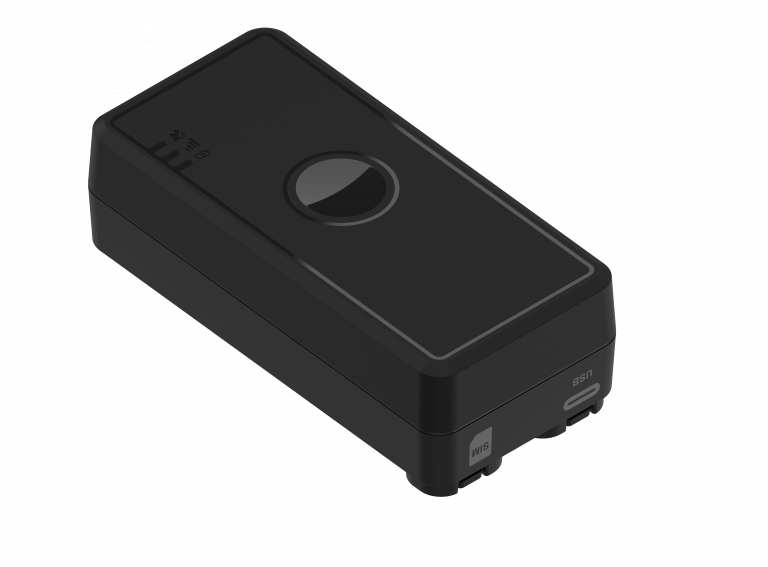

# TopFly - KnightX 100

El KnightX 100 es un rastreador GPS discreto y recargable, diseñado para la vigilancia a largo plazo de activos de alto valor. Integra posicionamiento híbrido, autonomía prolongada, almacenamiento en búfer y soporte para sensores auxiliares, lo que le permite ofrecer telemetría de ubicación y ambiental fiable sin necesidad de cableado permanente. Su tamaño compacto y montaje magnético lo hace ideal para instalaciones temporales donde la baja visibilidad y el bajo mantenimiento son prioridades.

Este modelo es compatible con Plaspy desde el primer momento, por lo que resulta una opción práctica para organizaciones que necesitan incorporar datos de ubicación, sensores y eventos a una plataforma de gestión de flotas ya establecida. Al integrarlo con Plaspy, el KnightX 100 puede alimentar paneles con seguimiento en tiempo real, alertas e informes históricos para supervisión operativa, flujos de trabajo antirobo y monitoreo de cadena de frío.

## Características principales

- Batería recargable de larga duración diseñada para despliegues de varios meses según el intervalo de reporte y uso.
- Posicionamiento híbrido que combina GNSS con Wi Fi y LBS para mayor cobertura en distintos entornos.
- Capacidad de actualizaciones rápidas con almacenamiento en búfer que preserva las posiciones rastreadas cuando la conectividad se interrumpe.
- Soporte para sensores BLE y sonda de temperatura externa opcional para telemetría ambiental e integraciones con accesorios.
- Montaje magnético discreto y factor de forma compacto para instalaciones encubiertas o temporales.
- Carcasa con clasificación IP67 e interfaz USB C para mantenimiento sencillo en campo.
- Actualizaciones de firmware remotas y opciones de configuración pensadas para la gestión a escala de flota.

## Cómo funciona con Plaspy

El KnightX 100 envía datos de ubicación, sensores y eventos a Plaspy para que gestores de flota y de activos obtengan visibilidad oportuna y alertas accionables. Plaspy ingiere los reportes del dispositivo y las cargas en búfer para mantener la continuidad del historial de rastreo y soportar informes, alertas y flujos operativos.

- Ubicación y telemetría en tiempo real aparecen en los paneles de Plaspy para monitoreo activo de la flota.
- Eventos de movimiento, manipulación y pánico pueden reenviarse a Plaspy para enrutar alertas y coordinar respuestas incidentes.
- El almacenamiento en búfer del dispositivo garantiza que posiciones y eventos se carguen a Plaspy una vez que se restablece la conectividad.
- Lecturas de la sonda externa de temperatura y de sensores BLE se integran en Plaspy para monitoreo de cadena de frío y condiciones ambientales.
- Las funciones de gestión remota permiten flujos de trabajo de firmware y configuración compatibles con el mantenimiento de flotas gestionado desde Plaspy.

## Casos de uso típicos

- Rastreo discreto de activos ocultos para equipos, remolques y objetos de valor donde se requiera montaje discreto.
- Monitoreo de flotas y remolques en despliegues temporales o estacionales que demandan bajo mantenimiento.
- Flujos de trabajo antirobo y de seguridad usando alertas de movimiento y eventos de pánico gestionados desde Plaspy.
- Monitoreo de cadena de frío y carga refrigerada empleando la sonda de temperatura externa opcional y sensores BLE.
- Alquileres por corto plazo y activos de campo que se benefician de despliegues rápidos y reportes en búfer.

## Por qué elegir este rastreador con Plaspy

El KnightX 100 es una opción práctica para organizaciones que requieren telemetría de ubicación y ambiental fiable sin una instalación cableada permanente. Su combinación de larga autonomía, posicionamiento híbrido y soporte para sensores lo hace versátil en casos que van desde la protección encubierta de activos hasta el monitoreo de cadena de frío, y se integra de forma natural con Plaspy para convertir los datos brutos del dispositivo en información operativa.

Si desea explorar cómo encaja el KnightX 100 en su programa de rastreo, conozca más sobre Plaspy en el sitio principal https://www.plaspy.com. Las especificaciones del producto y la disponibilidad pueden cambiar con el tiempo, por lo que le recomendamos verificar los detalles técnicos actuales y el soporte regional en el sitio del fabricante https://www.topflytech.com/.
