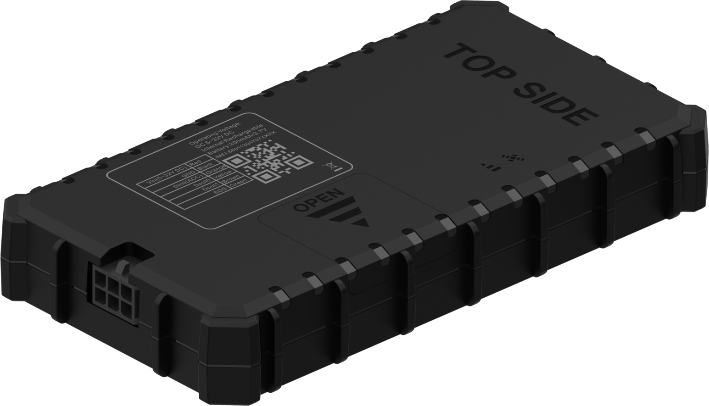

# TopFly - Pioneer X100

El Pioneer X100 es un rastreador GNSS cableado y compacto de TopFly, diseñado para la gestión de flotas y la seguridad vehicular. Ofrece conectividad global LTE Cat 1 con retrocompatibilidad 2G y admite posicionamiento con múltiples constelaciones GNSS. El equipo cuenta con varias entradas y salidas digitales para monitorear señales del vehículo y es compatible con sensores Bluetooth para supervisar condiciones ambientales y el estado de accesorios, lo que lo hace adecuado para una amplia gama de necesidades de monitoreo vehicular.

Como dispositivo compatible con Plaspy, el Pioneer X100 puede enviar datos de ubicación, estado y eventos a la plataforma Plaspy para ofrecer visibilidad centralizada de la flota. Sus funciones integradas de detección de eventos, como alertas de comportamiento del conductor y datos de incidentes por choque, permiten a los administradores de flota obtener información accionable dentro de Plaspy para programas de seguridad, supervisión operativa e informes, mientras que la capacidad de actualización remota ayuda a mantener las unidades desplegadas al día con un tiempo de inactividad mínimo.

## Aspectos destacados

- Rastreador GNSS cableado optimizado para despliegues de gestión de flotas y seguridad vehicular
- Conectividad global LTE Cat 1 con retrocompatibilidad 2G para mayor cobertura
- Varias entradas y salidas digitales para monitoreo del estado del motor, relés y accesorios
- Compatibilidad con sensores Bluetooth para ampliar el monitoreo a temperatura, humedad y estado de puertas
- Detección de comportamiento del conductor y alertas por conducción agresiva para apoyar programas de seguridad
- Detección de choques con recopilación de datos de incidentes y soporte para actualización remota de firmware

## Integración con Plaspy

Al integrarse con Plaspy, el Pioneer X100 suministra información de posición y eventos a una plataforma centralizada donde los operadores pueden supervisar activos, revisar incidentes y generar reportes. Plaspy procesa la telemetría del rastreador y la pone a disposición mediante paneles de control y herramientas de alertas diseñadas para uso operacional en flotas.

- Seguimiento de ubicación en tiempo real y revisión histórica de rutas para visibilidad vehicular
- Alertas configurables para eventos como pérdida de alimentación, conducción agresiva e incidentes por choque
- Informes agregados para apoyar el análisis de desempeño de la flota y las revisiones de seguridad
- Integración de lecturas de sensores BLE para monitoreo ambiental junto con datos de ubicación
- Gestión centralizada de dispositivos y monitoreo de estado para que los administradores vean la salud y conectividad de las unidades

## Casos de uso típicos

- Flotas de camiones comerciales y de reparto que requieren seguimiento continuo y monitoreo del comportamiento del conductor
- Autos corporativos y vehículos de servicio que necesitan supervisión del estado del motor y accesorios
- Protección de activos y seguridad vehicular con geocercas y alertas por manipulación
- Monitoreo de carga sensible a la temperatura mediante accesorios con sensores BLE y registro centralizado
- Organizaciones que se benefician de actualizaciones remotas de firmware para reducir mantenimiento in situ

## Por qué elegir este rastreador con Plaspy

El Pioneer X100 combina características de hardware prácticas con las capacidades de la plataforma Plaspy para ofrecer a las flotas una solución equilibrada de visibilidad y seguridad. Su combinación de conectividad celular de amplio alcance, múltiples opciones de E/S y soporte de sensores BLE permite a los operadores recopilar diversos flujos de datos que Plaspy presenta en vistas consolidadas, alertas e informes. La posibilidad de actualizar firmware de forma remota reduce la necesidad de mantenimiento físico y ayuda a mantener los dispositivos desplegados alineados con los requisitos operativos.

Si desea evaluar el Pioneer X100 para su flujo de trabajo de flota, Plaspy puede ayudar a convertir los datos del rastreador en paneles, alertas e información operativa. Para obtener más información sobre Plaspy visite https://www.plaspy.com. Las especificaciones del producto, la disponibilidad y los detalles del fabricante pueden cambiar con el tiempo, por lo que le recomendamos verificar las especificaciones y opciones actuales en el sitio oficial de TopFly https://www.topflytech.com/
