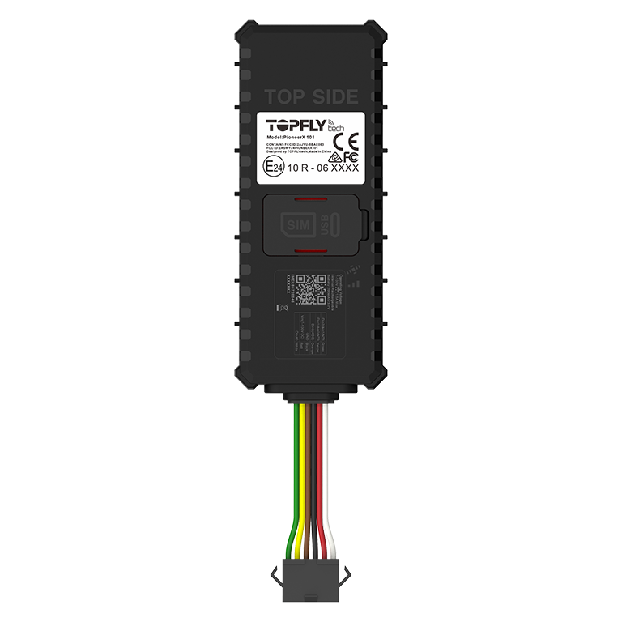

# TopFly - PioneerX 101

El PioneerX 101 es un rastreador GPS compatible con Plaspy, diseñado para ofrecer seguimiento en tiempo real confiable, gestión de flotas y soluciones telemáticas robustas. Como un dispositivo cableado de nivel de entrada a intermedio, ofrece actualizaciones frecuentes de posición (hasta cada 3 segundos), un amplio búfer offline para funcionamiento fuera de cobertura y una carcasa compacta con certificación IP67, ideal para vehículos, remolques y activos fijos que requieren localización continua, telemetría y capacidades antirrobo.

Este modelo es relevante para usuarios de Plaspy porque combina funciones telemáticas prácticas con opciones flexibles de reporte que se integran en los flujos de trabajo de Plaspy. El PioneerX 101 admite sensores externos y canales de telemetría ampliados para registrar eventos del conductor, estado de alimentación y condiciones del activo dentro de Plaspy, mientras que su búfer offline y reportes seguros ayudan a mantener la visibilidad de la flota cuando la conectividad fluctúa.

## Aspectos clave

- Reporte de posición en tiempo real con frecuencia de actualización configurable, con intervalos de hasta cada 3 segundos.
- Gran búfer interno para resiliencia offline, que permite una rápida resincronización de puntos almacenados cuando vuelve la conectividad.
- Diseño resistente y compacto con certificación IP67, adecuado para instalaciones en vehículos y activos.
- Soporte BLE 5.0 para extender la telemetría mediante sensores Bluetooth de temperatura, estado de puertas y eventos de pánico.
- Conectividad celular multiprotocolo con opciones de conmutación y múltiples modos de reporte para integración flexible con Plaspy.
- Múltiples entradas digitales y control remoto de salidas para detección de ignición, acciones de inmovilizador y respuestas antirrobo.
- Detección integrada de movimiento y comportamiento para reportar colisiones, conducción agresiva, exceso de velocidad o remolque a la plataforma de monitoreo.

## Cómo funciona con Plaspy

El PioneerX 101 transmite ubicación, telemetría y datos de eventos en un formato que Plaspy puede procesar, de modo que gerentes de flota e integradores obtengan visibilidad continua en su panel de Plaspy. El dispositivo almacena datos cuando se pierde la cobertura y los sincroniza una vez que la conexión se restablece, garantizando continuidad histórica y alertas confiables para la supervisión operativa.

- Transmisión en tiempo real de ubicación y telemetría hacia Plaspy con envío en búfer y transmisión al reconectar para conservar el historial completo de rutas y eventos.
- Eventos de vehículos y activos como estado de ignición, activaciones de puertas o botón de pánico y alertas por pérdida de energía, enviados a Plaspy para monitoreo en vivo y registros.
- Telemetría de sensores BLE transmitida a Plaspy para soportar controles de temperatura, monitoreo de estado de puertas y otros datos auxiliares.
- Acciones de control remoto disponibles desde Plaspy, como conmutación de salidas para inmovilizador o control de zumbador dentro de flujos antirrobo.
- Datos vehiculares ampliados, como telemetría de combustible o batería de vehículos eléctricos, pueden integrarse en Plaspy cuando se usan interfaces opcionales al bus del vehículo.

## Casos de uso típicos

- Gestión y enrutamiento de flotas donde actualizaciones frecuentes de ubicación y monitoreo de comportamiento apoyan decisiones operativas y capacitación de conductores.
- Flujos de trabajo antirrobo y recuperación usando detección de ignición, alertas por desconexión y control remoto de salidas.
- Cadena de frío y monitoreo de condiciones de activos vinculando sensores BLE de temperatura y humedad a los reportes en Plaspy.
- Proyectos de telemetría avanzada para vehículos eléctricos y otros que requieren integración de datos opcionales del bus vehicular en los tableros de la flota.
- Remolques y activos fuera de red que se benefician de un gran búfer interno y una rápida resincronización con Plaspy cuando vuelve la cobertura.

## Por qué elegir este rastreador con Plaspy

El PioneerX 101 ofrece un equilibrio entre funciones prácticas e integración flexible que lo convierten en una opción valiosa para organizaciones que implementan Plaspy para visibilidad de flotas y activos. Su combinación de actualizaciones frecuentes de posición, almacenamiento offline y modos de reporte seguros ayuda a mantener registros de rastreo consistentes, mientras que el soporte para sensores BLE y las múltiples opciones de E/S amplían los tipos de telemetría que pueden mostrarse dentro de Plaspy.

Para operadores enfocados en seguridad, antirrobo y supervisión operativa, la detección de movimiento y comportamiento del dispositivo, junto con sus capacidades de control remoto, permiten a los usuarios de Plaspy implementar flujos de monitoreo y respuesta sin necesidad de hardware adicional extenso. Para saber más sobre cómo Plaspy puede integrarse con dispositivos como el PioneerX 101 visite https://www.plaspy.com. Las especificaciones del producto y la disponibilidad pueden cambiar con el tiempo, por lo que verifique los detalles técnicos actuales y la documentación del fabricante en https://www.topflytech.com/ antes de tomar decisiones de despliegue.
