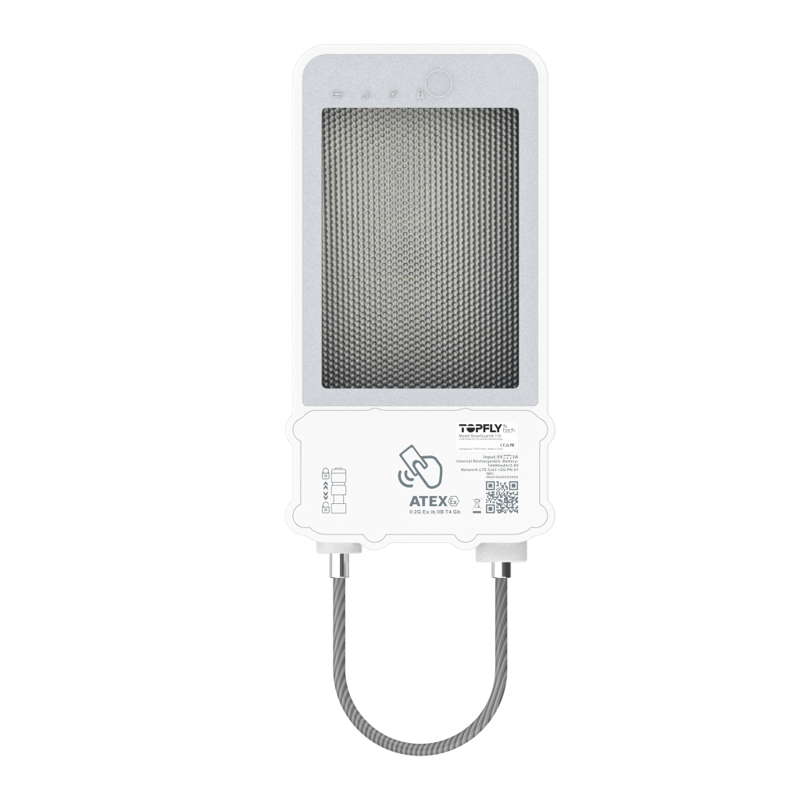

# TopFly - SolarGuardX 110

El SolarGuardX 110 es un rastreador GPS robusto, alimentado por energía solar y diseñado en un formato de candado de alta resistencia para la seguridad de activos en exteriores y el monitoreo a largo plazo. Ideado para contenedores, remolques y otros activos móviles en entornos remotos o hostiles, combina un panel solar integrado con una batería recargable de gran capacidad y GNSS multiconstelación para maximizar el tiempo operativo, ofrecer telemetría de ubicación fiable y funciones endurecidas contra el robo.

Como dispositivo compatible con Plaspy, el SolarGuardX 110 puede transmitir posiciones y eventos en tiempo real a Plaspy para el monitoreo de flotas, la gestión de geocercas y la elaboración de informes operativos. Su registro en búfer y los intervalos de reporte configurables lo hacen apropiado para flujos de trabajo que requieren continuidad durante periodos sin conexión, mientras que las comunicaciones seguras y las funciones de gestión remota facilitan la integración de la unidad en despliegues empresariales de protección de activos y seguimiento de flotas mediante la plataforma Plaspy.

## Características principales

- Seguimiento y telemetría en tiempo real compatibles con Plaspy, diseñados para la seguridad de activos en exteriores.
- Batería recargable de 14,400 mAh con soporte solar para operación prolongada en campo y menor mantenimiento.
- GNSS multiconstelación que proporciona fijaciones de posición muy precisas para una conciencia de ubicación exacta.
- Carcasa tipo candado resistente con protección IP67 y características mecánicas pensadas para entornos exigentes.
- Capacidad de reporte en alta frecuencia con intervalos cortos y gran buffer interno para continuidad durante desconexiones.
- Gestión remota y opciones de mantenimiento por aire para simplificar actualizaciones y control a escala de flota.

## Cómo funciona con Plaspy

El SolarGuardX 110 envía datos de posición y eventos a Plaspy, donde los operadores pueden ver los activos en mapas, configurar alertas e incluir la telemetría del dispositivo en informes y paneles. Plaspy procesa esos datos para apoyar la conciencia situacional, la revisión histórica y los flujos de trabajo automatizados para la protección de activos.

- Actualizaciones de ubicación y telemetría en tiempo real visibles en los mapas y vistas de monitoreo en vivo de Plaspy.
- Entrega de eventos y alarmas por condiciones como movimiento, manipulación o cambios de acceso para activar notificaciones.
- Carga de datos registrados en búfer tras periodos sin conexión para preservar la continuidad histórica de ubicaciones en los informes de Plaspy.
- Reportes configurables y subidas programadas de posición para equilibrar vida de batería y granularidad del seguimiento.
- Acciones remotas y gestión de firmware reflejadas en el estado del dispositivo en Plaspy para supervisión operacional.

## Casos de uso típicos

- Seguridad de contenedores y remolques con monitoreo anti robo y controles remotos de acceso.
- Seguimiento a largo plazo de activos estacionados como remolques, chasis y equipos intermodales.
- Despliegues de equipos en lugares remotos donde la carga solar y la gran capacidad de batería reducen las visitas al sitio.
- Gestión de activos compartidos o de alquiler usando geocercas y alertas de movimiento para controlar acceso y uso.
- Combinación de monitoreo de ubicación y condiciones ambientales cuando se integra con sensores complementarios ingeridos en Plaspy.

## Por qué elegir este rastreador con Plaspy

El SolarGuardX 110 es ideal para organizaciones que necesitan un rastreador duradero y de bajo mantenimiento para activos móviles de alto valor en campo. Su combinación de carga solar, gran capacidad de batería y carcasa reforzada reduce el tiempo de inactividad y las tareas de mantenimiento, al tiempo que ofrece la precisión de ubicación y la flexibilidad de reporte que los equipos esperan de un dispositivo compatible con Plaspy.

Si desea visibilidad consolidada en los flujos de trabajo de protección de activos y gestión de flota, integrar el SolarGuardX 110 con Plaspy ofrece una vía práctica hacia la supervisión centralizada, las alertas y los informes históricos. Obtenga más información sobre Plaspy en el sitio principal https://www.plaspy.com. Las especificaciones del producto y los detalles del fabricante pueden cambiar con el tiempo, por lo que le recomendamos verificar la información técnica y la disponibilidad actuales con la documentación oficial del fabricante en https://www.topflytech.com/.
