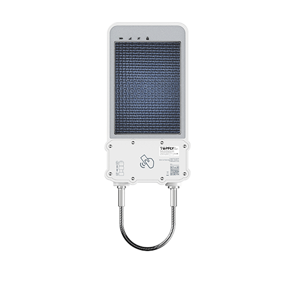

# TopFly - SolarGuardX 200

El SolarGuardX 200 de TopFly es un candado GPS resistente, alimentado por energía solar, diseñado para telemática de largo plazo en exteriores. Pensado para la protección de contenedores, remolques y activos remotos, combina una carga solar continua, una amplia batería Li‑Polymer de 14,400 mAh y una carcasa con clasificación IP67 para ofrecer autonomía extendida, seguimiento en tiempo real y alertas de manipulación en un formato compacto y resistente.

Como dispositivo compatible con Plaspy desde el primer momento, el SolarGuardX 200 puede enviar ubicaciones, eventos de seguridad y telemetría de estado a Plaspy para la supervisión de flotas y la gestión de incidentes. Su reporte de manipulación, eventos de bloqueo y desbloqueo, historial en búfer y capacidades de comandos remotos lo convierten en una opción práctica para organizaciones que desean centralizar el seguimiento y las alertas en los paneles de Plaspy sin requerir mantenimiento frecuente in situ.

## Aspectos clave

- Candado GPS solar compatible con Plaspy para protección de contenedores, remolques y activos remotos.
- Autonomía prolongada gracias a una batería recargable de 14,400 mAh asistida por un panel solar integrado.
- Diseño robusto con carcasa IP67 y detección de manipulación para cortes de cuerda, extracción de la cubierta de la SIM y eventos de bloqueo y desbloqueo.
- Posicionamiento GNSS de alta precisión con sistemas satelitales paralelos que ofrecen precisión horizontal inferior a 2.5 m para informes de ubicación precisos.
- Almacenamiento local en el dispositivo para registro en búfer que preserva el historial durante interrupciones de cobertura.
- Múltiples funciones de acceso y gestión remota, incluidas actualizaciones de firmware OTA y comandos remotos de bloqueo y desbloqueo.
- Construido para uso en exteriores exigente con estructura a prueba de clima, indicadores de estado y monitoreo ambiental a bordo.

## Cómo funciona con Plaspy

Al integrarse con Plaspy, el SolarGuardX 200 envía actualizaciones continuas de ubicación y eventos de seguridad a su cuenta de Plaspy para que usted pueda monitorear activos, activar alertas e incorporar la telemetría del dispositivo en flujos operativos. Plaspy procesa los informes del dispositivo y los presenta mediante mapas, notificaciones y herramientas de reporte usadas para la supervisión de flotas y la respuesta a incidentes.

- Ubicación y telemetría en tiempo real mostradas en los mapas de Plaspy para visibilidad inmediata de activos y monitoreo de rutas
- Eventos de manipulación, bloqueo y desbloqueo reenviados a Plaspy para generar alertas y flujos de notificación inmediatos
- Historial de ubicación en búfer subido a Plaspy tras cortes para ofrecer seguimiento sin huecos y registros auditables
- Comandos remotos y configuraciones enviados desde Plaspy para controlar el estado del candado y ajustar el comportamiento de reporte del dispositivo
- Gestión centralizada de dispositivos con FOTA y supervisión de estado para mantener la flota actualizada y visible en Plaspy

## Casos de uso típicos

- Seguridad de contenedores y remolques con alertas antirrobo en tiempo real y control remoto de desbloqueo
- Monitoreo de carga en ubicaciones remotas donde la larga autonomía y la carga solar reducen las visitas de mantenimiento
- Despliegues en aduanas y protección de activos que requieren detección de manipulación y registros de eventos para auditoría
- Seguimiento de equipos al aire libre y activos de alto valor en entornos expuestos que solicitan hardware resistente al clima
- Integración en flotas para auditoría de rutas, cumplimiento de geocercas e informes operativos en una sola plataforma

## Por qué elegir este rastreador con Plaspy

El SolarGuardX 200 es idóneo para organizaciones que necesitan una solución de rastreo duradera y de bajo mantenimiento para activos al aire libre e intermodales. Su combinación de energía asistida por panel solar, gran capacidad de batería, detección de manipulación y posicionamiento satelital preciso reduce la necesidad de servicios frecuentes en campo, al mismo tiempo que ofrece telemetría fiable para la toma de decisiones operativas.

Al integrarse con Plaspy, este rastreador forma parte de un ecosistema de flota gestionado donde ubicación, eventos y salud del dispositivo alimentan paneles, reglas e informes. Plaspy transforma la telemetría del SolarGuardX 200 en alertas accionables y análisis históricos para que los equipos protejan la carga, hagan cumplir geocercas y administren activos remotos con mayor eficiencia.

Para obtener más información sobre seguimiento y gestión de flotas con Plaspy visite https://www.plaspy.com. Las especificaciones del producto, disponibilidad y detalles del fabricante pueden cambiar con el tiempo por lo que verifique las especificaciones actuales en el sitio del fabricante https://www.topflytech.com/.
