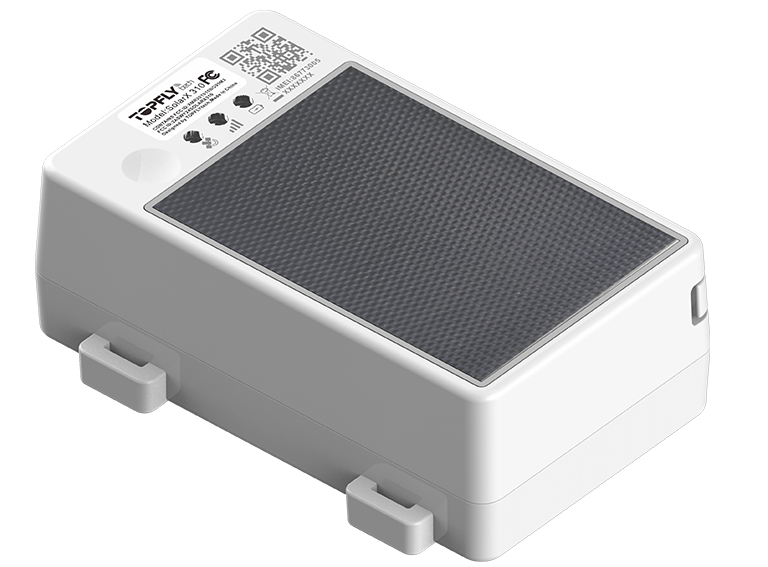

# TopFly - SolarX 310

El SolarX 310 es un rastreador GPS robusto con alimentación solar, diseñado para despliegues prolongados en exteriores. Pensado para contenedores, remolques, camiones y otros activos móviles de alto valor, combina seguimiento en tiempo real, un amplio búfer local y resistencia ambiental para mantener la ubicación y la telemetría disponibles incluso en áreas remotas. Su diseño prioriza la autonomía a largo plazo y la protección duradera en instalaciones expuestas.

Compatible con Plaspy desde el primer momento, el SolarX 310 envía directamente posiciones y eventos a Plaspy para tableros, alertas e informes históricos. Esa compatibilidad nativa lo hace adecuado para equipos que requieren visibilidad continua, notificaciones antirrobo y telemetría sensible a sensores dentro de una plataforma de gestión de flotas como Plaspy.

## Características principales

- Compatible con Plaspy y con actualizaciones en tiempo real configurables para visibilidad rápida de la flota y seguimiento de activos.
- Alimentación asistida por panel solar integrado y batería interna para extender la vida operativa entre mantenimientos.
- Carcasa resistente con clasificación IP67 y refuerzos para uso en exteriores sobre contenedores, remolques y camiones.
- Amplio búfer local que almacena decenas de miles de puntos para preservar las rutas cuando no hay cobertura celular.
- Posicionamiento GNSS multiconstelación con alta precisión horizontal para mejorar la exactitud de ubicación en los flujos de trabajo de activos.
- Soporte para sensores Bluetooth para monitoreo ambiental y sensores de puertas o estado, integrando telemetría con ubicación.
- Detección de manipulación y extracción, además de geocercas configurables y tipos de alarma para monitoreo antirrobo y de seguridad.

## Cómo funciona con Plaspy

Al integrarse con Plaspy, el SolarX 310 proporciona flujos continuos de posiciones y eventos que alimentan tableros en vivo, reglas de alerta y reproducción histórica. Plaspy procesa los mensajes del dispositivo y utiliza los puntos almacenados en búfer para preservar la continuidad si el rastreador queda temporalmente sin conexión, además de presentar eventos y lecturas de sensores para una acción inmediata.

- Actualizaciones de ubicación y telemetría en tiempo real disponibles en los tableros de Plaspy para monitoreo en vivo y supervisión operativa.
- Reproducción histórica a partir del búfer almacenado para reconstruir rutas y líneas de tiempo tras interrupciones de conectividad.
- Alertas instantáneas en Plaspy por extracción, manipulación o violaciones de geocercas que apoyan los flujos de trabajo antirrobo.
- Telemetría ambiental y de estado desde sensores a bordo y Bluetooth enviada a Plaspy para alertas basadas en condiciones.
- Informes y análisis en Plaspy utilizando eventos del dispositivo y datos históricos para optimizar servicios y revisar cumplimiento.

## Casos de uso típicos

- Gestión de flotas de remolques y camiones que requieren seguimiento GPS continuo y visibilidad operativa.
- Rastreo de contenedores y carga donde la energía solar y la carcasa resistente reducen las necesidades de mantenimiento.
- Flujos de trabajo antirrobo y detección de extracciones mediante alertas de manipulación y notificaciones de geocerca.
- Telemetría ambiental para cargas sensibles usando datos de sensores combinados con contexto de ubicación.
- Monitoreo de activos en despliegues prolongados que depende de registro en búfer y vida útil extendida del equipo.

## Por qué elegir este rastreador con Plaspy

El SolarX 310 es una opción práctica para organizaciones que usan Plaspy y priorizan la durabilidad, la larga autonomía de batería y el seguimiento confiable. Su operación asistida por energía solar y su amplio búfer local reducen las brechas de datos y el mantenimiento in situ, mientras que el soporte de sensores y la detección de extracciones permiten un monitoreo antirrobo y ambiental más completo dentro de Plaspy. Esa combinación ayuda a que los tableros reflejen información precisa y las alertas sean oportunas sin intervención excesiva.

Para equipos que evalúan opciones de rastreadores, el SolarX 310 combina hardware pensado para activos expuestos con la plataforma Plaspy para ofrecer visibilidad de extremo a extremo, informes y alertas. Conozca más sobre Plaspy en el sitio principal https://www.plaspy.com. Las especificaciones y la disponibilidad del producto pueden cambiar con el tiempo, por lo que es recomendable verificar los detalles técnicos y las certificaciones actuales en la documentación del fabricante en https://www.topflytech.com/
