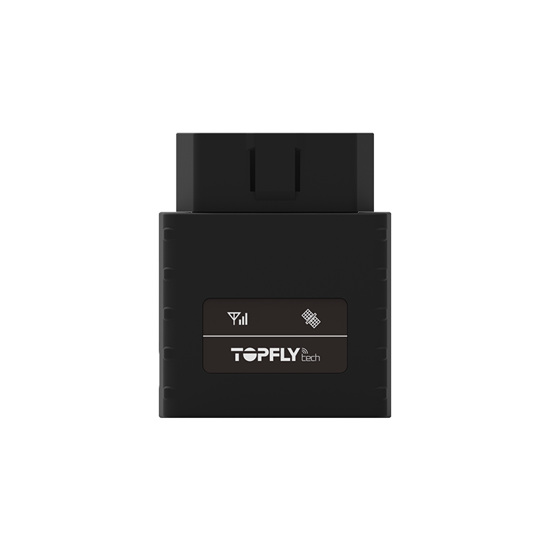

# TopFly - T8608

El TopFly T8608 \(2G\) es un rastreador OBDII básico diseñado para un seguimiento sencillo de vehículos sin características complejas o innecesarias. Este rastreador plug & play es fácil de usar y no requiere instalación ni mantenimiento. Está equipado con tecnología BLE \(Bluetooth de baja energía\), lo que le permite trabajar con sensores BLE para monitorear temperatura, humedad, estado de las puertas y más.

Una de las características destacadas del T8608 es su capacidad de ubicación en tiempo real y en búfer. Puede proporcionar actualizaciones de ubicación en tiempo real con una frecuencia de hasta cada 3 segundos, y puede guardar hasta 60,000 puntos de ubicación en su búfer si se queda sin cobertura de red. Esto asegura que nunca pierdas datos de ubicación importantes.

El tamaño compacto del T8608 lo convierte en uno de los rastreadores OBDII más pequeños del mercado. Se conecta fácilmente al puerto OBDII de tu vehículo, eliminando la necesidad de cualquier instalación. A pesar de su tamaño reducido, cuenta con potentes características.

En cuanto a la conectividad, el T8608 admite frecuencias GSM de cuádruple banda \(850/900/1800/1900 MHz\) y está equipado con un receptor GNSS todo en uno que admite los sistemas de satélite GPS, Glonass, Galileo y Beidou. Esto garantiza una posición precisa y confiable.

El T8608 también ofrece una variedad de alertas y notificaciones, incluyendo alertas de desconexión cuando el dispositivo se desconecta de la alimentación, alertas de encendido/apagado del motor y alertas de exceso de velocidad. También puede detectar eventos de conducción imprudente, como aceleración brusca, giros, frenado y colisiones.

Con su compatibilidad BLE 4.0, el T8608 puede funcionar con los sensores BLE de TOPFLYtech, incluyendo sensores de temperatura y humedad, sensores de puertas, relés inalámbricos e incluso tus propios sensores. Esto permite una amplia gama de posibilidades de monitoreo.

En cuanto a las especificaciones, el T8608 cuenta con un diseño compacto con dimensiones de 57 mm x 50 mm x 24 mm y pesa solo 50 g. Opera en un rango de voltaje de 7V a 32V DC y tiene un rango de temperatura de funcionamiento de -30℃ a +80℃ \(-22°F a 176°F\). También cuenta con una batería de respaldo para enviar alertas de desconexión cuando se desconecta la alimentación.

En resumen, el TopFly T8608 \(2G\) es un rastreador OBDII confiable y fácil de usar que ofrece seguimiento en tiempo real, compatibilidad con sensores BLE y una variedad de características útiles. Ya sea que necesites rastrear tu vehículo personal o gestionar una flota de vehículos, el T8608 es una excelente opción.

