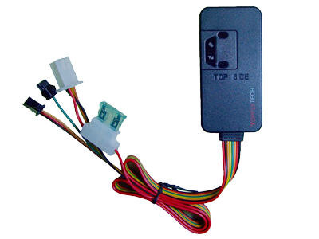

# TopFly - T8803 PRO

El T8803 PRO de TopFly es un rastreador GPS vehicular compacto pensado para el monitoreo confiable de ubicación y la seguridad básica del vehículo. Este modelo PRO se basa en la plataforma T8803A y añade alarmas por remolque y vibración, un sensor G integrado, entrada SOS y cable para micrófono. Su carcasa sellada con protección IP66 y el diseño sin antena externa lo hacen ideal para instalar de forma discreta en autos y furgonetas donde la resistencia a la intemperie y una instalación poco visible son importantes.

Como dispositivo compatible con Plaspy, el T8803 PRO puede enviar datos de ubicación y eventos a los flujos de trabajo de gestión de flotas para mejorar la visibilidad y el control operativo. El rastreador ofrece posicionamiento GPS con respaldo por Cell ID cuando no hay señal satelital, dispone de modo de sueño inteligente para optimizar el consumo de datos y permite administración remota por GPRS. Estas características lo convierten en una opción práctica para integrar con Plaspy en seguimiento de flotas, alertas y supervisión remota básica.

## Puntos clave

- Rastreador vehicular compacto sin antenas externas para una colocación discreta
- Carcasa con grado IP66, resistente al polvo y salpicaduras de agua
- Sensor G integrado y alarmas por remolque y vibración para mayor seguridad
- Entrada SOS y cable para micrófono para señales de emergencia y opciones de audio
- Modo de sueño inteligente y protocolo optimizado para reducir el uso de datos GPRS
- Amplio rango de voltaje de entrada adecuado para autos y vans, con batería interna de respaldo para operación limitada sin alimentación principal
- Posicionamiento GPS con respaldo por Cell ID en ubicaciones con recepción satelital limitada

## Cómo funciona con Plaspy

Cuando usted lo use con Plaspy, el T8803 PRO transmite posiciones y eventos a una plataforma centralizada de gestión de flotas donde los operadores pueden supervisar vehículos y responder a incidentes. Plaspy procesa las actualizaciones de ubicación y las señales de alarma para ofrecer visibilidad en tiempo real y reportes históricos que apoyan la toma de decisiones operativas.

- Seguimiento de ubicación en tiempo real visible en los mapas de Plaspy para supervisión de flota
- Reenvío de alarmas a Plaspy para eventos de remolque, vibración y SOS que aceleran la respuesta
- Rutas históricas e informes por intervalos disponibles en Plaspy para revisión de recorridos y cumplimiento
- Indicadores de estado del dispositivo y online/offline para facilitar la planificación de mantenimiento
- Uso de posiciones por Cell ID en Plaspy como respaldo cuando no hay señal GPS
- Menor consumo de datos reflejado en la plataforma gracias al modo de sueño inteligente

## Casos de uso típicos

- Monitoreo de vehículos de flotas pequeñas y medianas de reparto o servicios
- Disuasión y apoyo en recuperación ante robos mediante alarmas de remolque y vibración con avisos
- Supervisión remota de autos y furgonetas de la empresa donde se prefiere una instalación discreta
- Alertas de emergencia para conductores mediante la entrada SOS vinculada a los flujos de trabajo del operador
- Entornos que requieren hardware resistente al clima para uso confiable en exteriores

## Por qué elegir este rastreador con Plaspy

El T8803 PRO es una elección práctica para organizaciones que buscan un rastreador compacto y resistente al clima, con alarmas básicas de seguridad y modos de reporte sencillos. Sus funciones de alarma integradas y la batería de respaldo garantizan continuidad en el monitoreo y permiten alertas oportunas, mientras que la ausencia de antenas externas facilita la instalación en espacios reducidos del vehículo.

Combinado con Plaspy, este rastreador ofrece un camino directo hacia visibilidad en tiempo real, generación de alertas e informes históricos sin configuraciones innecesariamente complejas. Si su operación requiere un rastreador robusto y orientado a vehículos que se integre con una plataforma moderna de gestión de flotas, vale la pena considerar el T8803 PRO.

Para obtener más información sobre la gestión de dispositivos compatibles y las capacidades de la plataforma, visite Plaspy en https://www.plaspy.com. Las especificaciones del producto y las opciones de accesorios pueden cambiar con el tiempo, por lo que le recomendamos verificar los detalles técnicos y la disponibilidad actuales con el fabricante en https://www.topflytech.com/.
