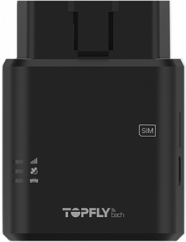

# TopFly - TLD2-D

El TopFly TLD2-D es un rastreador GPS 4G LTE en formato OBDII plug-and-play diseñado para un despliegue rápido en flotas, autos corporativos y vehículos de alquiler. Ofrece posicionamiento en tiempo real con alta frecuencia y telemetría desde el bus CAN, como VIN, odómetro, nivel de combustible, RPM y códigos de diagnóstico, todo accesible sin cables al conectarlo al puerto OBDII del vehículo. Además soporta emparejamiento con sensores Bluetooth, cuenta con un acelerómetro interno con buzzer para alertas por eventos bruscos y funciones en el equipo para vigilancia antirrobo.

Al ser compatible con Plaspy desde el primer momento, el TLD2-D puede enviar ubicación, telemetría del vehículo e entradas de sensores directamente a Plaspy para visualización en vivo, alertas e informes. Esta integración lo convierte en una opción práctica para operadores que necesitan visibilidad inmediata de la ubicación y el estado de sus unidades, y que desean centralizar eventos, geocercas y datos históricos en la plataforma de gestión de flotas Plaspy.

## Aspectos destacados

- Formato OBDII plug-and-play para despliegues rápidos en grandes flotas sin necesidad de cableado adicional.
- Seguimiento en tiempo real de alta frecuencia con intervalos configurables hasta aproximadamente cada 3 segundos.
- Telemetría profunda desde el bus CAN, incluyendo VIN, odómetro, nivel de combustible, RPM y DTC para diagnósticos y reportes de flota.
- Soporte para sensores BLE de temperatura, humedad y estado de puertas para ampliar la visibilidad de carga y accesos.
- Acelerómetro integrado y buzzer interno para detección de eventos bruscos y avisos al conductor en programas de seguridad.
- Resiliencia de red, gestión remota con soporte de actualizaciones de firmware, batería de respaldo y detección de interferencias para mayor capacidad de respuesta ante robos.

## Cómo funciona con Plaspy

Al conectarse a Plaspy, el TLD2-D transmite posición GPS, telemetría del bus CAN y datos de sensores emparejados a la plataforma, de modo que los administradores de flota pueden monitorear vehículos en tiempo real y revisar la actividad histórica. Plaspy procesa eventos y mediciones para alimentar el mapeo, las alertas, los reportes programados y los paneles operativos.

- Actualizaciones de ubicación y telemetría en tiempo real con intervalos configurables para una visibilidad detallada.
- Datos del bus CAN como VIN, odómetro, nivel de combustible, RPM y códigos de diagnóstico disponibles dentro de Plaspy.
- Notificaciones de ignición y desconexión, además de alertas de batería de respaldo para apoyar los flujos de trabajo antirrobo.
- Eventos de conducción y relacionados con choques, incluyendo detección de frenadas bruscas, aceleraciones intensas y giros cerrados para análisis de seguridad.
- Datos de sensores BLE sobre temperatura, humedad y estado de puertas entregados junto con la ubicación para monitoreo de carga y control de accesos.

## Casos de uso típicos

- Seguimiento de operaciones de flota para optimizar rutas, programación de mantenimiento y gestión de combustible.
- Monitoreo de autos de alquiler para registrar kilometraje, diagnósticos y ubicación del activo.
- Flujos de trabajo de prevención y recuperación por robo que emplean alertas de desconexión, detección de jamming y estado de ignición.
- Programas de seguridad para conductores que usan reportes de eventos bruscos y avisos por buzzer para capacitación y revisión de incidentes.
- Monitoreo de carga sensible a la temperatura mediante emparejamiento de sensores BLE ambientales con geoposicionamiento.

## Por qué elegir este rastreador con Plaspy

El TLD2-D ofrece una ruta de baja fricción hacia una telemática completa al combinar la conectividad OBDII plug-and-play con telemetría vehicular avanzada y soporte de sensores. Para organizaciones que usan Plaspy, esto significa implementación más rápida, visibilidad de telemetría inmediata e integración de alertas e informes sin instalaciones complejas.

Los usuarios de Plaspy se benefician de las frecuentes actualizaciones de posición del TLD2-D, los datos del bus CAN y las entradas de sensores para mejorar la supervisión operativa, el monitoreo de seguridad y la garantía de la carga. Si necesita un dispositivo práctico que se empareje rápidamente con una plataforma centralizada de gestión de flota, el TLD2-D es una opción sólida para evaluar junto con las opciones de integración de Plaspy.

Learn more about Plaspy on the main website https://www.plaspy.com. Product specifications and availability can change over time so please verify current specifications and manufacturer details on the official TopFly website https://www.topflytech.com/.
