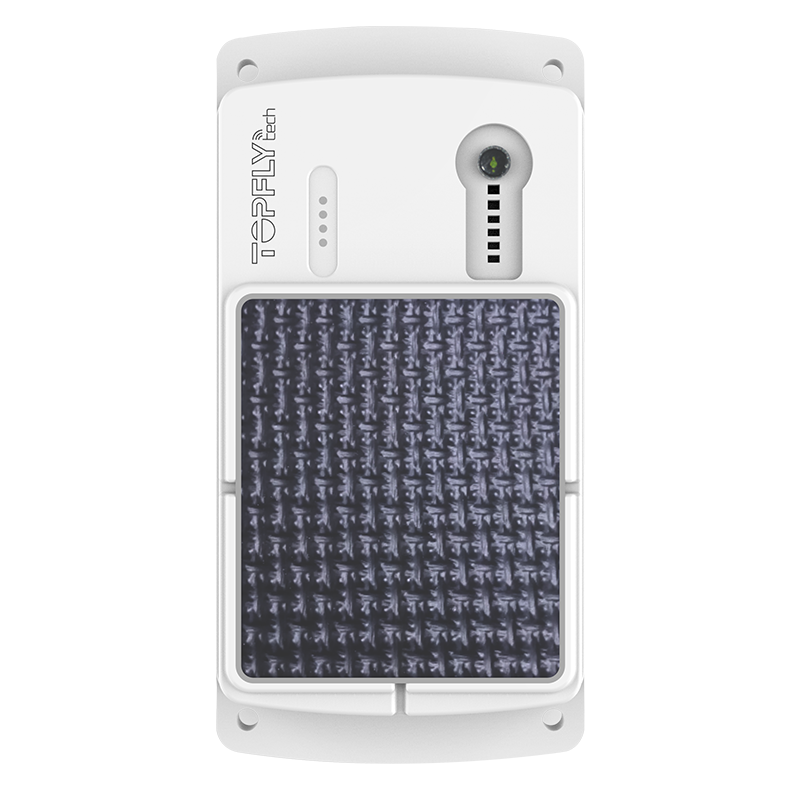

# TopFly - TLP1-SF

El TopFly TLP1-SF es un rastreador GPS 4G LTE con asistencia solar diseñado para el seguimiento de activos, remolques y camiones. Combina una batería interna recargable de gran capacidad con carga solar para reducir las intervenciones de mantenimiento, y ofrece reportes de ubicación en tiempo real además de almacenamiento en buffer para mantener el seguimiento cuando la cobertura es limitada. El equipo cuenta con una construcción robusta y resistente a la intemperie y múltiples opciones de montaje pensadas para uso exterior.

Como dispositivo compatible con Plaspy, el TLP1-SF puede enviar datos de posición en vivo e históricos a Plaspy para la gestión centralizada de flotas y activos. Sus actualizaciones en tiempo real y su amplia memoria de buffer ayudan a Plaspy a conservar la continuidad del historial de ubicaciones, mientras que las alertas de movimiento y los indicadores de estado aportan visibilidad operacional y supervisión básica del estado del dispositivo dentro de la plataforma.

## Características principales

- Asistencia solar y batería interna recargable de alta capacidad para reducir mantenimiento y extender el tiempo de despliegue
- Reportes de ubicación en tiempo real con capacidad de actualizaciones frecuentes para mayor resolución en el seguimiento
- Gran memoria de buffer capaz de almacenar hasta 60,000 puntos de ubicación para mantener continuidad durante interrupciones de cobertura
- Alertas por movimiento y alarmas por extracción para apoyar la seguridad básica y la detección de movimiento
- Carcasa robusta con certificación IP67, probada para exposición prolongada al agua, adecuada para instalaciones exteriores
- Soporte para múltiples sistemas globales de satélites para posicionamiento confiable y amplia cobertura
- Varias opciones de montaje, incluyendo imanes y tornillos, para adaptarse a distintos tipos de activos

## Cómo funciona con Plaspy

Cuando se utiliza con Plaspy, el TLP1-SF entrega datos de ubicación y estado que Plaspy ingiere para monitoreo, alertas e informes. Plaspy puede mostrar la información del dispositivo en una vista unificada de la flota y aplicar reglas o notificaciones basadas en eventos de movimiento y geocercas.

- Visualice posiciones en vivo e historial reciente de dispositivos individuales y de toda la flota en los paneles de Plaspy
- Reciba alertas de movimiento y eventos de geocerca generados por el dispositivo como notificaciones de Plaspy
- Utilice los datos almacenados en buffer para reproducir rutas y examinar el historial de ubicaciones cuando la cobertura de red no estuvo disponible
- Consolide indicadores de estado del dispositivo, como conectividad y nivel de batería, en informes operativos
- Incluya dispositivos TLP1-SF en grupos de flota de Plaspy para seguimiento, programación y supervisión combinados

## Casos de uso típicos

- Seguimiento de activos en despliegues prolongados donde la carga solar reduce la necesidad de servicio manual de baterías
- Monitoreo de remolques y contenedores para mantener visibilidad de ubicación durante transporte y almacenamiento
- Gestión de flotas de camiones que requieren actualizaciones continuas de posición y alertas de movimiento
- Equipos remotos que se benefician de carcasas resistentes e impermeables y de historial en buffer
- Operaciones que necesitan reproducción histórica fiable para investigar rutas o incidentes

## Por qué elegir este rastreador con Plaspy

El TLP1-SF es una opción práctica para organizaciones que buscan reducir el mantenimiento de activos remotos mientras mantienen visibilidad continua en Plaspy. Su combinación de asistencia solar, almacenamiento interno significativo para ubicaciones y construcción robusta lo hace ideal para el seguimiento exterior de activos en despliegues largos y con cobertura intermitente.

Los usuarios de Plaspy pueden aprovechar las alertas de movimiento del dispositivo, el historial de ubicaciones en buffer y los indicadores de estado para mantener supervisión operativa sin necesidad de frecuentes intervenciones en sitio. Para equipos que evalúan opciones de rastreadores, el TLP1-SF ofrece un equilibrio entre bajo mantenimiento y alimentación confiable de datos a Plaspy para monitoreo e informes de flota.

Para obtener más información sobre cómo Plaspy puede trabajar con dispositivos TopFly visite https://www.plaspy.com. Las especificaciones del producto, el estado de certificaciones y la disponibilidad pueden cambiar con el tiempo, así que verifique los detalles técnicos y las certificaciones actuales en el sitio del fabricante https://www.topflytech.com/.
