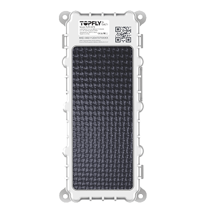

# TopFly - TLP2-SFB

El TLP2-SFB es un rastreador GPS de uso intensivo con asistencia solar, diseñado para el monitoreo prolongado de activos en exterior. Pensado para contenedores, remolques y camiones, combina una carcasa resistente con certificación IP67 y múltiples opciones de montaje con carga solar integrada para soportar despliegues extendidos. El equipo prioriza la visibilidad fiable de la ubicación y un amplio almacenamiento en búfer offline, de modo que los activos sigan siendo rastreables incluso en zonas con cobertura intermitente.

Como dispositivo compatible con Plaspy, el TLP2-SFB transmite ubicación y telemetría a la plataforma y puede reenviar datos de sensores externos para ofrecer información operativa más completa. Su capacidad para entregar actualizaciones de posición frecuentes y almacenar historial en búfer lo convierte en una opción práctica para operadores que usan Plaspy para monitoreo en tiempo real, alertas e informes históricos de activos remotos o de alto valor.

## Características principales

- Diseño con asistencia solar y gran capacidad de batería a bordo para extender la autonomía de despliegues remotos.
- Carcasa robusta con clasificación IP67 y múltiples opciones de montaje, apta para contenedores, remolques y vehículos pesados.
- Seguimiento de alta frecuencia con actualizaciones de hasta cada 3 segundos para mejorar la visibilidad de la ubicación.
- Amplio búfer offline que preserva hasta 49,000 puntos de localización para mantener el historial durante interrupciones de conectividad.
- Soporte para sensores BLE (temperatura, humedad y estado de puertas) para integrar telemetría en Plaspy.
- Dos sensores de luz y detección de movimiento para habilitar alertas por extracción o manipulación en flujos de trabajo de seguridad.

## Cómo funciona con Plaspy

El TLP2-SFB se integra con Plaspy enviando ubicación, historial en búfer y telemetría de sensores a la plataforma, donde los puntos se procesan para mapas en vivo, alertas e informes. Plaspy puede utilizar la alimentación del rastreador para impulsar paneles operativos, notificaciones automatizadas y análisis históricos.

- Ubicación y telemetría en tiempo real visibles en los mapas y páginas de seguimiento de Plaspy para supervisión operativa.
- Las cargas de ubicaciones en búfer garantizan que el historial de viajes y los puntos de diagnóstico se sincronicen con Plaspy cuando se restablece la conectividad.
- Eventos de inicio de movimiento, parada y estacionamiento que disparan notificaciones en Plaspy y se pueden usar en flujos automatizados para la operación de flotas.
- Detección de extracción y manipulación reportada a Plaspy para que los equipos de seguridad respondan ante movimientos no autorizados o interferencias en el dispositivo.
- Lecturas de sensores BLE de temperatura, humedad y estado de puertas que se integran en Plaspy para soportar alertas de cadena de frío y monitoreo de condiciones.

## Casos de uso habituales

- Rastreo de contenedores y remolques con amplio búfer offline para visibilidad logística en cruces fronterizos y zonas remotas.
- Monitoreo de activos en cadena de frío mediante sensores BLE de temperatura y humedad para alimentar cumplimiento y alertas en Plaspy.
- Supervisión de flota para vehículos pesados, donde los eventos de movimiento y estacionamiento ayudan a controlar la utilización y las rutas.
- Flujos de trabajo contra robo y detección de extracción que dependen de alertas por manipulación y notificaciones de movimiento.
- Despliegues de activos en exterior a largo plazo donde la carga solar y la construcción resistente reducen las visitas de mantenimiento.

## Por qué elegir este rastreador con Plaspy

El TLP2-SFB ofrece un equilibrio entre durabilidad, autonomía prolongada e integración de sensores que se ajusta a los casos de uso de Plaspy para activos remotos y de trabajo pesado. Su combinación de actualizaciones de posición frecuentes, gran búfer offline e integración con sensores BLE ayuda a las organizaciones a mantener visibilidad continua y telemetría accionable dentro de la plataforma Plaspy.

Seleccionar este rastreador para trabajar con Plaspy puede reducir las necesidades de mantenimiento en sitio mientras centraliza el historial de ubicaciones, las alertas por manipulación y los datos de sensores ambientales en un único sistema de gestión de flotas. Para equipos que gestionan contenedores, remolques u otros activos exteriores a largo plazo, el TLP2-SFB es una opción práctica a considerar para informes fiables y telemetría integrada.

Aprenda más sobre Plaspy en el sitio principal https://www.plaspy.com y verifique las especificaciones actuales del producto, disponibilidad y documentación del fabricante en el sitio de TopFly https://www.topflytech.com/ ya que los detalles y las características del producto pueden cambiar con el tiempo.
