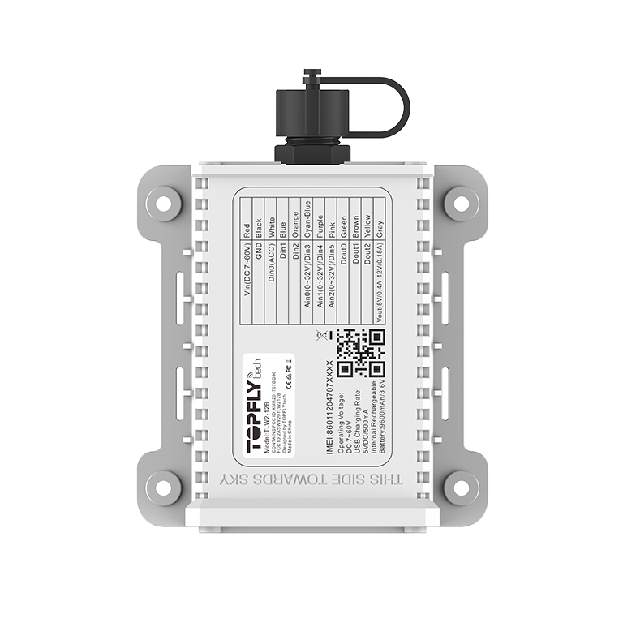

# TopFly - TLW2-12B

El TLW2-12B es un rastreador GPS de remolque cableado, diseñado para un seguimiento robusto de remolques y activos con larga permanencia, y es compatible con Plaspy desde fábrica. Con soporte BLE 5.0, una gran batería interna recargable y conectividad celular multinivel, el TLW2-12B ofrece seguimiento en tiempo real fiable y telemetría enriquecida para la gestión de flotas, monitoreo de cadena de frío y flujos de trabajo anti-robo que deben continuar, ya sea que el remolque esté conectado a un camión o permanezca solo en un patio.

Diseñado para integrarse con Plaspy, el TLW2-12B ofrece actualizaciones frecuentes de ubicación \(tan a menudo como cada 3 segundos\), reporte en modo búfer cuando hay pérdida de cobertura \(hasta 60.000 puntos\) y control de salidas remoto para alarmas y relevadores de accesorios. Su carcasa con clasificación IP67, el GNSS Qualcomm Gen 8C y su larga duración de batería lo convierten en una opción práctica cuando se necesita seguimiento persistente y seguro, con datos de sensores alimentando los paneles y alertas de Plaspy.

## Aspectos destacados

- Rastreador GPS compatible con Plaspy para el seguimiento de remolques y activos, con soporte nativo para actualizaciones de ubicación en tiempo real frecuentes y almacenamiento en búfer.
- Gran batería interna recargable de Li‑ion \(9600 mAh / 3.6V\) que alimenta largos intervalos de espera y operaciones cuando la alimentación externa está desconectada.
- Soporte BLE 5.0 para sensores Bluetooth \(temperatura, humedad\) y relés inalámbricos para ampliar la telemetría de cadena de frío y accesorios.
- Carcasa resistente IP67 impermeable \(probada a 5 m durante 15 horas\) y un formato compacto para montaje magnético o con tornillos en remolques y activos.
- Conectividad celular multinivel \(FDD, TDD, EGPRS\) con soporte Cat M1 y protocolos TCP/UDP/MQTT/SMS para una entrega de datos fiable a los servicios de Plaspy.
- Entradas y salidas digitales/analógicas configurables para conectar relevadores, sensores o entradas de encendido/auxiliares y habilitar el control remoto de salidas y alarmas.
- GNSS de alta precisión \(GPS+GLONASS+Galileo+Beidou\) con CEP \<2 m y TTFF rápido para reportes de ubicación precisos.

## Cómo funciona con Plaspy

Cuando se empareja con Plaspy, el TLW2-12B proporciona flujos continuos de posición, movimiento y telemetría que alimentan los mapas de seguimiento en tiempo real, las alertas y los informes históricos de Plaspy. El dispositivo utiliza datos celulares \(o SMS\) para transmitir datos de GPS y sensores, mientras que los puntos en búfer se envían automáticamente cuando la cobertura vuelve, asegurando que no haya lagunas en el historial de viajes ni en las líneas de tiempo de incidentes. Las lecturas de sensores BLE se recogen localmente y se envían a Plaspy para monitoreo de cadena de frío y alarmas ambientales.

- Actualizaciones de seguimiento en tiempo real \(configurables hasta intervalos de 3 segundos\) para la visibilidad de la flota en vivo en Plaspy.
- Almacenamiento de ubicación en búfer \(hasta 60.000 puntos\) para conservar los datos del recorrido durante las interrupciones de cobertura y subir en bloque al reconectarse.
- Alertas de movimiento, desconexión y pérdida de alimentación externa para activar notificaciones en Plaspy y reglas de escalamiento.
- Entradas configurables que pueden monitorizar el encendido, interruptores de puertas/alarma u otros sensores auxiliares y reportar estado a Plaspy.
- Soporte de sensores BLE 5.0 para telemetría de temperatura y humedad; los relés inalámbricos pueden controlarse de forma remota mediante Plaspy a través de las salidas del dispositivo.

## Resumen técnico

| Conectividad | Bandas LTE FDD B1/B2/B3/B4/B5/B8/B12/B13/B18/B19/B20/B25/B28; TDD B39 \(solo Cat M1\); EGPRS 850/900/1800/1900 MHz |
| --- | --- |
| Bandas y Protocolos | Soporta TCP, UDP, MQTT y SMS para la subida de datos a Plaspy |
| Alimentación y batería | Batería interna recargable de Li 9600 mAh / 3.6V; batería de reserva; puede alimentarse cuando el remolque está cableado o funcionar sólo con batería; cable magnético de carga/datos USB |
| Interfaces | 3 entradas digitales, 3 salidas digitales, 3 entradas configurables \(digital/analógico\), 1 salida de voltaje \(DC 5V/12V\); LEDs indicativos; sensor de retroiluminación; sensor de temperatura |
| GNSS | Conjunto Qualcomm Gen 8C; GPS + GLONASS + Galileo + Beidou; precisión de posición autónoma &lt;2 m CEP; TTFF Cold &lt;29 s, Warm &lt;27 s, Hot &lt;1 s |
| Bluetooth | BLE 5.0 para sensores de temperatura y humedad TOPFLYtech y relés inalámbricos |
| Gestión remota | Soporte FOTA; control remoto de salidas y configuración de alarmas |
| Forma y entorno | Resistente al agua IP67; dimensiones 132 × 100 × 34 mm; peso 320 g; rango de temperatura de operación -25°C a +80°C; montaje magnético o con tornillos |
| Certificaciones | FCC, PTCRB, CE, RCM, AT&T, US Cellular \(Verizon/T-Mobile/Sprint listadas como pendientes en la página del producto\) |

## Casos de uso

- Gestión de flotas: ubicación persistente del remolque y telemetría de movimiento para el seguimiento de rutas, análisis de utilización y recuperación rápida.
- Flujos de anti-robo y inmovilización de flotas: alertas de movimiento y desconexión, además de salidas controladas de forma remota para activar relevadores o integraciones de inmovilizador a través de hardware conectado.
- Monitoreo de la cadena de frío: sensores BLE de temperatura y humedad vinculados al TLW2-12B alimentan Plaspy con telemetría ambiental y alertas por umbral.
- Patios remotos y activos fuera de red: gran batería interna y buffering de alta capacidad aseguran el seguimiento histórico incluso cuando los remolques se almacenan sin alimentación externa.
- Mantenimiento impulsado por sensores y monitoreo de estado: entradas analógicas/digitales permiten reportar estado de puertas, eventos de alarma u otros sensores auxiliares a Plaspy para flujos de trabajo automatizados.

## Por qué elegir este rastreador con Plaspy

El TLW2-12B ofrece una combinación equilibrada de resistencia, durabilidad y conectividad que se alinea con las capacidades de seguimiento en tiempo real y gestión de flotas de Plaspy. Su batería de 9600 mAh y su buffering extenso reducen la pérdida de datos durante estancias largas en patios, mientras BLE 5.0 y las entradas/salidas configurables permiten extender la telemetría a sensores de temperatura, relés y otros sensores Bluetooth. La conectividad celular multinivel y el soporte MQTT/TCP simplifican la integración con la plataforma de Plaspy para despliegues escalables.

Para flotas y gestores de activos que priorizan una precisión de posición fiable, una larga vida de la batería y la capacidad de mantener los remolques conectados a Plaspy, ya sea cuando están cableados a un camión o estacionados durante meses, el TLW2-12B es una opción práctica y robusta. Soporta control remoto de salidas y flujos de alarmas, actualizaciones FOTA para la gestión continua del dispositivo y las integraciones de sensores necesarias para antirrobo, telemetría y monitoreo de la cadena de frío a través de Plaspy.

