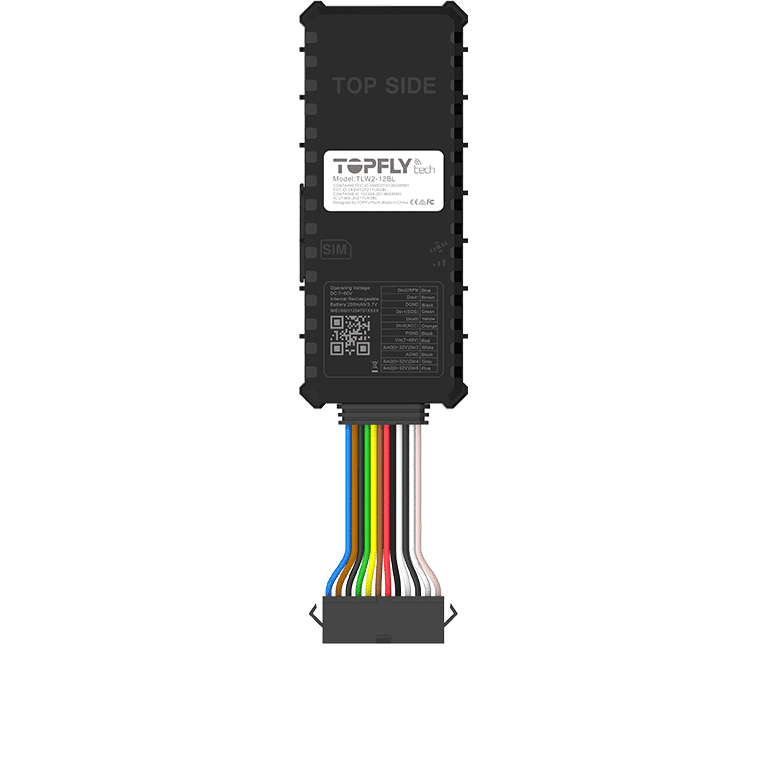

# TopFly - TLW2-12BL

El TLW2-12BL es un rastreador GPS para vehículos con cableado fijo, diseñado para la gestión de flotas, protección antirrobo y telemetría avanzada. Compatible con Plaspy desde el inicio, este equipo ofrece seguimiento en tiempo real de alta frecuencia \(actualizaciones de posición cada 3 segundos\), rendimiento robusto de GNSS e integración de Bluetooth Low Energy para soporte de sensores externos, lo que lo convierte en una opción versátil para operadores que requieren inteligencia de ubicación confiable y control de vehículos a través de la plataforma Plaspy.

El TLW2-12BL está diseñado para despliegue global con conectividad 4G CAT-M1 y respaldo 2G, I/O extenso para detección de encendido y inmovilización controlada por relé, y almacenamiento en búfer en el dispositivo de hasta 60,000 puntos de ubicación para operar en redes intermitentes. Cuando se empareja con Plaspy, los gestores de flotas obtienen acceso inmediato a la ubicación en vivo, telemetría, monitoreo de combustible, alertas de accidentes y de comportamiento de conducción, y datos de sensores BLE para monitoreo de la cadena de frío o de puertas/temperatura.

## Aspectos clave

- Rastreador GPS compatible con Plaspy con seguimiento en tiempo real de hasta 3 segundos para una gestión de flotas precisa.
- Cobertura global 4G CAT-M1 con respaldo 2G y un conjunto completo de bandas soportadas para roaming mundial.
- BLE 5.0 integrado para accesorios TOPFLYtech: sensores de temperatura, humedad y de puertas, además de relés inalámbricos.
- I/O extenso: detección de encendido, múltiples entradas digitales/analógicas, salidas digitales para control remoto del inmovilizador y del zumbador.
- GNSS robusto con Qualcomm Gen 8C \(GPS+GLONASS+Galileo+BeiDou\) con precisión autónoma &lt;2 m CEP y arranque rápido TTFF.
- Amplio búfer fuera de línea \(hasta 60,000 puntos\) y telemetría a través de TCP/UDP/MQTT/SMS para un seguimiento y reporte resilientes.
- Funciones de seguridad del vehículo, incluida detección de choque, detección de remolque, monitoreo del comportamiento de conducción y detección de interferencias.
- Unidad de vehículo con cableado; IP65; dimensiones 102.5 x 42.5 x 12 mm; peso 55 g; temperatura de operación -30 °C a +80 °C.
- Acelerómetro interno de 6 ejes para detección de choque, remolque y comportamiento de conducción; detección de velocidad y interferencias; alarma de batería de respaldo baja.

## Cómo funciona con Plaspy

El TLW2-12BL transmite la posición del vehículo y telemetría directamente a Plaspy utilizando canales telemáticos estándar \(TCP/UDP/MQTT/SMS\). Plaspy procesa coordenadas GPS/GNSS, eventos basados en acelerómetro, cambios de estado de entradas y salidas y lecturas de sensores BLE, y las presenta en paneles, mapas e informes. El almacenamiento en búfer en el lado del dispositivo garantiza que no se pierda el historial durante caídas temporales de la red: los puntos en búfer se cargan automáticamente cuando la conectividad se restablece.

- Actualizaciones de ubicación y telemetría en tiempo real \(tan frecuentes como cada 3 segundos\) — disponibles en los mapas de Plaspy y vistas en vivo.
- Estado de encendido y de entradas digitales para detección de viaje, PTO y alarmas de puertas — integrados en las alertas e informes de Plaspy.
- Entrada analógica de sensor de combustible para monitoreo de combustible e informes de telemetría a Plaspy.
- Control remoto del inmovilizador/relé mediante comandos de Plaspy, soportado por las salidas digitales del dispositivo.
- Sensores Bluetooth \(BLE 5.0\) como sensores de temperatura, humedad y de puertas — la telemetría de sensores se transmite a Plaspy para casos de cadena de frío y seguridad.

## Visión técnica

| Conectividad | 4G CAT-M1 \(bandas LTE global\) con respaldo EGPRS 2G; TCP/UDP/MQTT/SMS soportados |
| --- | --- |
| Bandas | FDD: B1/B2/B3/B4/B5/B8/B12/B13/B18/B19/B20/B25/B28; TDD: B39 \(Cat M1 solamente\); EGPRS 850/900/1800/1900 MHz |
| Potencia & Batería | Voltaje de operación DC 7V–60V; batería de respaldo Li-Polímero 200 mAh \(3.7V\); alarma de desconexión de alimentación externa soportada |
| Interfaces | 3 entradas digitales, 2 salidas digitales, 3 entradas configurables \(digital/analógico\), control de relé, integración de zumbador y botón SOS, indicadores LED |
| GNSS | Receptor GNSS Qualcomm Gen 8C; GPS + GLONASS + Galileo + BeiDou; 33 canales de seguimiento; precisión autónoma &lt;2 m CEP; arranque en frío &lt;29 s, arranque en recalentamiento &lt;27 s, arranque en caliente &lt;1 s |
| Bluetooth | BLE 5.0 para accesorios TOPFLYtech \(TSTH1-B, TSDT1-B, TSR1-B\) — temperatura, humedad y sensores de puerta, además de relés inalámbricos |
| Gestión remota | Actualizaciones de firmware por aire \(FOTA\); control remoto de salidas; control de roaming de datos |
| Formato y Ambiental | Unidad de vehículo con cableado; IP65; dimensiones 102.5 x 42.5 x 12 mm; peso 55 g; temperatura de operación -30°C a +80°C |
| Sensores y Alarmas | Acelerómetro interno de 6 ejes para detección de choque, remolque y comportamiento de conducción; detección de velocidad y interferencias; alarma de batería de reserva baja |

## Casos de uso

- Gestión de flotas — seguimiento en vivo de vehículos, monitoreo del comportamiento del conductor, informes programados y reproducción de rutas en Plaspy.
- Antirrobo e inmovilización — detección de encendido, inmovilizador controlado por relé y control remoto de salidas vía Plaspy para evitar uso no autorizado.
- Monitoreo de combustible — entrada analógica de sensor de combustible e informes de telemetría a Plaspy.
- Monitoreo de cadena de frío y condición de activos — sensores BLE de temperatura/humedad acoplados al rastreador proporcionan telemetría ambiental a Plaspy para camiones y remolques refrigerados.
- Instalaciones en activos mixtos — I/O robusto y amplio rango de voltaje permiten instalaciones en camiones, autobuses, furgonetas y equipos industriales.

## Por qué elegir este rastreador con Plaspy

El TLW2-12BL es un rastreador GPS diseñado para operadores que requieren seguimiento en tiempo real confiable, telemetría rica y E/S flexible en un paquete compatible con Plaspy. Su conectividad global CAT-M1 con respaldo 2G y un receptor GNSS de alto rendimiento ofrecen ubicaciones precisas y un seguimiento resistente. BLE 5.0 integrado amplía el monitoreo a sensores de temperatura, humedad y puertas, proporcionando visibilidad de la cadena de frío junto con las funciones tradicionales de flota y antirrobo. Con FOTA, control remoto de salidas y protocolos telemáticos estándar, el TLW2-12BL se integra sin problemas en instalaciones Plaspy para ofrecer gestión de flotas escalable, inmovilización remota y telemetría integral sin necesidad de integraciones personalizadas complejas.

