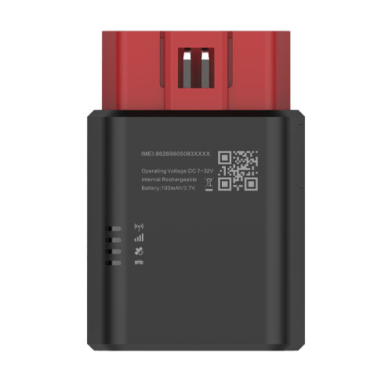

# TopFly - TorchX 310

El TorchX 310 es un rastreador GPS OBD-II compacto y plug-and-play, pensado para una implementación sencilla en flotas comerciales y vehículos particulares. Combina posicionamiento GNSS a bordo con datos del bus CAN para entregar VIN, odómetro real, nivel de combustible, códigos de diagnóstico, estado de encendido y otros parámetros del vehículo sin necesidad de instalaciones complejas. Además, el equipo soporta emparejamiento de accesorios BLE y cuenta con alertas integradas para conductor, lo que permite capturar contexto de comportamiento y condiciones ambientales junto con la ubicación.

Al ser compatible con Plaspy desde el primer momento, el TorchX 310 se integra en los flujos de gestión de flotas basados en Plaspy para ofrecer visibilidad continua de ubicación y diagnóstico vehicular. Su combinación de seguimiento en tiempo real, registro en búfer sin conexión y soporte de accesorios lo hace útil para monitoreo en vivo, generación automática de informes y alertas dentro de Plaspy, ayudando a reducir tiempos de inactividad y mejorar la supervisión operativa.

## Características principales

- Instalación OBD-II plug-and-play para despliegues rápidos y mínima inmovilización del vehículo.
- Compatibilidad con Plaspy para seguimiento en tiempo real, informes y integración en paneles de control.
- Lecturas directas del bus CAN de VIN, odómetro real, nivel de combustible y códigos de diagnóstico para telemetría precisa.
- Soporte BLE 5.0 para emparejar sensores de temperatura, sensores de puertas, relés inalámbricos y llaveros, ampliando la telemetría.
- Conectividad LTE Cat M1 con NB2 y fallback a 2G donde aplique para amplia cobertura celular.
- Gran búfer offline y intervalos de reporte configurables para un registro fiable durante cortes de conectividad.
- Funciones de seguridad al conductor como detección de choques, monitoreo de eventos bruscos y un zumbador interno para alertas dentro de la cabina.

## Cómo funciona con Plaspy

Cuando se utiliza con Plaspy, el TorchX 310 transmite la ubicación GNSS y la telemetría derivada del CAN a la plataforma Plaspy, permitiendo a los gestores de flota visualizar posiciones, monitorear el estado del vehículo y generar alertas. Plaspy procesa los datos entrantes para poblar mapas en vivo, recorridos históricos, registros de diagnóstico y notificaciones basadas en reglas que apoyan la toma de decisiones operativas.

- Actualizaciones de ubicación y telemetría en tiempo real con intervalos de reporte configurables para visibilidad continua.
- Informes de estado del vehículo incluyendo VIN, odómetro real, nivel de combustible y códigos de diagnóstico para flujos de trabajo de mantenimiento y cumplimiento.
- Detección de eventos y comportamientos como estado de encendido, aceleraciones bruscas, frenadas intensas, giros pronunciados y eventos de choque para programas de capacitación y seguridad vial.
- Reenvío de datos en búfer para que los puntos almacenados se transmitan a Plaspy cuando se restaure la conectividad, preservando la continuidad de los registros.
- Integración de accesorios BLE para mostrar temperatura, estado de puertas u otras lecturas de sensores junto con los datos del vehículo.
- Alertas configurables e informes automáticos para apoyar monitoreo antirrobo, programación de mantenimiento y KPIs operativos.

## Casos de uso típicos

- Gestión de flotas para rastreo de ubicación, monitoreo de combustible y diagnóstico CAN en vehículos ligeros y pesados.
- Programas de seguro basado en uso y comportamiento del conductor que requieren captura de eventos bruscos y detección de choques.
- Monitoreo antirrobo y alertas por manipulación usando reportes de respaldo y notificaciones en cabina.
- Monitoreo de cadena de frío y transporte refrigerado emparejando sensores de temperatura BLE con la telemetría del vehículo.
- Flujos de trabajo de control remoto e inmovilizadores usando relés inalámbricos o llaveros emparejados para acceso y seguridad.

## Por qué elegir este rastreador con Plaspy

El TorchX 310 es una opción práctica para organizaciones que usan Plaspy y necesitan telemetría precisa a nivel de vehículo junto con una implementación sencilla. Su integración OBD-II ofrece acceso directo a VIN y diagnósticos derivados del CAN sin cableados adicionales, mientras que la conectividad celular y un búfer offline considerable ayudan a mantener un seguimiento fiable y registros históricos. El soporte de accesorios BLE y las alertas en cabina amplían los casos de uso operativos, desde monitoreo de temperatura hasta seguridad del conductor, sin requerir ecosistemas de hardware separados.

Para equipos que gestionan flotas en Plaspy, el TorchX 310 ofrece un conjunto equilibrado de funciones que cubren visibilidad de ubicación, diagnóstico vehicular y monitoreo de comportamiento en un paquete compacto. Para conocer más sobre cómo Plaspy puede aprovechar la telemetría y los informes del TorchX 310, visite el sitio principal de Plaspy en https://www.plaspy.com. Las especificaciones y la disponibilidad del producto pueden cambiar con el tiempo, por lo que le recomendamos verificar los detalles actuales y la compatibilidad en el sitio oficial del fabricante en https://www.topflytech.com/.
