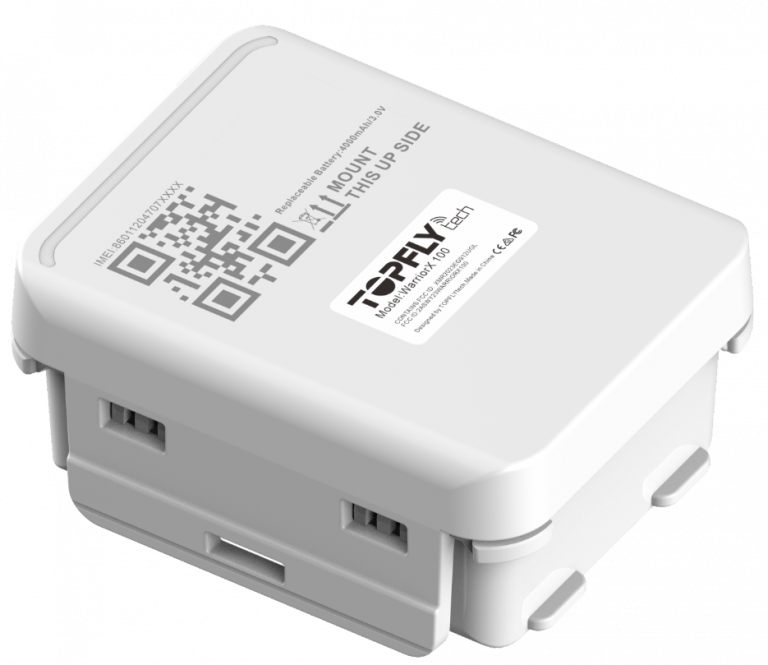

# TopFly - WarriorX 100

El WarriorX 100 es un rastreador GPS compatible con Plaspy, diseñado para el monitoreo de activos en exteriores con larga durabilidad. Como dispositivo autónomo alimentado por batería, cuenta con una carcasa robusta IP67 y una vida útil de varios años, por lo que es ideal para rastrear contenedores, remolques, maquinaria pesada y otros activos de alto valor donde la baja necesidad de mantenimiento y la resistencia son imprescindibles. El equipo combina posicionamiento GNSS en paralelo con modos de reporte optimizados para ofrecer ubicaciones confiables y telemetría básica durante despliegues prolongados.

Al integrarse con plataformas de gestión de flotas, el WarriorX 100 es una opción relevante como dispositivo compatible con Plaspy para organizaciones que desean centralizar ubicación, sensores y alertas. Su estrategia de reporte flexible, soporte para actualizaciones remotas de firmware y notificaciones por eventos como alertas de extracción lo hacen adecuado para flujos de trabajo de Plaspy que priorizan la visibilidad operativa, la respuesta ante robo y la supervisión a largo plazo de activos.

## Puntos clave

- Dispositivo compatible con Plaspy, pensado para seguimiento en tiempo real y centralización de telemetría.
- Opciones de batería reemplazable con autonomía de varios años para minimizar mantenimientos de campo y maximizar disponibilidad.
- Carcasa resistente IP67, apta para despliegues exteriores en flotas y activos.
- Posicionamiento GNSS paralelo para mayor confianza en la ubicación y fijaciones oportunas.
- Soporte para opciones de transporte estándar y actualizaciones de firmware OTA para gestión remota del dispositivo.
- Sensor de temperatura integrado y alertas de extracción para soportar flujos de trabajo básicos de cadena de frío y anti robo.
- Geocercas configurables y notificaciones de batería baja para automatizar alertas operativas.

## Cómo funciona con Plaspy

Al conectarse a Plaspy, el WarriorX 100 envía fijaciones de ubicación, lecturas de sensores y notificaciones de eventos para que Plaspy muestre mapas en vivo, historial, alertas e informes. Los perfiles de reporte del dispositivo permiten equilibrar la frecuencia de actualizaciones y la vida de la batería, y las funciones de gestión remota facilitan actualizaciones de firmware y cambios de configuración desde la plataforma.

- Ubicación en vivo y telemetría encaminadas a Plaspy para visibilidad en el panel y reproducción en el mapa.
- Alertas de extracción y manipulación enviadas a Plaspy para activar flujos de trabajo anti robo y notificaciones a operadores.
- Lecturas de temperatura y datos compatibles de sensores ingeridos para monitoreo ambiental básico y creación de informes.
- Eventos de entrada y salida de geocercas, más alertas configurables de batería baja, que Plaspy utiliza para automatizar notificaciones e informes.
- Soporte para modos de reporte frecuentes como SVR para periodos que requieren conciencia situacional casi en tiempo real.

## Casos de uso típicos

- Monitoreo prolongado de contenedores y remolques donde la impermeabilidad y la larga autonomía de la batería reducen la necesidad de servicio en sitio.
- Maquinaria pesada y activos fuera de la red que necesitan reportes de ubicación fiables y alertas de extracción con mantenimiento mínimo.
- Logística y envíos de alto valor donde la medición de temperatura y las alertas por eventos ayudan a prevenir pérdidas y supervisar la cadena de frío.
- Carteras de activos remotos distribuidos que se benefician de geocercas, notificaciones automáticas de batería baja y reportes centralizados en Plaspy.
- Supervisión de flotas durante operaciones intensivas donde ventanas de reporte configurables proporcionan el equilibrio entre frecuencia de actualizaciones y conservación de batería.

## Por qué elegir este rastreador con Plaspy

El WarriorX 100 combina durabilidad y larga vida de batería con las funcionalidades de transporte y gestión que facilitan la integración con Plaspy. Su diseño está enfocado en ofrecer ubicación confiable y telemetría esencial durante despliegues prolongados, reduciendo la frecuencia de visitas de campo y dando a los gestores de flota la visibilidad operativa necesaria. La capacidad de actualización remota de firmware y los perfiles de reporte flexibles ayudan a los equipos a ajustar el comportamiento del dispositivo según los requisitos operativos sin acceso físico al equipo.

Para organizaciones que buscan centralizar la visibilidad de activos y las alertas en Plaspy, el WarriorX 100 es una opción práctica gracias a su factor de forma resistente, posicionamiento GNSS multiconstelación y sensores de evento integrados. Para obtener más información sobre Plaspy y cómo los dispositivos compatibles se integran con la plataforma visite https://www.plaspy.com. Las especificaciones del producto, la disponibilidad y los datos del fabricante pueden cambiar con el tiempo, por lo que verifique las especificaciones actuales con el fabricante en https://www.topflytech.com/ antes de finalizar despliegues.
